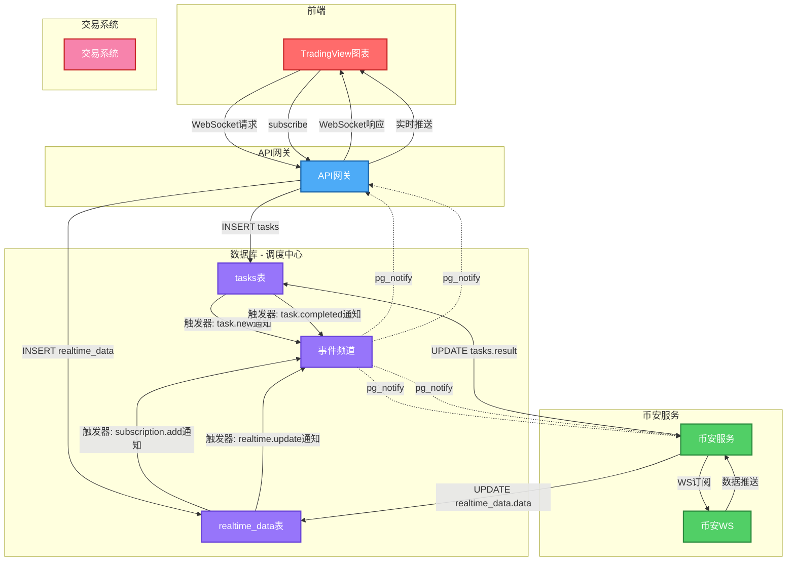
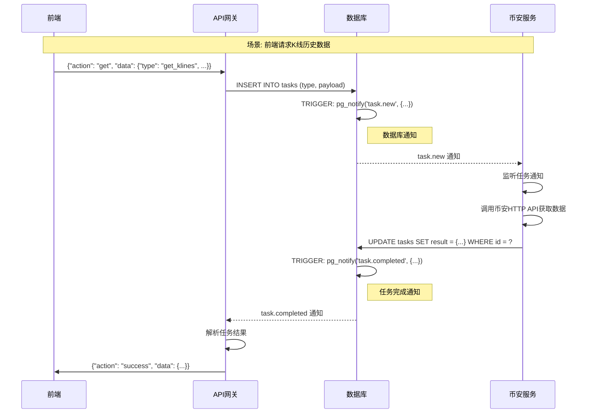
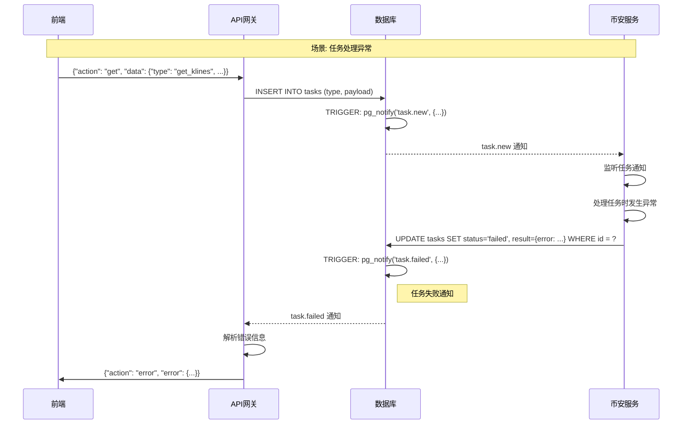
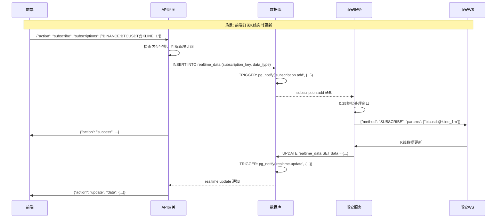
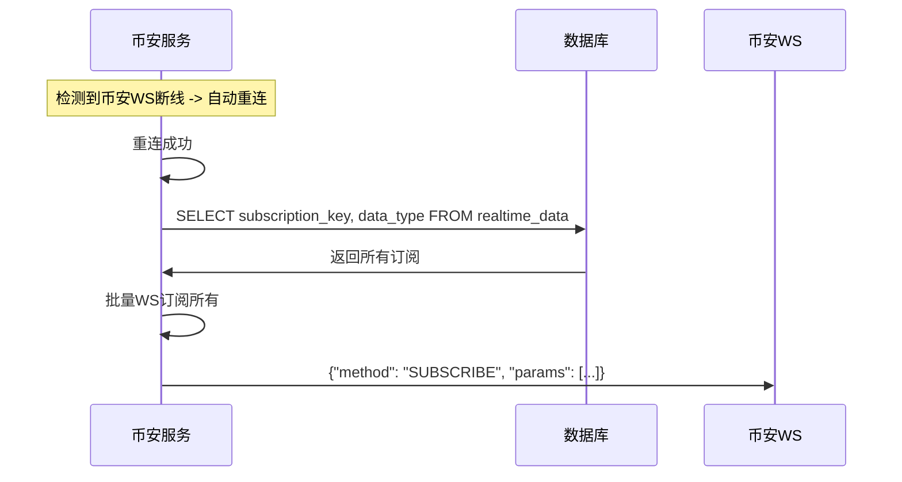
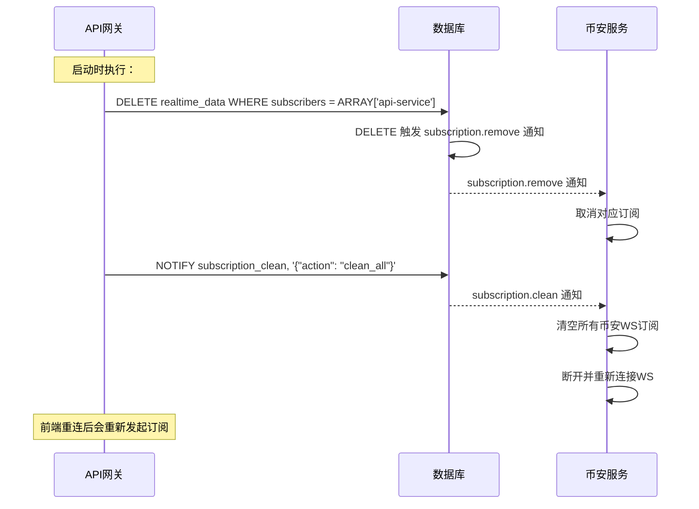
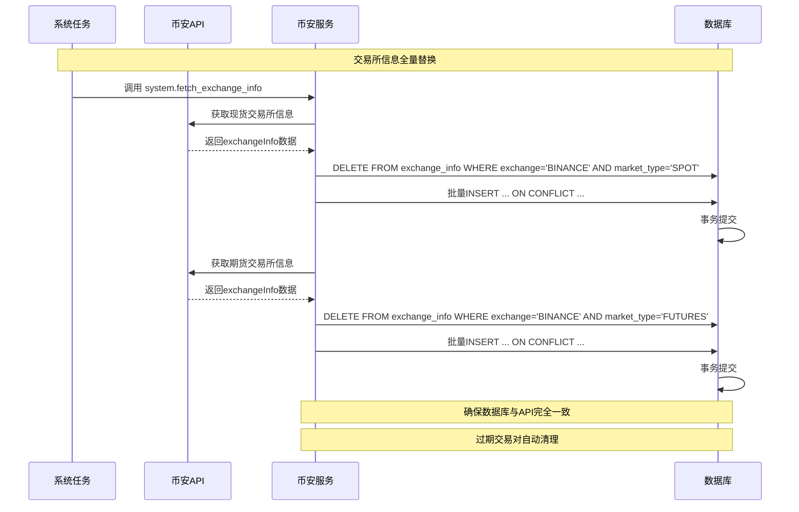
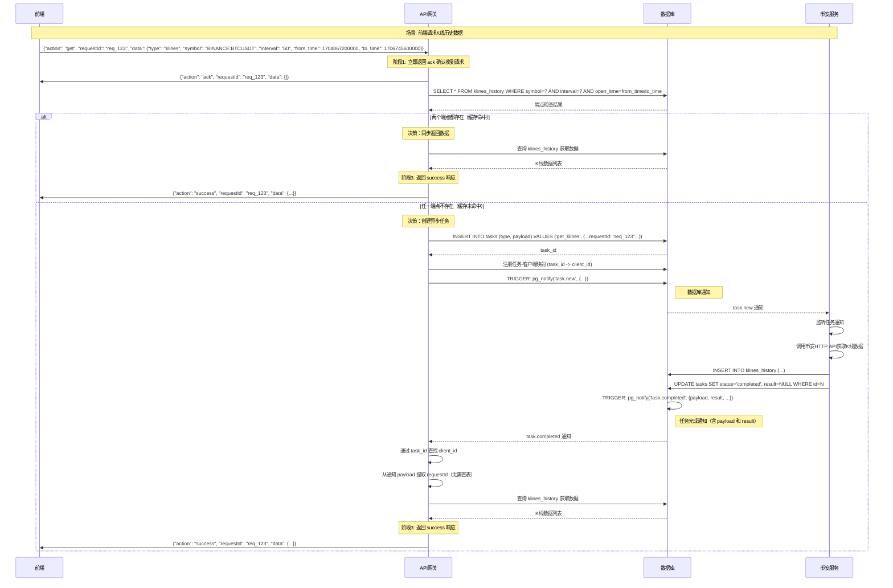

# 数据流设计

## 1. 概述

本文档描述系统中的数据流动路径和事件链机制，遵循 DATABASE_COORDINATED_ARCHITECTURE.md 中定义的 **"数据库即调度中心"** 架构，核心模式为：**写入 -> 触发 -> 通知 -> 订阅**。

## 2. 整体数据流架构



## 3. 核心事件通知通道

系统使用 PostgreSQL NOTIFY/LISTEN 机制实现服务间松耦合通信：

| 通知频道 | 触发时机 | 发送者 | 接收者 | 通知内容 |
|---------|---------|-------|-------|----------|
| `task.new` | INSERT tasks | 数据库 | 币安服务 | 任务ID、类型、payload |
| `task.completed` | UPDATE tasks.status=completed | 数据库 | API网关 | 任务ID、类型、**payload（含requestId）、result** |
| `task.failed` | UPDATE tasks.status=failed | 数据库 | API网关 | 任务ID、类型、错误信息 |
| `subscription.add` | INSERT realtime_data | 数据库 | 币安服务 | 订阅键、数据类型 |
| `subscription.remove` | DELETE realtime_data | 数据库 | 币安服务 | 订阅键、数据类型 |
| `subscription.clean` | API网关手动通知 | API网关 | 币安服务 | 清空所有订阅（API网关重启） |
| `realtime.update` | UPDATE realtime_data.data (仅当data变化时) | 数据库 | API网关/信号服务 | 订阅键、数据、事件时间 |

> **重要说明**：`realtime.update` 只在 UPDATE 且 data 字段实际变化时触发，INSERT 时不触发。
> 这样可以避免向客户端推送空数据。

> **task_completed 优化说明**：
> - 通知包含 `payload`（requestId 等）和 `result`（任务结果）
> - API 网关无需再查询 `tasks` 表获取这些信息
> - `get_klines` 任务的 `result` 为 `null`（需查询 `klines_history` 表获取数据）

> **subscription_clean 变化**：
> - 原来是 TRUNCATE 触发器自动发送
> - 现在是 API 网关在清理 api-service 订阅后手动发送

## 4. 一次性请求详细流程



**任务失败流程**（当币安服务处理异常时）：



## 5. 实时订阅详细流程



## 6. 币安服务断线重连恢复



## 7. API网关启动流程



**关键变化**：
- **DELETE 而非 TRUNCATE**：精确清理 api-service 的订阅
- **保留 signal-service 订阅**：其他服务的订阅不会被误删

## 8. 数据流与组件映射表

| 数据流类型 | 起点 | 中间节点 | 终点 | 触发器/监听 |
|-----------|------|---------|------|-----------|
| 一次性请求-任务创建 | 前端 | API网关 | tasks表 | 无 |
| 一次性请求-任务通知 | tasks表 | pg_notify | 币安服务 | INSERT触发器 |
| 一次性请求-结果写入 | 币安服务 | UPDATE | tasks表 | 无 |
| 一次性请求-完成通知 | tasks表 | pg_notify | API网关 | UPDATE触发器 |
| 订阅-新增 | 前端 | API网关 | realtime_data表 | 无 |
| 订阅-新增通知 | realtime_data表 | pg_notify | 币安服务 | INSERT触发器 |
| 订阅-实时更新 | 币安WS | 币安服务 | realtime_data表 | 无 |
| 订阅-更新通知 | realtime_data表 | pg_notify | API网关 | UPDATE触发器 |
| 订阅-取消 | API网关 | DELETE | realtime_data表 | 无 |
| 订阅-取消通知 | realtime_data表 | pg_notify | 币安服务 | DELETE触发器 |
| 交易所信息-全量替换 | 系统任务 | DELETE+INSERT | exchange_info表 | 无 |
| 交易所信息-自动清理 | exchange_info表 | 自动 | 无 | 无 |

## 9. 交易所信息全量替换流程



**触发时机**：
- **系统启动**：执行一次全量替换，确保初始数据正确
- **定时任务**：每天凌晨执行（如02:00）
- **手动触发**：通过API调用

**优势**：
- 数据完全一致：数据库信息与币安API实时同步
- 自动清理：已移除的交易对会被自动删除
- 状态准确：交易对状态变化会准确反映
- 事务保证：整个替换过程具有原子性

## 10. 获取历史K线流程

### 10.1 设计背景

前端获取 K 线历史数据的请求需要优化处理流程：
- **问题**：大数据（如500条K线）存入 `tasks.result` 字段造成性能问题
- **解决**：`klines_history` 表作为唯一数据源，任务完成后 `result=NULL`
- **优势**：避免大数据存储，api-service 二次查询获取最新数据

### 10.2 核心设计原则

1. **只有 `get_klines` 任务特殊处理**
   - 其他任务（`get_quotes`, `get_server_time`）保持原设计，result 字段照常使用

2. **任务完成后 result 字段可以为空**
   - api-service 收到通知后会二次查询 klines_history 表获取数据

3. **数据源唯一**
   - `klines_history` 表作为 K 线历史数据的唯一数据源
   - 实时订阅的 K 线通过 `trigger_archive_closed_kline` 触发器归档到此表
   - get_klines 任务获取的数据也写入此表

### 10.3 TasksRepository 新增方法

```python
class TasksRepository:
    async def check_kline_endpoints_exist(
        self,
        symbol: str,
        interval: str,
        from_time: int,
        to_time: int,
    ) -> dict[str, Any]:
        """检查K线端点是否存在

        检查指定时间点的K线数据是否存在于klines_history表中。
        用于判断是同步返回数据还是创建异步任务。

        Returns:
            {
                "from_exists": bool,
                "to_exists": bool,
                "from_bar": dict | None,  # 起始K线数据
                "to_bar": dict | None,    # 结束K线数据
            }
        """

    async def query_klines_range(
        self,
        symbol: str,
        interval: str,
        from_time: int,
        to_time: int,
    ) -> list[dict[str, Any]]:
        """查询指定时间范围内的K线数据

        用于同步返回K线数据场景。
        """
```

### 10.4 完整数据流程

> **重要设计**：所有请求都必须先返回 ack 确认收到请求，然后再执行后续处理逻辑。



### 10.5 任务结果处理

| 任务类型 | result 来源 | 数据库查询 | 推送内容 |
|---------|------------|-----------|----------|
| `get_klines` | 通知中为 NULL | 查询 klines_history | 从 klines_history 查询完整数据 |
| `get_server_time` | 通知中已包含 | 无需查询 | 直接推送 result |
| `get_quotes` | 通知中已包含 | 无需查询 | 直接推送 result |
| 失败任务 | 通知中包含 | 无需查询 | 推送错误消息 |

> **实现说明**：任务结果处理由 DataProcessor._on_task_notification() 统一负责，不再使用独立的 TaskResultHandler。

### 10.6 端点检查逻辑

```python
# TaskRouter._handle_get("klines")
endpoint_check = await tasks_repo.check_kline_endpoints_exist(
    symbol=symbol,
    interval=interval,
    from_time=from_time,
    to_time=to_time,
)

if endpoint_check["from_exists"] and endpoint_check["to_exists"]:
    # 两个端点都存在 -> 同步返回
    klines = await tasks_repo.query_klines_range(...)
    return {"action": "success", "data": {"type": "klines", "klines": klines, "count": len(klines)}}
else:
    # 任一不存在 -> 创建异步任务
    return await _create_async_task(task_type="get_klines", payload=..., store_result=False)
```

### 10.7 设计优势

| 优势 | 说明 |
|-----|------|
| **避免大数据存储** | 500条K线不再存入 tasks.result，避免JSONB膨胀 |
| **数据一致性** | klines_history 作为唯一数据源，实时归档+任务写入统一 |
| **减少网络开销** | 任务完成后直接推送数据（api-service二次查询），避免客户端轮询 |
| **同步优先** | 数据已存在时直接返回，无异步延迟 |

## 相关文档

- [QUANT_TRADING_SYSTEM_ARCHITECTURE.md](./QUANT_TRADING_SYSTEM_ARCHITECTURE.md) - 完整实施文档
- [01-task-subscription.md](./01-task-subscription.md) - 任务与订阅管理
- [03-kline-collector.md](./03-kline-collector.md) - K线采集设计
- [04-dataprocessor.md](./04-dataprocessor.md) - DataProcessor设计

---

**版本**：v3.1
**更新**：2026-02-21
