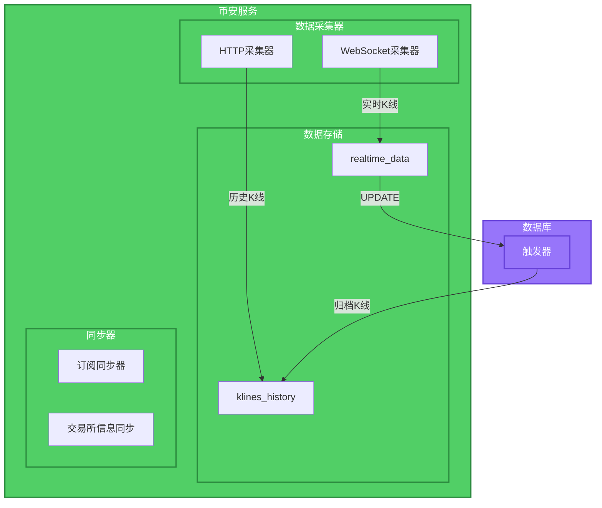
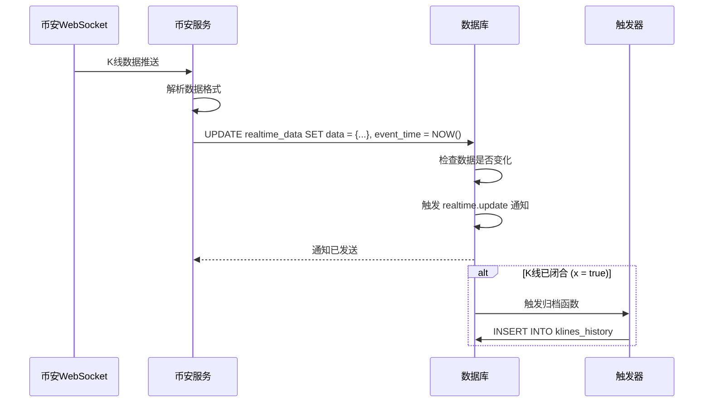
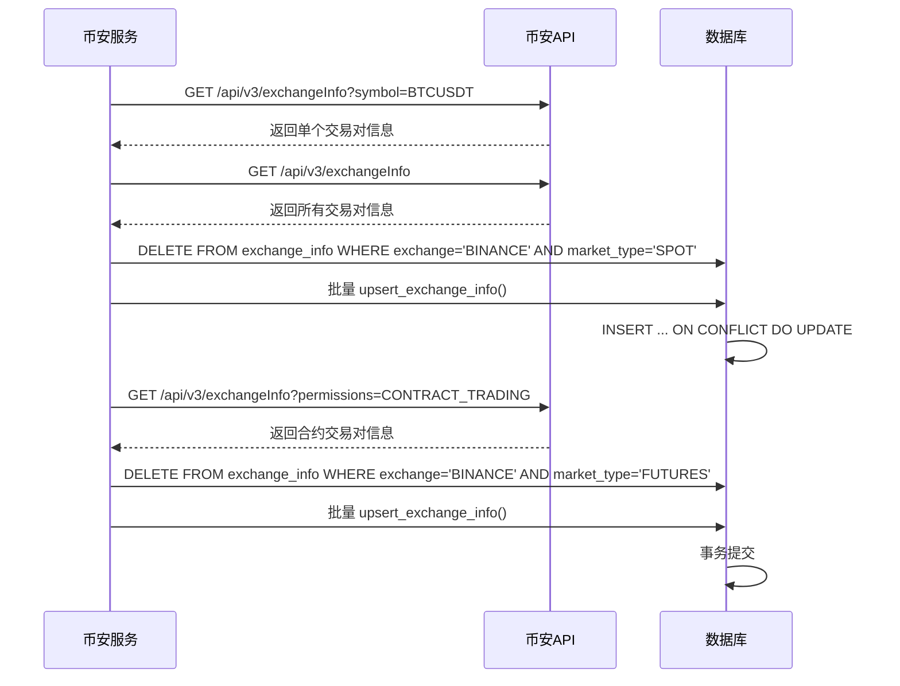
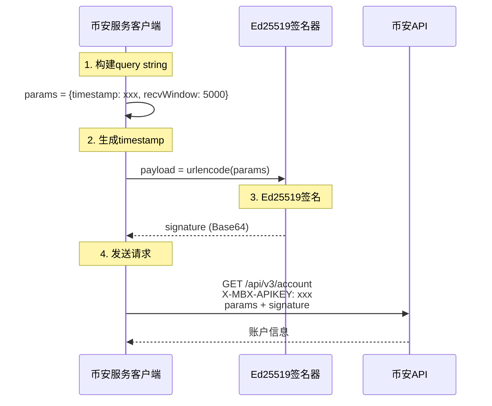
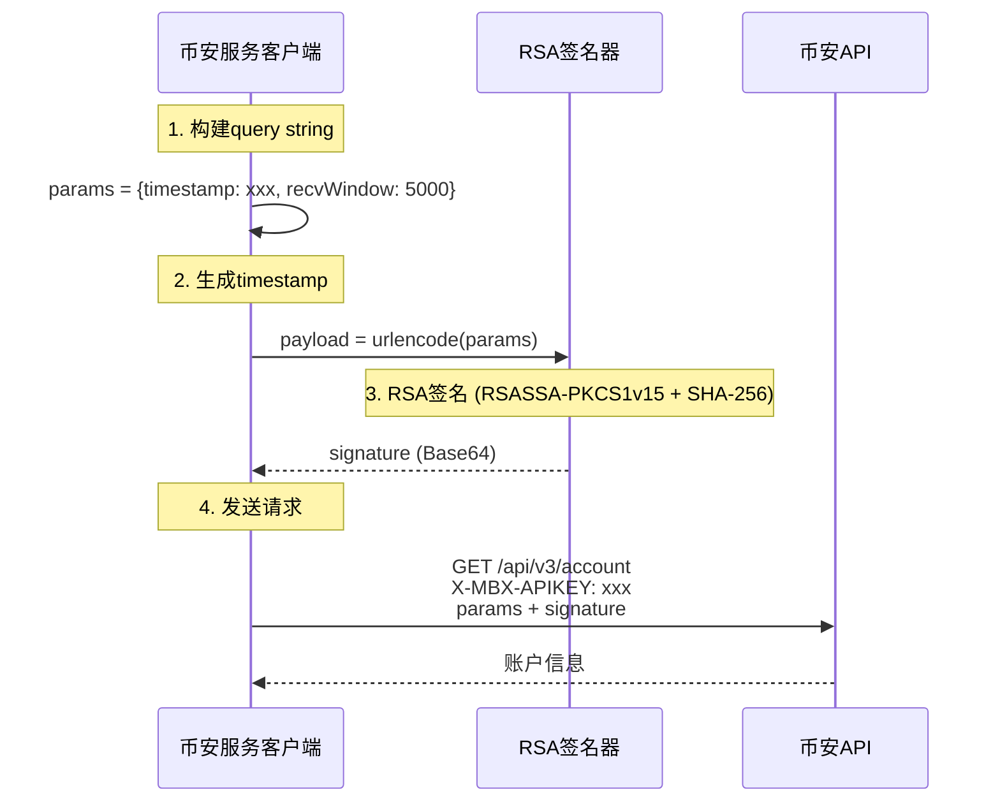

# 币安K线采集设计

## 1. 设计概述

本文档描述币安服务中的K线数据采集机制，包括实时数据订阅、历史数据获取和交易所信息同步。

## 2. 采集架构



## 3. 实时K线采集

### 3.1 WebSocket采集器

币安WebSocket用于接收实时K线数据推送。

**订阅格式**：
```json
{
    "method": "SUBSCRIBE",
    "params": ["btcusdt@kline_1m", "ethusdt@kline_5m"],
    "id": 1
}
```

**接收数据格式**：
```json
{
    "e": "kline",
    "s": "BTCUSDT",
    "k": {
        "t": 1672531200000,
        "T": 1672531259999,
        "s": "BTCUSDT",
        "i": "1m",
        "f": 100,
        "L": 200,
        "o": "16500.00",
        "c": "16510.00",
        "h": "16520.00",
        "l": "16490.00",
        "v": "100.5",
        "n": 150,
        "x": true,
        "q": "1652500.00",
        "V": "50.3",
        "Q": "826250.00"
    }
}
```

### 3.2 数据写入流程



### 3.3 实时数据表更新

```python
async def update_realtime_kline(self, symbol: str, kline_data: dict) -> None:
    """更新实时K线数据到数据库"""
    subscription_key = f"BINANCE:{symbol}@KLINE_{self._interval_to_tv(kline_data['k']['i'])}"

    query = """
        INSERT INTO realtime_data (subscription_key, data_type, data, event_time)
        VALUES ($1, 'KLINE', $2, NOW())
        ON CONFLICT (subscription_key)
        DO UPDATE SET data = EXCLUDED.data, event_time = EXCLUDED.event_time
    """

    await self._pool.execute(query, subscription_key, kline_data)
```

## 4. 历史K线采集

### 4.1 HTTP采集器

用于获取历史K线数据，通过任务系统触发。

**API调用**：
```
GET https://api.binance.com/api/v3/klines?symbol=BTCUSDT&interval=1h&startTime=1672531200000&endTime=1672617600000
```

### 4.2 数据写入

```python
async def fetch_and_store_klines(
    self,
    symbol: str,
    interval: str,
    start_time: int,
    end_time: int
) -> list[dict]:
    """获取并存储K线数据"""

    # 调用币安API
    klines = await self._fetch_klines(symbol, interval, start_time, end_time)

    # 转换为数据库格式
    records = self._convert_to_history_records(symbol, interval, klines)

    # 批量写入
    async with self._pool.acquire() as conn:
        async with conn.transaction():
            for record in records:
                await conn.fetchval("""
                    INSERT INTO klines_history (
                        symbol, interval, open_time, close_time,
                        open_price, high_price, low_price, close_price,
                        volume, quote_volume, number_of_trades,
                        taker_buy_base_volume, taker_buy_quote_volume
                    ) VALUES ($1, $2, $3, $4, $5, $6, $7, $8, $9, $10, $11, $12, $13)
                    ON CONFLICT (symbol, open_time, interval)
                    DO UPDATE SET
                        close_time = EXCLUDED.close_time,
                        open_price = EXCLUDED.open_price,
                        high_price = EXCLUDED.high_price,
                        low_price = EXCLUDED.low_price,
                        close_price = EXCLUDED.close_price,
                        volume = EXCLUDED.volume,
                        quote_volume = EXCLUDED.quote_volume,
                        number_of_trades = EXCLUDED.number_of_trades,
                        taker_buy_base_volume = EXCLUDED.taker_buy_base_volume,
                        taker_buy_quote_volume = EXCLUDED.taker_buy_quote_volume
                """, *record)

    return records
```

## 5. 交易所信息同步

### 5.1 全量替换策略

交易所信息采用**全量替换**模式，确保数据库中的信息与币安API完全同步。

**设计优势**：
- 数据一致性：数据库信息与币安API完全同步
- 自动清理：已移除的交易对会被自动删除
- 状态准确：交易对状态变化会准确反映

### 5.2 同步流程



### 5.3 同步时机

| 触发方式 | 说明 |
|---------|------|
| **系统启动** | 执行一次全量替换，确保初始数据正确 |
| **定时任务** | 每天凌晨执行（如02:00） |
| **手动触发** | 通过API调用 |

### 5.4 upsert_exchange_info() 存储过程

```sql
CREATE OR REPLACE FUNCTION upsert_exchange_info(
    p_exchange VARCHAR,
    p_market_type VARCHAR,
    p_symbol VARCHAR,
    p_base_asset VARCHAR,
    p_quote_asset VARCHAR,
    p_status VARCHAR,
    p_base_asset_precision INTEGER DEFAULT 8,
    p_quote_precision INTEGER DEFAULT 8,
    p_quote_asset_precision INTEGER DEFAULT 8,
    p_base_commission_precision INTEGER DEFAULT 8,
    p_quote_commission_precision INTEGER DEFAULT 8,
    p_filters JSONB,
    p_order_types JSONB,
    p_permissions JSONB,
    p_iceberg_allowed BOOLEAN DEFAULT FALSE,
    p_oco_allowed BOOLEAN DEFAULT FALSE,
    p_oto_allowed BOOLEAN DEFAULT FALSE,
    p_opo_allowed BOOLEAN DEFAULT FALSE,
    p_quote_order_qty_market_allowed BOOLEAN DEFAULT FALSE,
    p_allow_trailing_stop BOOLEAN DEFAULT FALSE,
    p_cancel_replace_allowed BOOLEAN DEFAULT FALSE,
    p_amend_allowed BOOLEAN DEFAULT FALSE,
    p_peg_instructions_allowed BOOLEAN DEFAULT FALSE,
    p_is_spot_trading_allowed BOOLEAN DEFAULT TRUE,
    p_is_margin_trading_allowed BOOLEAN DEFAULT FALSE,
    p_permission_sets JSONB DEFAULT '[]',
    p_default_self_trade_prevention_mode VARCHAR DEFAULT 'NONE',
    p_allowed_self_trade_prevention_modes JSONB DEFAULT '[]'
) RETURNS BIGINT AS $$
DECLARE
    v_id BIGINT;
BEGIN
    INSERT INTO exchange_info (
        exchange, market_type, symbol, base_asset, quote_asset, status,
        base_asset_precision, quote_precision, quote_asset_precision,
        base_commission_precision, quote_commission_precision,
        filters, order_types, permissions,
        iceberg_allowed, oco_allowed, oto_allowed, opo_allowed,
        quote_order_qty_market_allowed, allow_trailing_stop,
        cancel_replace_allowed, amend_allowed, peg_instructions_allowed,
        is_spot_trading_allowed, is_margin_trading_allowed,
        permission_sets,
        default_self_trade_prevention_mode, allowed_self_trade_prevention_modes,
        last_updated
    ) VALUES (
        p_exchange, p_market_type, p_symbol, p_base_asset, p_quote_asset, p_status,
        COALESCE(p_base_asset_precision, 8), COALESCE(p_quote_precision, 8),
        COALESCE(p_quote_asset_precision, 8), COALESCE(p_base_commission_precision, 8),
        COALESCE(p_quote_commission_precision, 8),
        p_filters, p_order_types, p_permissions,
        p_iceberg_allowed, p_oco_allowed, p_oto_allowed, p_opo_allowed,
        p_quote_order_qty_market_allowed, p_allow_trailing_stop,
        p_cancel_replace_allowed, p_amend_allowed, p_peg_instructions_allowed,
        p_is_spot_trading_allowed, p_is_margin_trading_allowed,
        p_permission_sets,
        p_default_self_trade_prevention_mode, p_allowed_self_trade_prevention_modes,
        NOW()
    )
    ON CONFLICT (exchange, market_type, symbol) DO UPDATE SET
        base_asset = p_base_asset,
        quote_asset = p_quote_asset,
        status = p_status,
        base_asset_precision = COALESCE(p_base_asset_precision, 8),
        quote_precision = COALESCE(p_quote_precision, 8),
        quote_asset_precision = COALESCE(p_quote_asset_precision, 8),
        base_commission_precision = COALESCE(p_base_commission_precision, 8),
        quote_commission_precision = COALESCE(p_quote_commission_precision, 8),
        filters = p_filters,
        order_types = p_order_types,
        permissions = p_permissions,
        iceberg_allowed = p_iceberg_allowed,
        oco_allowed = p_oco_allowed,
        oto_allowed = p_oto_allowed,
        opo_allowed = p_opo_allowed,
        quote_order_qty_market_allowed = p_quote_order_qty_market_allowed,
        allow_trailing_stop = p_allow_trailing_stop,
        cancel_replace_allowed = p_cancel_replace_allowed,
        amend_allowed = p_amend_allowed,
        peg_instructions_allowed = p_peg_instructions_allowed,
        is_spot_trading_allowed = p_is_spot_trading_allowed,
        is_margin_trading_allowed = p_is_margin_trading_allowed,
        permission_sets = p_permission_sets,
        default_self_trade_prevention_mode = p_default_self_trade_prevention_mode,
        allowed_self_trade_prevention_modes = p_allowed_self_trade_prevention_modes,
        last_updated = NOW()
    RETURNING id INTO v_id;

    RETURN v_id;
END;
$$ LANGUAGE plpgsql;
```

### 5.5 对比：增量更新 vs 全量替换

| 特性 | 增量更新 | 全量替换 |
|------|----------|----------|
| 数据一致性 | 可能保留过期数据 | 完全同步 |
| 数据清理 | 需要手动清理 | 自动清理 |
| 性能开销 | 较低 | 较高 |
| 适用规模 | 数万级交易对 | 数千级交易对 |
| 实现复杂度 | 简单 | 简单 |

## 6. 订阅同步器

### 6.1 功能职责

订阅同步器负责：
1. 监听数据库订阅变更通知
2. 执行币安WebSocket订阅/取消操作
3. 断线重连后恢复订阅

### 6.2 监听频道

| 频道 | 操作 |
|------|------|
| `subscription.add` | 执行WS订阅 |
| `subscription.remove` | 执行WS取消订阅 |
| `subscription.clean` | 清空所有订阅并重连 |

### 6.3 批处理优化

为减少WebSocket请求次数，订阅同步器使用0.25秒批处理窗口：

```python
class SubscriptionSync:
    def __init__(self):
        self._pending_subscribe: set[str] = set()
        self._pending_unsubscribe: set[str] = set()
        self._flush_task: asyncio.Task | None = None

    async def subscribe(self, subscription_key: str) -> None:
        """添加订阅到待处理队列"""
        self._pending_subscribe.add(self._to_binance_format(subscription_key))
        self._schedule_flush()

    async def unsubscribe(self, subscription_key: str) -> None:
        """添加取消订阅到待处理队列"""
        self._pending_unsubscribe.add(self._to_binance_format(subscription_key))
        self._schedule_flush()

    def _schedule_flush(self) -> None:
        """调度批量执行"""
        if self._flush_task is None or self._flush_task.done():
            self._flush_task = asyncio.create_task(self._flush_after(0.25))

    async def _flush_after(self, delay: float) -> None:
        """延迟后批量执行"""
        await asyncio.sleep(delay)
        await self._execute_batch()
```

## 7. 数据转换

### 7.1 K线周期转换

币安API使用不同的周期格式，需要转换为TradingView格式：

| 币安格式 | TV格式 |
|---------|--------|
| 1m | 1 |
| 3m | 3 |
| 5m | 5 |
| 15m | 15 |
| 30m | 30 |
| 1h | 60 |
| 2h | 120 |
| 4h | 240 |
| 6h | 360 |
| 8h | 480 |
| 12h | 720 |
| 1d | 1D |
| 3d | 3D |
| 1w | 1W |
| 1M | 1M |

### 7.2 Symbol格式转换

数据库存储格式与币安API格式转换：

| 场景 | 格式 |
|------|------|
| 数据库 | `BINANCE:BTCUSDT` |
| 币安API | `BTCUSDT` |
| 永续合约 | `BINANCE:BTCUSDT.PERP` |
| 币安永续 | `BTCUSDT_PERP` |

## 8. 私有API认证

### 8.1 认证架构

币安私有API使用Ed25519签名认证，参考官方文档：[REST API/请求鉴权类型.md](../../../binance-docs/binance_spot_docs/REST%20API/请求鉴权类型.md)



### 8.2 签名流程

**关键点**：
1. 参数按**添加顺序**构建query string（不排序）
2. 使用`urllib.parse.urlencode(params, encoding='UTF-8')`构建payload
3. 使用ASCII编码签名：`private_key.sign(payload.encode('ASCII'))`
4. Base64编码签名
5. httpx会自动处理签名的URL编码

```python
# 正确的签名流程
import base64
import urllib.parse
from cryptography.hazmat.primitives.serialization import load_pem_private_key

# 1. 构建参数（按添加顺序）
params = {
    'timestamp': str(int(time.time() * 1000)),
    'recvWindow': '5000'
}

# 2. 构建payload（不排序）
payload = urllib.parse.urlencode(params, encoding='UTF-8')
# 结果: timestamp=1771796666082&recvWindow=5000

# 3. 签名（ASCII编码）
private_key = load_pem_private_key(private_key_pem, password=None)
signature_bytes = private_key.sign(payload.encode('ASCII'))

# 4. Base64编码
signature = base64.b64encode(signature_bytes).decode('utf-8')

# 5. 发送请求（httpx自动处理URL编码）
response = await client.get(url, params={**params, 'signature': signature}, headers=headers)
```

### 8.3 密钥管理

**密钥文件结构**：
```
services/binance-service/keys/
├── private_key.pem    # Ed25519私钥（PEM格式）
├── public_key.pem     # Ed25519公钥
├── private_rsa.pem   # RSA私钥（PEM格式，PKCS#8）
└── public_rsa.pem    # RSA公钥
```

**密钥加载**：
```python
from cryptography.hazmat.primitives.serialization import load_pem_private_key

with open("keys/private_key.pem", "rb") as f:
    private_key_pem = f.read()

private_key = load_pem_private_key(private_key_pem, password=None)
```

**公钥绑定**：
1. 登录币安账户
2. 进入 API 管理页面
3. 创建新API Key，选择Ed25519
4. 绑定公钥内容（去除PEM头尾）

### 8.4 客户端组件

**BinanceSpotPrivateHTTPClient**：

```python
class BinanceSpotPrivateHTTPClient(BinanceHTTPClient):
    """私有API HTTP客户端（支持Ed25519和RSA签名）"""

    VALID_SIGNATURE_TYPES = {"ed25519", "rsa"}

    def __init__(
        self,
        api_key: str,
        private_key_pem: bytes,
        signature_type: str = "ed25519",
        timeout: float = 10.0,
        proxy_url: Optional[str] = None,
    ) -> None:
        super().__init__(timeout=timeout, proxy_url=proxy_url)
        self.api_key = api_key

        # 根据签名类型选择签名器
        if signature_type.lower() == "rsa":
            self._signer = RSASigner(private_key_pem)
        else:
            self._signer = Ed25519Signer(private_key_pem)

    async def get_account_info(self) -> BinanceAccountInfo:
        """获取账户信息 - GET /api/v3/account"""
        return await self._signed_request(
            method="GET",
            path="api/v3/account",
            params={},
        )
```

### 8.5 RSA签名认证

币安API同时支持Ed25519和RSA两种签名方式。RSA签名使用PKCS#8格式的私钥。

#### 8.5.1 RSA签名流程



#### 8.5.2 RSA签名实现

```python
import base64
from cryptography.hazmat.primitives import hashes, serialization
from cryptography.hazmat.primitives.asymmetric import padding
from cryptography.hazmat.backends import default_backend

class RSASigner:
    """RSA签名器 - 使用RSASSA-PKCS1-v1_5 + SHA-256"""

    def __init__(self, private_key_pem: bytes) -> None:
        self._private_key = serialization.load_pem_private_key(
            private_key_pem,
            password=None,
            backend=default_backend()
        )

    def sign(self, payload: str) -> str:
        """对payload进行RSA签名"""
        # 使用SHA-256进行签名
        signature = self._private_key.sign(
            payload.encode('ascii'),
            padding.PKCS1v15(),
            hashes.SHA256()
        )
        # Base64编码
        return base64.b64encode(signature).decode('ascii')
```

#### 8.5.3 RSA密钥生成

```bash
# 生成RSA私钥 (PKCS#8格式)
openssl genrsa -out private_rsa.pem 2048

# 转换为PKCS#8格式 (币安要求)
openssl pkcs8 -topk8 -inform PEM -in private_rsa.pem -out private_rsa_pkcs8.pem -nocrypt

# 生成公钥
openssl rsa -in private_rsa.pem -pubout -out public_rsa.pem
```

#### 8.5.4 签名类型对比

| 特性 | Ed25519 | RSA |
|------|---------|-----|
| 密钥长度 | 256位 | 2048/4096位 |
| 签名长度 | 64字节 | 256/512字节 |
| 性能 | 更快 | 较慢 |
| 密钥管理 | 需要绑定公钥 | 只需提供私钥 |
| 兼容性 | 较新 | 更广泛支持 |

#### 8.5.5 使用RSA签名

```python
from clients.spot_private_http_client import BinanceSpotPrivateHTTPClient

# 使用RSA签名
client = BinanceSpotPrivateHTTPClient(
    api_key="your_api_key",
    private_key_pem=private_key_pem,  # RSA私钥PEM
    signature_type="rsa",
    proxy_url="http://proxy:7890",
)

account = await client.get_account_info()
```

### 8.6 支持的私有API

| API | 用途 | 鉴权类型 |
|-----|------|----------|
| GET /api/v3/account | 获取账户信息 | USER_DATA |
| GET /api/v3/order | 查询订单 | USER_DATA |
| GET /api/v3/openOrders | 当前挂单 | USER_DATA |
| GET /api/v3/allOrders | 历史订单 | USER_DATA |
| POST /api/v3/order | 下单 | TRADE |
| DELETE /api/v3/order | 取消订单 | TRADE |

### 8.7 数据模型

**BinanceAccountInfo**：
```python
class BinanceAccountInfo(BaseModel):
    # 手续费
    maker_commission: int          # 挂单手续费率
    taker_commission: int          # 吃单手续费率
    commission_rates: CommissionRates  # 详细手续费率

    # 权限
    can_trade: bool               # 是否可交易
    can_withdraw: bool            # 是否可提现
    can_deposit: bool             # 是否可充值

    # 账户属性
    account_type: str             # 账户类型
    balances: list[Balance]       # 余额列表
    permissions: list[str]        # 权限列表
```

### 8.8 账户信息获取

币安服务支持通过私有API获取账户信息，供前端账户信息页面使用。

#### 8.8.1 任务类型

| 任务类型 | 说明 | 数据来源 |
|----------|------|----------|
| `get_futures_account` | 获取期货账户信息 | Binance 合约账户 API |
| `get_spot_account` | 获取现货账户信息 | Binance 现货账户 API |

#### 8.8.2 数据流

```
前端 → WebSocket请求 → api-service → tasks表 → task.new通知
                                                    ↓
                                              binance-service (监听处理)
                                                    ↓
                                              写入 result → task.completed通知
                                                    ↓
                                              api-service → WebSocket推送 → 前端
```

#### 8.8.3 数据优化

现货账户的 `balances` 字段包含所有交易对，大量零余额资产会导致 PostgreSQL JSONB 字段超限（`payload string too long`）。

**优化策略**：仅返回有余额的资产：

```python
if account_data.get("balances"):
    non_zero_balances = [
        b for b in account_data["balances"]
        if float(b.get("free", "0") or "0") > 0 or float(b.get("locked", "0") or "0") > 0
    ]
    account_data["balances"] = non_zero_balances
    account_data["balances_count"] = len(non_zero_balances)
```

#### 8.8.6 环境配置

账户信息功能需要配置以下环境变量：

| 环境变量 | 说明 | 示例 |
|----------|------|------|
| `BINANCE_API_KEY` | 现货 API Key | `O8ewxuQPnTEdperT...` |
| `BINANCE_FUTURES_API_KEY` | 期货 API Key（可选，默认同现货） | 同上 |
| `BINANCE_PRIVATE_KEY_PATH` | 私钥文件路径 | `/app/keys/private_rsa.pem` |
| `BINANCE_SIGNATURE_TYPE` | 签名类型 | `rsa` 或 `ed25519` |

#### 8.8.7 前端集成

前端通过 `account-store.ts` 管理账户状态，使用 WebSocket 与后端通信：

```typescript
// 获取期货账户
await accountStore.fetchFuturesAccount()

// 获取现货账户
await accountStore.fetchSpotAccount()

// 刷新全部账户
await accountStore.refreshAccounts()
```

## 相关文档

- [QUANT_TRADING_SYSTEM_ARCHITECTURE.md](./QUANT_TRADING_SYSTEM_ARCHITECTURE.md) - 完整实施文档
- [01-task-subscription.md](./01-task-subscription.md) - 任务与订阅管理
- [02-dataflow.md](./02-dataflow.md) - 数据流设计
- [04-dataprocessor.md](./04-dataprocessor.md) - DataProcessor设计

---

**版本**：v2.1
**更新**：2026-02-23 - 添加RSA签名认证支持
