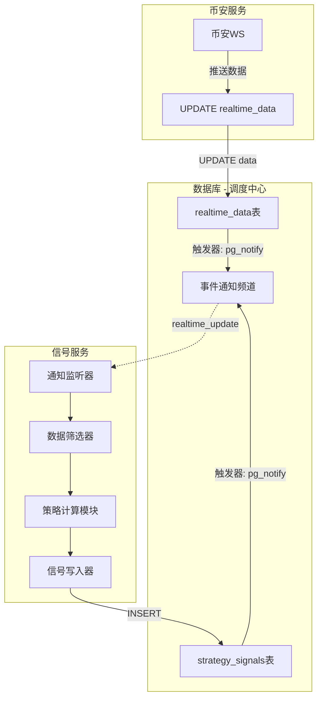
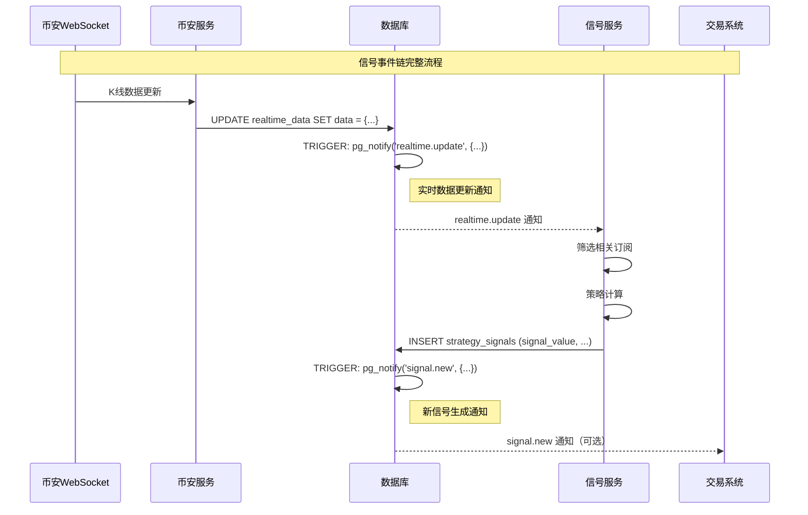

# 信号服务设计

## 概述

信号服务（Signal Service）负责根据实时数据计算策略信号，监听 `realtime.update` 通知，当K线数据更新时触发策略计算，并将结果写入策略信号表。

**核心职责**：
- 监听 `realtime.update` 数据库通知
- 根据订阅的策略类型筛选相关数据
- 调用策略计算模块进行信号计算
- 将计算结果写入 `strategy_signals` 表
- 可选：通知交易系统执行交易

## 架构

```
realtime_data (K线) → 信号计算 → strategy_signals → signal.new 事件
```

---

## 8.1 设计背景

信号服务（Signal Service）负责根据实时数据计算策略信号，监听 `realtime.update` 通知，当K线数据更新时触发策略计算，并将结果写入策略信号表。

**核心职责**：
- 监听 `realtime.update` 数据库通知
- 根据订阅的策略类型筛选相关数据
- 调用策略计算模块进行信号计算
- 将计算结果写入 `strategy_signals` 表
- 可选：通知交易系统执行交易

---

## 8.2 核心数据模型

### 8.2.1 strategy_signals 策略信号表

```sql
CREATE TABLE IF NOT EXISTS strategy_signals (
    id BIGSERIAL PRIMARY KEY,

    -- 关联告警（用于追溯配置来源）
    alert_id VARCHAR(36) NOT NULL,   -- 关联 alert_configs.id

    -- 交易对（冗余但避免关联查询）
    symbol VARCHAR(50) NOT NULL,          -- 交易对，如 "BINANCE:BTCUSDT"

    -- 信号结果
    signal_value BOOLEAN NOT NULL,   -- 信号值：true(做多) / false(做空) / null(无信号)
    signal_reason TEXT,              -- 信号原因：如"建仓信号"、"清仓信号"、"无信号"

    -- 计算时间
    computed_at TIMESTAMPTZ DEFAULT NOW()
);

-- 复合索引：按交易对 + 时间查询
CREATE INDEX IF NOT EXISTS idx_signals_symbol_time
    ON strategy_signals (symbol, computed_at DESC);

-- 复合索引：按告警 ID 查询（查看特定告警的所有信号）
CREATE INDEX IF NOT EXISTS idx_signals_alert_id
    ON strategy_signals (alert_id, computed_at DESC);

-- 转换为 Hypertable
SELECT create_hypertable('strategy_signals', 'computed_at');

-- 保留策略：保留30天
SELECT add_retention_policy('strategy_signals', drop_after => INTERVAL '30 days');
```

**字段说明**：
| 字段 | 说明 |
|------|------|
| `id` | 唯一标识，数据库自增主键 |
| `alert_id` | 关联的告警ID（前端生成），便于追溯配置来源 |
| `symbol` | 交易对（冗余设计，避免 JOIN 查询） |
| `signal_value` | 信号值 |
| `computed_at` | 计算时间 |

**索引使用场景**：
| 索引 | 典型查询 |
|------|----------|
| `idx_signals_alert_id` | 查询某告警的所有信号 |
| `idx_signals_symbol_time` | 查询某交易对的信号历史 |

**设计说明**：
- 精简设计：其他字段（created_by, strategy_type, interval, trigger_type）可通过 alert_id 关联 alert_configs 表获取
- 冗余 symbol：保留以优化常见查询性能

### 8.2.2 signal.new 信号生成通知

**signal.new 通知**：INSERT strategy_signals 时触发，通知 API 网关或交易系统。**格式与 realtime.update 通知保持统一**：

```json
{
    "event_id": "0189a1b3-c4d5-6e7f-8901-bcde23456789",
    "event_type": "signal.new",
    "timestamp": "2026-02-05T10:30:05Z",
    "data": {
        "id": 12345,
        "alert_id": "0189a1b1-c3d4-5e6f-7890-abcd12345677",
        "created_by": "user_001",
        "strategy_type": "macd_resonance_v5",
        "symbol": "BINANCE:BTCUSDT",
        "interval": "60",
        "signal_value": true,
        "signal_reason": "建仓信号",
        "computed_at": "2026-02-05T10:30:05Z"
    }
}
```

---

## 8.3 信号服务架构



---

## 8.4 核心组件职责

| 组件 | 职责 |
|------|------|
| **通知监听器** | 监听 `realtime.update` 频道，接收实时数据更新通知 |
| **数据筛选器** | 根据订阅的策略类型筛选相关订阅键 |
| **策略计算模块** | 接收K线数据，执行策略计算，返回信号值 |
| **信号写入器** | 将计算结果写入 `strategy_signals` 表 |

---

## 8.5 订阅管理设计

### 8.5.1 信号服务订阅策略

信号服务通过查询 `realtime_data` 表来管理自己的订阅：

```sql
-- 查询信号服务需要的K线订阅
SELECT subscription_key, data_type, data, subscribers
FROM realtime_data
WHERE subscription_key LIKE '%KLINE%'
  AND subscription_key LIKE 'BINANCE:%';
```

### 8.5.2 动态订阅机制

信号服务启动时：
1. 查询 `realtime_data` 表获取现有订阅
2. 如果没有需要的订阅，创建新的 `realtime_data` 条目（`subscribers = ARRAY['signal-service']`）
3. INSERT 触发 `subscription.add` 通知，币安服务开始订阅
4. 如果已存在但没有 signal-service 订阅，追加 `signal-service` 到 `subscribers` 数组

```python
# 信号服务启动逻辑
async def ensure_subscriptions(self, strategies: list[StrategyConfig]):
    """确保信号服务有足够的订阅"""
    for strategy in strategies:
        subscription_key = f"BINANCE:{strategy.symbol}@KLINE_{strategy.interval}"

        # 检查是否已存在订阅
        existing = await self.repo.get_subscription(subscription_key)
        if existing is None:
            # 创建新订阅，触发币安服务订阅
            await self.repo.add_subscription(
                subscription_key=subscription_key,
                data_type="KLINE",
                subscriber="signal-service"  # 指定订阅源
            )
```

### 8.5.3 多服务订阅场景

**场景：两个服务都订阅同一数据**

```mermaid
flowchart LR
    subgraph "订阅流程"
        API[api-service] -->|INSERT ARRAY['api-service']| RT[realtime_data]
        Sig[signal-service] -->|ARRAY_APPEND ARRAY['signal-service']| RT
    end

    RT -->|subscription_add x2| BN[币安服务]
```

**数据状态**：
```sql
-- realtime_data 表状态
subscription_key: 'BINANCE:BTCUSDT@KLINE_1m'
subscribers: {'api-service', 'signal-service'}
```

**取消行为**：
- api-service 取消订阅：从数组移除 `api-service`，保留数据行
- signal-service 取消订阅：从数组移除 `signal-service`，保留数据行
- 两个服务都取消：数组变空，删除数据行，触发 `subscription.remove`

### 8.5.4 K线缓存初始化设计

信号服务启动时，需要初始化K线缓存用于策略计算。由于K线数据是策略计算的基础，必须确保数据基本完整性。

**设计原则**：
1. **两条件检查**：数量、连续性（不检查时间正确性）
2. **不阻塞启动**：启动时不验证K线是否最新，避免网络问题时无限重试
3. **运行时自愈**：时间正确性由运行时实时数据触发检测和补齐
4. **被动响应优于主动检查**：收到实时数据说明上游服务正常，此时补齐更容易成功

**设计原因**：
- 如果启动时检测"时间正确性"（最后一根K线是否为最新），在网络不通的情况下会无限创建失败任务
- 无限重试会导致币安服务的httpx客户端假死，网络恢复后仍无法正常工作
- 事件驱动架构应该"被动响应"：收到实时数据说明上游正常工作，此时补齐大概率能成功

**K线缓存要求**：
- 数量：>= 280 条（MACD等指标计算需要）
- 连续性：K线时间连续，无缺失
- ~~时间正确性：最后一根K线必须是当前周期的前一个完整周期~~（改为运行时检测）

#### 8.5.4.1 初始化流程图

```mermaid
flowchart TD
    START(["启动信号服务"]) --> FETCH[K线历史数据]

    FETCH --> CHECK{两个条件检查}

    CHECK -->|数量 >= 280| COND1_OK
    CHECK -->|数量 < 280| COND_FAIL

    CHECK -->|K线连续| COND2_OK
    CHECK -->|K线不连续| COND_FAIL

    COND1_OK --> ALL_OK{全部满足?}

    COND2_OK --> ALL_OK

    ALL_OK -->|YES| DONE[初始化缓存完成<br/>进入正常计算]
    ALL_OK -->|NO| FILL[执行数据补齐循环]

    FILL --> CREATE[创建任务: get_klines<br/>payload: {symbol, interval, limit: 1000}]

    CREATE --> LISTEN[监听任务通知<br/>超时5秒]

    LISTEN --> RESULT{任务结果}

    RESULT -->|task.completed| SUCCESS[补齐成功]
    RESULT -->|task.failed| RETRY[重试: sleep 2s<br/>重新创建任务]
    RESULT -->|超时5秒| CHECK_STATE[查询任务状态]

    CHECK_STATE -->|status=processing| RETRY
    CHECK_STATE -->|status=completed| SUCCESS
    CHECK_STATE -->|status=failed| RETRY

    SUCCESS --> REQUERY[重新查询历史数据]

    REQUERY --> DONE2[初始化缓存完成<br/>无论连续性是否正确]

    REQUERY --> DONE

    subgraph "运行时自愈机制"
        DONE --> WAIT[等待实时数据]
        WAIT --> REALTIME[收到 realtime.update]
        REALTIME --> CHECK_TIME[检测时间正确性]
        CHECK_TIME -->|需要补齐| FILL_GAP[触发补齐]
        CHECK_TIME -->|无需补齐| UPDATE[更新缓存]
        FILL_GAP --> UPDATE
        UPDATE --> WAIT2[继续等待]
    end

    style DONE fill:#90EE90
    style DONE2 fill:#90EE90
    style SUCCESS fill:#90EE90
    style FILL_GAP fill:#87CEEB
    style UPDATE fill:#87CEEB
```

#### 8.5.4.2 两条件检查详解

| 条件 | 检查内容 | 检查方法 | 失败处理 |
|------|---------|---------|---------|
| 数量 | >= 280 条 | `SELECT COUNT(*) FROM klines_history` | 进入补齐循环 |
| 连续性 | K线时间无缺口 | 检查相邻K线时间差 = 周期间隔 | 进入补齐循环 |
| ~~时间正确性~~ | ~~最后K线 = 前一周期~~ | ~~计算当前时间对应的周期，对比最后K线时间~~ | ~~进入补齐循环~~（改为运行时检测） |

**时间正确性检查移到运行时的原因**：
- 启动时无法确定网络状态，可能创建大量失败任务
- 收到实时数据说明上游服务（币安服务）已正常工作
- 此时补齐任务大概率能成功，提高系统稳定性

#### 8.5.4.3 补齐循环逻辑

**补齐流程**：
1. 检查两条件（数量、连续性）
2. 任意条件不满足，进入补齐循环
3. 循环内：
   - 创建任务：`get_klines`，limit=1000
   - 监听任务通知（`task.completed`、`task.failed`），超时5秒
   - 超时或收到失败通知，sleep 2秒后重新创建任务
   - 收到成功通知，退出循环

**任务创建**：
- 类型：`get_klines`
- 数量：1000条（币安API单次最大返回量）
- payload：`{symbol, interval, limit: 1000}`

**等待任务完成**：
- 使用 PostgreSQL NOTIFY/LISTEN 机制监听任务通知（详见第7章任务处理流程）
- 监听频道：`task.completed`、`task.failed`
- 超时时间：5秒

**超时/失败处理**：
- 5秒内未收到任何通知，立即查询任务状态
- 如果任务状态仍为 `processing`，判定为卡死
- 任何失败情况（failed、超时卡死），sleep 2秒后重新创建任务
- 循环继续，直到任务成功完成

**补齐结果处理**：

| 任务结果 | 处理方式 |
|---------|---------|
| completed | 重新查询历史数据，初始化缓存，进入正常计算 |
| failed (5秒内收到通知) | sleep 2秒，重新创建任务 |
| 超时5秒查询=processing | sleep 2秒，重新创建任务 |
| 超时5秒查询=completed | 重新查询数据，初始化缓存 |
| 超时5秒查询=failed | sleep 2秒，重新创建任务 |

**关键设计决策**：
- 补齐循环持续运行，直到成功获取数据为止（仅针对数量和连续性）
- 每次重试间隔2秒，避免对币安服务造成压力
- 补齐成功后，即使数据仍不连续，也进入正常计算流程
- **时间正确性问题**：启动时不检测，由运行时实时数据触发检测和补齐
- **连接复用**：补齐循环中使用单一数据库连接，避免每次重试都创建新连接的开销

### 8.5.5 运行中数据连续性检测设计

#### 8.5.5.1 问题背景

在信号服务运行过程中，可能出现以下场景导致K线数据不连续：

1. **币安服务停止**：币安服务停止运行时，K线数据停止写入数据库
2. **实时更新停止**：信号服务不再收到 `realtime.update` 通知
3. **数据缺口**：当币安服务恢复后，新的实时数据与缓存中的历史数据存在时间缺口

此时如果不检测并补齐数据，会导致策略计算错误（使用不连续的K线数据）。

#### 8.5.5.2 设计方案

**检测时机**：每次收到 `realtime.update` 通知时，先进行连续性检测，再更新缓存

**检测位置**：`_process_realtime_update()` 函数中，缓存更新之前

**核心思路**：缓存是计算依据，不需要查询数据库。网络中断导致的实时数据中断也会导致历史数据没有新数据。直接比较缓存最后一根K线时间与实时K线时间来判断场景。

**处理流程**：
```
1. 解析通知数据 (subscription_key, kline_data, new_time)
2. 【先检测】获取缓存最后一根K线时间，计算 gap
3. 判断是否需要补齐：
   - gap == 0 或 gap == interval_ms: 正常，无需补齐
   - gap > interval_ms × 1.5: 数据不连续，需要补齐
   - 其他: 正常，无需补齐（避免未知条件导致计划外补齐）
4. 【关键】如果需要补齐，必须等待补齐程序执行完毕并建立新缓存后，才能进入后续流程
5. 【后更新】执行 _update_kline_cache 更新缓存
6. 执行策略计算
```

**关键设计**：补齐任务是**同步等待**的，不是异步的。必须等待补齐任务完成后才能继续后续流程，确保缓存数据完整。

**并发控制设计**：
- 使用 `asyncio.Lock` 按订阅键（subscription_key）进行互斥控制
- 每个订阅键对应一个锁，防止并发补齐和数据竞争
- 当检测到需要补齐时：
  1. 检查该订阅键是否已有锁（正在补齐中）
  2. 如果已有锁在等待，当前更新直接忽略（避免重复补齐）
  3. 如果没有锁，获取锁后执行补齐流程
  4. 补齐完成后释放锁
- 补齐过程中收到的更新直接忽略，并记录日志

```
处理流程（含并发控制）：
1. 解析通知数据
2. 检查该订阅键是否正在补齐（是否有锁）
   - 如果正在补齐：记录日志，忽略本次更新，返回
   - 如果没有锁：继续执行
3. 获取锁，开始处理
4. 初始化缓存（如需要）
5. 【先检测】连续性检测
6. 【关键】如果需要补齐，同步等待补齐完成
7. 【后更新】更新K线缓存
8. 执行策略计算
9. 释放锁
```

**缓存结构说明**：
- 缓存包含已关闭K线和当前未关闭K线
- 结构：`[已关闭k1, 已关闭k2, ..., 已关闭kN, 未关闭k_curr]`
- 缓存DataFrame列：`time, open, high, low, close, volume`（不带is_closed字段）

**检测逻辑**（比较缓存最后一根K线与实时K线）：

```
1. 获取实时k线的开盘时间 new_time = k["t"]
2. 获取缓存最后一根K线的开盘时间 cache_last_time
3. 计算时间差: gap = new_time - cache_last_time
4. 获取周期毫秒数: interval_ms (1分钟=60000, 15分钟=900000)
5. 判断场景:
   - gap == 0: 时间一致，更新该K线
   - gap == interval_ms: 间隔1个周期，新增K线
   - gap > interval_ms × 1.5: 数据不连续，发起补齐任务
   - 其他: 正常，无需补齐（避免未知条件导致计划外补齐）
```

#### 8.5.5.3 触发阈值说明

- 阈值设为 `interval_ms × 1.5`（1.5个周期）
- 原因：实时数据可能在k线刚切换时到达，此时 new_time 是新k线的开始时间
- 例如：1分钟k线，间隔超过90秒认为不连续
- 注意：当 `gap > interval_ms` 时说明数据缺口超过1个周期，此时需要补齐

#### 8.5.5.4 补齐任务

检测到不连续后，调用已有的 `_fill_kline_data()` 函数发起补齐任务：

```python
# 根据场景处理
if gap == 0:
    # 时间一致，更新该K线（_update_kline_cache已处理）
    pass
elif gap == interval_ms:
    # 间隔1个周期，新增K线（_update_kline_cache已处理）
    pass
elif gap > interval_ms * 1.5:
    # 数据不连续，发起补齐
    logger.warning(
        "Detected kline gap: subscription_key=%s cache_last=%d new=%d gap=%dms",
        subscription_key, cache_last_time, new_time, gap
    )
    await self._fill_kline_data(subscription_key, symbol, interval)
# 其他情况: 正常，无需补齐
```

#### 8.5.5.5 设计优势

1. **简单直接**：比较缓存最后一根K线时间与实时数据时间，无需查找"已关闭K线"
2. **高效检测**：O(1)复杂度，不遍历缓存
3. **缓存即依据**：缓存本身就是从数据库查询获取的，网络中断导致的数据缺口会自然体现在缓存与实时数据的差异中
4. **最小改动**：复用已有的 `_fill_kline_data()` 函数
5. **解耦**：在信号服务侧检测，不影响币安服务

---

## 8.6 策略计算模块接口

```python
from abc import ABC, abstractmethod
from dataclasses import dataclass
from typing import Optional


@dataclass(frozen=True)
class StrategyInput:
    """策略输入数据"""
    symbol: str
    interval: str
    kline_data: dict  # K线数据快照
    subscription_key: str
    computed_at: datetime


@dataclass(frozen=True)
class StrategyOutput:
    """策略输出数据"""
    signal_value: Optional[bool]  # true=做多, false=做空, null=无信号


class Strategy(ABC):
    """策略计算抽象基类"""

    @abstractmethod
    def name(self) -> str:
        """策略名称"""
        ...

    @abstractmethod
    def calculate(self, input_data: StrategyInput) -> StrategyOutput:
        """
        计算策略信号

        Args:
            input_data: 策略输入数据

        Returns:
            StrategyOutput: 策略输出，包含信号值和原因
        """
        ...


class RandomStrategy(Strategy):
    """随机策略（测试用）- 简单返回 true/false"""

    def name(self) -> str:
        return "random"

    def calculate(self, input_data: StrategyInput) -> StrategyOutput:
        import random

        signal_value = random.choice([True, False, None])

        return StrategyOutput(
            signal_value=signal_value
        )
```

---

## 8.7 信号事件链



---

## 8.8 触发器实现

```sql
-- INSERT：通知有新信号生成
-- 格式与 notify_realtime_update 保持统一
CREATE OR REPLACE FUNCTION notify_signal.new()
RETURNS TRIGGER AS $$
BEGIN
    PERFORM pg_notify('signal.new', jsonb_build_object(
        'event_id', uuidv7()::TEXT,
        'event_type', 'signal.new',
        'timestamp', NOW()::TEXT,
        'data', jsonb_build_object(
            'id', NEW.id,
            'alert_id', NEW.alert_id,
            'created_by', NEW.created_by,
            'strategy_type', NEW.strategy_type,
            'symbol', NEW.symbol,
            'interval', NEW.interval,
            'signal_value', NEW.signal_value,
            'computed_at', NEW.computed_at::TEXT
        )
    )::TEXT);
    RETURN NEW;
END;
$$ LANGUAGE plpgsql;

DROP TRIGGER IF EXISTS trigger_strategy_signals_new ON strategy_signals;
CREATE TRIGGER trigger_strategy_signals_new
    AFTER INSERT ON strategy_signals
    FOR EACH ROW
    EXECUTE FUNCTION notify_signal.new();
```

---

## 8.9 通知频道扩展

信号服务引入新的通知频道：

| 通知频道 | 触发时机 | 发送者 | 接收者 | 通知内容 |
|---------|---------|-------|--------|----------|
| `realtime.update` | UPDATE realtime_data.data | 数据库 | 信号服务/API网关 | 订阅键、数据、事件时间 |
| `signal.new` | INSERT strategy_signals | 数据库 | API网关/交易系统 | 信号ID、策略名、信号值、原因 |

---

## 8.10 与现有架构的集成

### 8.10.1 复用现有基础设施

- **数据库连接**：复用 api-service 的数据库连接模式
- **通知监听**：复用 binance-service 的 `pg_notify` 监听模式
- **配置管理**：使用环境变量或配置文件

### 8.10.2 服务独立部署

```
services/
├── api-service/          # API网关
├── binance-service/       # 币安API服务
├── signal-service/        # 新增：信号服务
│   ├── src/
│   │   ├── main.py        # FastAPI入口
│   │   ├── config.py      # 配置
│   │   ├── db/            # 数据库
│   │   │   ├── database.py
│   │   │   ├── realtime_data_repository.py
│   │   │   └── strategy_signals_repository.py
│   │   ├── listener/      # 通知监听
│   │   │   └── realtime_update_listener.py
│   │   ├── strategies/    # 策略计算
│   │   │   ├── base.py    # 策略抽象基类
│   │   │   └── random_strategy.py  # 随机策略（测试用）
│   │   └── services/      # 业务服务
│   │       └── signal_service.py   # 信号服务
│   ├── pyproject.toml
│   └── tests/
└── trading/              # 交易系统
```

---

## 8.11 测试策略

### 8.11.1 单元测试

- 策略计算模块测试（随机策略返回 true/false/null）
- 数据筛选器测试
- 信号写入器测试

### 8.11.2 集成测试

- 信号服务启动和订阅管理
- realtime.update 通知监听
- strategy_signals 表写入验证
- signal.new 通知触发验证

### 8.11.3 E2E测试

- 完整事件链：K线更新 → 信号计算 → 信号写入 → 通知发送

---

## 8.12 策略元数据管理

策略元数据管理用于集中管理系统中已注册的策略及其参数定义。前端在创建或编辑告警时，需要先获取策略列表，然后根据用户选择的策略类型动态渲染参数表单。

### 8.12.1 设计原理

系统采用**数据驱动**的设计理念：
- 策略列表通过 API 动态获取，数据库是唯一的策略元数据来源
- 前端通过 WebSocket 调用 `get_strategy_metadata` API 获取策略列表
- 参数表单完全由数据动态渲染，无需硬编码
- 文档不硬编码具体策略列表

### 8.12.2 策略注册机制

**核心设计：signal-service 启动时自动注册策略，同步到数据库，api-service 从数据库查询返回前端。**

```
┌─────────────────────────────────────────────────────────────────────┐
│                         策略注册数据流                                │
├─────────────────────────────────────────────────────────────────────┤
│                                                                     │
│  signal-service 启动                                                 │
│       │                                                             │
│       ▼                                                             │
│  自动发现策略类 (扫描 strategies/ 目录)                               │
│       │                                                             │
│       ▼                                                             │
│  策略类通过类属性声明元数据                                          │
│  (type, name, description, params)                                  │
│       │                                                             │
│       ▼                                                             │
│  注册到内存 StrategyRegistry                                         │
│       │                                                             │
│       ▼                                                             │
│  同步策略元数据到数据库                                              │
│  (alert_strategy_metadata 表，UPSERT 模式)                           │
│                                                                     │
│                                              api-service 收到请求      │
│                                                     │               │
│                                                     ▼               │
│                                            从数据库查询策略列表       │
│                                                     │               │
│                                                     ▼               │
│                                            返回给前端                │
└─────────────────────────────────────────────────────────────────────┘
```

**策略类声明规范：**

每个策略类必须通过类属性声明元数据：

```python
from src.strategies.base import BaseStrategy

class MACDResonanceStrategyV5(BaseStrategy):
    # 必须声明：策略类型标识符（类名）
    type: str = "MACDResonanceStrategyV5"

    # 必须声明：策略显示名称
    name: str = "MACD共振策略V5"

    # 必须声明：策略描述
    description: str = "双MACD指标金叉/死叉共振..."

    # 必须声明：策略参数定义
    params: list[StrategyParam] = [
        StrategyParam(name="macd1_fastperiod", type="int", default=12, ...),
        ...
    ]

    def compute(self, data: StrategyInput) -> StrategyOutput:
        # 策略计算逻辑
        ...
```

**数据库表设计：**

```sql
-- 策略元数据表（自动创建，由 signal-service 维护）
CREATE TABLE IF NOT EXISTS alert_strategy_metadata (
    type VARCHAR(100) PRIMARY KEY,  -- 策略类型标识符（类名）
    name VARCHAR(255) NOT NULL,      -- 策略显示名称
    description TEXT,                 -- 策略描述
    params JSONB NOT NULL,           -- 策略参数定义
    created_at TIMESTAMP DEFAULT NOW(),
    updated_at TIMESTAMP DEFAULT NOW()
);
```

**自动发现机制：**

signal-service 启动时：
1. 扫描 `strategies/` 目录下所有继承自 `BaseStrategy` 的类
2. 读取类的 `type`、`name`、`description`、`params` 属性
3. 注册到内存 `StrategyRegistry`
4. 将元数据 UPSERT 到数据库 `alert_strategy_metadata` 表

**API 服务查询：**

api-service 收到 `get_strategy_metadata` 请求时：
1. 从数据库 `alert_strategy_metadata` 表查询所有记录
2. 转换为 API 响应格式返回前端

**好处：**
- 新增策略只需定义类，自动被发现和注册
- 数据库是唯一真相来源，两个服务无需同步
- 前端始终获取最新策略列表
- 无需手动维护策略列表

### 8.12.3 策略参数结构

每个策略包含以下参数字段：

| 字段 | 类型 | 说明 |
|------|------|------|
| `type` | string | 策略类型标识符 |
| `name` | string | 策略显示名称 |
| `description` | string | 策略描述 |
| `params` | array | 策略参数数组 |

参数数组中的每个参数包含：

| 字段 | 类型 | 说明 |
|------|------|------|
| `name` | string | 参数名称 |
| `type` | string | 参数类型（int, float, bool） |
| `default` | number/boolean | 默认值 |
| `min` | number | 最小值 |
| `max` | number | 最大值 |
| `description` | string | 参数描述 |

### 8.12.4 MACD策略参数

**MACD共振策略参数结构**：

```json
{
    "macd1_fastperiod": 12,
    "macd1_slowperiod": 26,
    "macd1_signalperiod": 9,
    "macd2_fastperiod": 4,
    "macd2_slowperiod": 20,
    "macd2_signalperiod": 4
}
```

**参数说明**：

| 参数 | 说明 | 默认值 | 范围 |
|------|------|--------|------|
| `macd1_fastperiod` | MACD1 快速EMA周期 | 12 | 1-100 |
| `macd1_slowperiod` | MACD1 慢速EMA周期 | 26 | 1-200 |
| `macd1_signalperiod` | MACD1 信号线周期 | 9 | 1-50 |
| `macd2_fastperiod` | MACD2 快速EMA周期（短周期） | 4 | 1-50 |
| `macd2_slowperiod` | MACD2 慢速EMA周期（短周期） | 20 | 1-100 |
| `macd2_signalperiod` | MACD2 信号线周期 | 4 | 1-50 |

**说明**：
- `macd1_` 前缀的参数用于长周期 MACD（通常 12/26/9）
- `macd2_` 前缀的参数用于短周期 MACD（通常 4/20/4）
- 两组 MACD 同时产生信号时为"共振"

### 8.12.5 Alpha01策略参数

```json
{
    "ema_period": 50,
    "volume_ma_period": 20,
    "threshold": 0.02
}
```

**参数说明**：

| 参数 | 说明 | 默认值 | 范围 |
|------|------|--------|------|
| `ema_period` | EMA周期 | 50 | 1-500 |
| `volume_ma_period` | 成交量MA周期 | 20 | 1-200 |
| `threshold` | 阈值 | 0.02 | 0.0-1.0 |

### 8.12.6 策略元数据API

| 操作 | data.type | 说明 |
|------|-----------|------|
| 获取所有策略 | `get_strategy_metadata` | 获取已注册策略列表及其参数定义 |
| 获取指定策略 | `get_strategy_metadata_by_type` | 根据策略类型获取详细参数定义 |

### 8.12.7 组件说明

| 组件 | 路径 | 说明 |
|------|------|------|
| StrategyMetadataHandler | `api-service/src/gateway/strategy_metadata_handler.py` | 策略元数据处理器 |
| StrategyHandler | `api-service/src/gateway/strategy_handler.py` | WebSocket 路由处理器 |
| APIStrategyRegistry | `api-service/src/api/strategy.py` | 策略注册中心（数据源） |

---

## 8.13 告警信号实例设计

### 8.13.1 设计背景

信号服务需要管理多个告警配置的策略实例缓存，每个告警配置对应一个独立的策略实例。

**核心需求**：
- 每个告警配置（alert_id）是唯一的
- 同一策略类型可以有多个告警（如不同参数）
- 策略实例需要根据 alert_id 进行缓存和查找
- 修改告警参数时需要能够方便地更新策略实例

**原有问题**：
- 使用 `strategy_type:symbol:interval` 作为 key 不具唯一性
- 同一策略/交易对/周期的多个告警会互相覆盖
- `_strategies` 和 `_loaded_alerts` 两个 dict 分开维护，增加复杂度

### 8.13.2 AlertSignal 告警信号类设计

```python
from dataclasses import dataclass
from datetime import datetime
from typing import Any
from uuid import UUID

import pandas as pd

from .trigger_engine import TriggerState

# 策略计算所需的最少K线数量
REQUIRED_KLINES = 280

@dataclass
class AlertSignal:
    """告警信号实例 - 策略配置 + 策略实例的封装

    将告警配置和策略实例封装在一起，作为信号服务的核心数据单元。
    这样设计的好处：
    1. 单一数据源：避免在多个 dict 中维护状态
    2. 简化更新逻辑：配置变更时直接删除重建
    3. 代码简洁：查找策略时直接通过 alert_id 获取
    """

    # 配置信息（来自 alert_configs 表）
    alert_id: UUID
    name: str
    strategy_type: str          # 策略类型，如 "MACDResonanceStrategyV5"
    symbol: str                 # 交易对，如 "BINANCE:BTCUSDT"
    interval: str               # K线周期，如 "60"
    trigger_type: str           # 触发类型
    params: dict[str, Any]      # 策略参数（单一参数组合，非数组）
    is_enabled: bool           # 是否启用

    # 运行时状态
    strategy: Strategy          # 策略实例
    trigger_state: TriggerState  # 触发器状态
    created_at: datetime       # 创建时间
    updated_at: datetime       # 更新时间

    def calculate(self, ohlcv: pd.DataFrame) -> StrategyOutput:
        """计算实时信号

        将K线数据传入策略的 generate_signals 方法，
        从返回的信号矩阵中提取最后一根K线对应的信号。

        Args:
            ohlcv: K线数据 DataFrame，至少需要 280 根K线

        Returns:
            StrategyOutput: 包含 signal_value 和 signal_reason
        """
        # 调用策略的批量信号生成（前端已确保传入单一参数组合）
        signals = self.strategy.generate_signals(
            ohlcv=ohlcv,
            **self.params
        )

        # 提取最后一个信号（对应最后一根K线）
        # 前端已限制参数为单一组合，columns 只有一列
        last_entry = signals.entries.iloc[-1, 0]  # 入场信号 (0 或 1)
        last_exit = signals.exits.iloc[-1, 0]     # 出场信号 (0 或 1)

        # 决定信号值：出场信号优先，其次入场信号
        if last_exit == 1:
            return StrategyOutput(signal_value=False, signal_reason="清仓信号")
        elif last_entry == 1:
            return StrategyOutput(signal_value=True, signal_reason="建仓信号")
        else:
            return StrategyOutput(signal_value=None, signal_reason="无信号")
```

### 8.13.3 SignalService 数据结构设计

```python
class SignalService:
    """信号服务 - 根据告警配置计算并存储信号"""

    def __init__(self, db: Database) -> None:
        self._db = db
        self._realtime_repo = RealtimeDataRepository(db)
        self._alert_repo = AlertConfigRepository(db)
        self._signals_repo = StrategySignalsRepository(db)

        # 告警信号实例字典（按 alert_id 索引）
        # key: alert_id (UUID)
        # value: AlertSignal 实例（包含配置 + 策略实例）
        self._alerts: dict[UUID, AlertSignal] = {}

        # 告警信号实例字典（按订阅键索引，支持一个订阅键对应多个告警）
        # key: subscription_key (如 "BINANCE:BTCUSDT@KLINE_60")
        # value: set[alert_id]（使用同一K线数据的告警ID集合）
        self._alerts_by_key: dict[str, set[UUID]] = {}

        # K线缓存（按订阅键索引，避免每次都查数据库）
        # key: subscription_key
        # value: pd.DataFrame - K线数据，与 backtest fetch_klines 返回格式一致
        #        列名: time, open, high, low, close, volume（与 binance_direct.fetch_klines 返回的 DataFrame 一致）
        #        按 open_time 升序排列
        self._kline_cache: dict[str, pd.DataFrame] = {}

        # 需要的K线数量（统一为280根）
        REQUIRED_KLINES = 280

        self._listener: RealtimeUpdateListener | None = None
        self._alert_listener: AlertSignalListener | None = None
        self._connection = None
        self._running = False
```

**存储格式**：

| key | value | 说明 |
|-----|-------|------|
| `alert_id` (UUID) | `AlertSignal` | 包含配置和策略实例的完整封装 |
| `subscription_key` | `set[alert_id]` | 按订阅键索引，一个K线数据可能被多个告警使用 |
| `subscription_key` | `list[dict]` | K线缓存，避免重复查询数据库 |

**数据流**：

```
收到 realtime.update (subscription_key, kline_data, is_closed)
    │
    ├── 1. 更新K线缓存
    │       │
    │       ├── 如果是 is_closed=true（新K线闭合）：
    │       │       ├── 缓存左移（去掉最旧1根）
    │       │       └── 添加新闭合的K线到末尾
    │       │
    │       └── 如果是 is_closed=false（更新中）：
    │               └── 更新缓存中最新的K线数据
    │
    ├── 2. 查找所有使用此订阅键的告警IDs
    │       self._alerts_by_key[subscription_key] → {alert_id1, alert_id2, ...}
    │
    ├── 3. 根据触发类型决定是否计算
    │       ├── each_kline_close：is_closed=true 时才计算
    │       ├── each_kline：每次都计算
    │       └── each_minute：每分钟计算
    │
    └── 4. 为每个需要计算的告警执行策略计算并写入数据库
```

### 8.13.4 策略工厂函数设计

```python
def create_strategy(strategy_type: str, params: dict[str, Any] | None = None) -> Strategy:
    """根据策略类型和参数创建策略实例

    Args:
        strategy_type: 策略类型，如 "MACDResonanceStrategyV5"
        params: 策略参数，用于初始化策略

    Returns:
        Strategy 实例
    """
    strategy_type = strategy_type.lower() if strategy_type else "macd"

    # MACD 共振策略
    if strategy_type in ("macd", "macd_resonance"):
        return create_macd_resonance_strategy(params or {})

    # 动态加载策略类
    strategy_class_map = {
        "MACDResonanceStrategyV5": ("macd_resonance_strategy", "MACDResonanceStrategyV5"),
        "MACDResonanceStrategyV6": ("macd_resonance_strategy", "MACDResonanceStrategyV6"),
        "Alpha01Strategy": ("alpha_01_strategy", "Alpha01Strategy"),
    }

    if strategy_type in strategy_class_map:
        module_name, class_name = strategy_class_map[strategy_type]
        try:
            module = __import__(f"..strategies.{module_name}", fromlist=[class_name])
            strategy_class = getattr(module, class_name)
            # 传递参数到构造函数（如果支持）
            if params:
                return strategy_class(**params)
            return strategy_class()
        except (ImportError, AttributeError) as e:
            logger.warning(f"Failed to load strategy {strategy_type}: {e}")

    # 回退到 MACD 策略
    logger.warning(f"Unknown strategy type {strategy_type}, using MACD")
    return create_macd_resonance_strategy({})
```

### 8.13.5 告警信号实例生命周期

```
1. 告警配置创建 (alert_config.new)
   ↓
2. signal-service 监听通知
   ↓
3. 从数据库加载告警配置
   ↓
4. 创建 AlertSignal 实例:
   - 根据 strategy_type 创建策略实例
   - 将 params 传递给策略
   - 初始化 trigger_state
   ↓
5. self._alerts[alert_id] = alert_signal  # 缓存
   ↓
6. K线更新时 (realtime.update)
   ↓
7. 遍历告警配置，找到匹配的订阅键
   ↓
8. alert_signal = self._alerts.get(alert_id)  # 查找
   ↓
9. alert_signal.strategy.calculate(...)  # 计算信号
   ↓
10. 写入信号到数据库
```

### 8.13.6 配置更新流程（智能重建，无需查库）

当告警配置更新时，采用**智能重建**逻辑：

**设计原则**：
1. 数据库通知中已包含重建 AlertSignal 所需的所有信息，无需再次查询数据库
2. 配置变更后 trigger_state 重置是合理的行为
3. `is_enabled` 变化时不需要删除重建策略实例

**更新策略**：

| 变更字段 | 处理方式 |
|----------|----------|
| 仅 `is_enabled` | 只更新字段，不删除重建 |
| 其他字段（params, strategy_type, symbol, interval, trigger_type） | 删除重建 |

**数据库通知字段**：
```json
{
  "event_type": "alert_config.update",
  "data": {
    "id": "uuid",
    "name": "告警名称",
    "description": "描述",
    "strategy_type": "MACDResonanceStrategyV5",
    "symbol": "BINANCE:BTCUSDT",
    "interval": "60",
    "trigger_type": "each_kline_close",
    "params": {...},
    "is_enabled": true,
    "created_by": "user",
    "created_at": "2024-01-01T00:00:00"
  }
}
```

**更新流程**：
```python
async def _handle_alert_update(self, data: dict[str, Any]) -> None:
    """处理告警配置更新 - 智能重建

    数据库通知已包含所有必要信息，无需查询数据库。
    - 如果 is_enabled 变化，只更新字段
    - 如果其他字段变化，删除重建
    """
    # 从通知中提取数据
    alert_data = data.get("data", {})
    alert_id_str = alert_data.get("id")
    if not alert_id_str:
        return

    alert_id = UUID(alert_id_str)

    # 检查是否需要重建
    needs_rebuild = False
    if alert_id in self._alerts:
        existing = self._alerts[alert_id]

        # 检查是否只有 is_enabled 变化
        if existing.is_enabled != alert_data.get("is_enabled"):
            # 检查其他字段是否变化
            other_fields_changed = (
                existing.params != alert_data.get("params") or
                existing.strategy_type != alert_data.get("strategy_type") or
                existing.symbol != alert_data.get("symbol") or
                existing.interval != alert_data.get("interval") or
                existing.trigger_type != alert_data.get("trigger_type")
            )

            if not other_fields_changed:
                # 只有 is_enabled 变化，只更新字段
                existing.is_enabled = alert_data.get("is_enabled", True)
                logger.info("Alert is_enabled updated: alert_id=%s is_enabled=%s",
                           alert_id, existing.is_enabled)
                return

        # 其他字段变化，需要重建
        needs_rebuild = True

    if needs_rebuild:
        # 删除旧的并重建
        if alert_id in self._alerts:
            del self._alerts[alert_id]
            logger.info("Alert removed for rebuild: alert_id=%s", alert_id)

        # 直接从通知数据创建 AlertSignal（无需查库）
        alert_signal = self._create_alert_signal_from_notify(alert_data)
        self._alerts[alert_id] = alert_signal
        logger.info("Alert rebuilt from notification: alert_id=%s", alert_id)

def _create_alert_signal_from_notify(self, data: dict[str, Any]) -> AlertSignal:
    """从通知数据创建 AlertSignal 实例"""
    from datetime import datetime
    from .strategy_factory import create_strategy

    alert_id = UUID(data["id"])
    strategy_type = data.get("strategy_type", "macd")
    params = data.get("params", {})

    return AlertSignal(
        alert_id=alert_id,
        name=data.get("name", ""),
        strategy_type=strategy_type,
        symbol=data.get("symbol", ""),
        interval=data.get("interval", ""),
        trigger_type=data.get("trigger_type", "each_kline_close"),
        params=params,
        is_enabled=data.get("is_enabled", True),
        strategy=create_strategy(strategy_type, params),
        trigger_state=TriggerState(),
        created_at=datetime.fromisoformat(data["created_at"]) if data.get("created_at") else datetime.utcnow(),
        updated_at=datetime.utcnow(),
    )
```

#### 8.13.6.1 订阅键索引设计

SignalService 需要管理两种索引：

**1. 告警索引（`_alerts`）**
```python
# 按 alert_id 索引的告警信号实例
# key: alert_id (UUID)
# value: AlertSignal 实例
self._alerts: dict[UUID, AlertSignal] = {}
```

**2. 订阅键索引（`_alerts_by_key`）**
```python
# 按订阅键索引，用于快速查找需要处理哪些告警
# key: subscription_key (如 "BINANCE:BTCUSDT@KLINE_60")
# value: set[alert_id] - 订阅该K线数据的告警ID集合
self._alerts_by_key: dict[str, set[UUID]] = {}
```

**3. K线缓存（`_kline_cache`）**
```python
# 按订阅键索引的K线缓存
# key: subscription_key
# value: pd.DataFrame - K线数据，与 backtest fetch_klines 返回格式一致
#        列名: time, open, high, low, close, volume（与 binance_direct.fetch_klines 返回的 DataFrame 一致）
#        按 open_time 升序排列
self._kline_cache: dict[str, pd.DataFrame] = {}
```

**索引关系**：
```
_alerts[alert_id] → AlertSignal(包含 interval)
                           ↓
              _build_subscription_key(symbol, interval)
                           ↓
              _alerts_by_key[subscription_key] → {alert_id1, alert_id2, ...}
                           ↓
              _kline_cache[subscription_key] → [kline1, kline2, ...]
```

#### 8.13.6.2 订阅键变更处理

当告警配置的 `symbol` 或 `interval` 发生变化时，subscription_key 会随之改变，必须清理旧索引。

**影响 subscription_key 的字段**：
| 字段 | 变化后影响 |
|------|-----------|
| `symbol` | 交易对改变，subscription_key 完全不同 |
| `interval` | K线周期改变，如 1 → 240 |

**更新流程**：

```python
async def _handle_alert_update(self, data: dict[str, Any]) -> None:
    """处理告警配置更新 - 智能重建

    数据库通知已包含重建 AlertSignal 所需的所有信息。
    - 如果 is_enabled 变化，只更新字段
    - 如果其他字段变化，删除重建
    """
    # 从通知中提取数据
    alert_data = data.get("data", {})
    alert_id_str = alert_data.get("id")
    if not alert_id_str:
        return

    alert_id = UUID(alert_id_str)

    # ========== 步骤1：获取旧配置（用于清理旧索引）==========
    old_alert = self._alerts.get(alert_id)
    old_subscription_key = None
    if old_alert:
        # 从旧配置构建旧订阅键
        old_subscription_key = _build_subscription_key(
            old_alert.symbol,
            old_alert.interval
        )

    # ========== 步骤2：检查是否需要重建 ==========
    needs_rebuild = False
    if old_alert:
        # 检查是否只有 is_enabled 变化
        if old_alert.is_enabled != alert_data.get("is_enabled"):
            # 检查其他字段是否变化
            other_fields_changed = (
                old_alert.params != alert_data.get("params") or
                old_alert.strategy_type != alert_data.get("strategy_type") or
                old_alert.symbol != alert_data.get("symbol") or
                old_alert.interval != alert_data.get("interval") or
                old_alert.trigger_type != alert_data.get("trigger_type")
            )

            if not other_fields_changed:
                # 只有 is_enabled 变化，只更新字段
                old_alert.is_enabled = alert_data.get("is_enabled", True)
                logger.info("Alert is_enabled updated: alert_id=%s is_enabled=%s",
                           alert_id, old_alert.is_enabled)
                return

        # 其他字段变化，需要重建
        needs_rebuild = True

    # ========== 步骤3：清理旧索引（如果需要）==========
    if needs_rebuild and old_subscription_key:
        # 获取新的订阅键
        new_subscription_key = _build_subscription_key(
            alert_data.get("symbol", ""),
            alert_data.get("interval", "")
        )

        # 如果订阅键发生变化，清理旧索引
        if old_subscription_key != new_subscription_key:
            # 1. 从旧订阅键索引中移除
            if old_subscription_key in self._alerts_by_key:
                self._alerts_by_key[old_subscription_key].discard(alert_id)
                if not self._alerts_by_key[old_subscription_key]:
                    del self._alerts_by_key[old_subscription_key]
                logger.info("Removed old subscription_key index: %s", old_subscription_key)

            # 2. 清理旧的K线缓存
            if old_subscription_key in self._kline_cache:
                del self._kline_cache[old_subscription_key]
                logger.info("Removed old K-line cache: %s", old_subscription_key)

    # ========== 步骤4：删除并重建 ==========
    if alert_id in self._alerts:
        del self._alerts[alert_id]
        logger.info("Alert removed for rebuild: alert_id=%s", alert_id)

    # 直接从通知数据创建 AlertSignal（无需查库）
    alert_signal = self._create_alert_signal_from_notify(alert_data)
    self._alerts[alert_id] = alert_signal

    # ========== 步骤5：建立新索引 ==========
    new_subscription_key = _build_subscription_key(
        alert_signal.symbol,
        alert_signal.interval
    )
    if new_subscription_key not in self._alerts_by_key:
        self._alerts_by_key[new_subscription_key] = set()
    self._alerts_by_key[new_subscription_key].add(alert_id)

    logger.info("Alert rebuilt from notification: alert_id=%s subscription_key=%s",
                alert_id, new_subscription_key)
```

**更新策略表**：

| 变更字段 | subscription_key 变化 | 处理方式 |
|----------|----------------------|----------|
| 仅 `is_enabled` | 否 | 只更新字段，不删除重建 |
| `trigger_type` | 否 | 删除重建 `_alerts[alert_id]` |
| `params` | 否 | 删除重建 `_alerts[alert_id]` |
| `strategy_type` | 否 | 删除重建 `_alerts[alert_id]` |
| `symbol` | **是** | 删除重建 + 清理 `_alerts_by_key[old_key]` + 清理 `_kline_cache[old_key]` |
| `interval` | **是** | 删除重建 + 清理 `_alerts_by_key[old_key]` + 清理 `_kline_cache[old_key]` |

**关键点**：
1. **旧值来源**：`self._alerts[alert_id]` 存储了旧配置，包含旧的 symbol 和 interval
2. **清理顺序**：先清理旧索引，再建立新索引
3. **双重索引**：`AlertSignal` 在 `_alerts` 中，alert_id 同时在 `_alerts_by_key` 中

### 8.13.7 设计优势

1. **唯一性**：每个告警独立策略实例，alert_id 作为唯一标识
2. **参数隔离**：同一策略类型、不同参数的告警独立计算
3. **简单高效**：使用 alert_id 直接查找，无需复杂 key 构建
4. **易于扩展**：新增策略只需在映射表中添加条目
5. **统一更新逻辑**：配置变更统一采用删除重建，代码简洁，不易出错
6. **状态一致性**：每次更新都从通知数据重建，确保内存状态与最新变更一致

### 8.13.8 相关代码文件

| 文件 | 说明 |
|------|------|
| `services/signal-service/src/services/signal_service.py` | 信号服务核心逻辑 |
| `services/signal-service/src/services/alert_signal.py` | AlertSignal 类定义 |
| `services/signal-service/src/services/strategy_factory.py` | 策略工厂函数 |
| `services/signal-service/main.py` | 服务入口 |

---

## 相关文档

- [QUANT_TRADING_SYSTEM_ARCHITECTURE.md](./QUANT_TRADING_SYSTEM_ARCHITECTURE.md) - 完整实施文档

---

**版本**：v3.1
**更新**：2026-02-21
