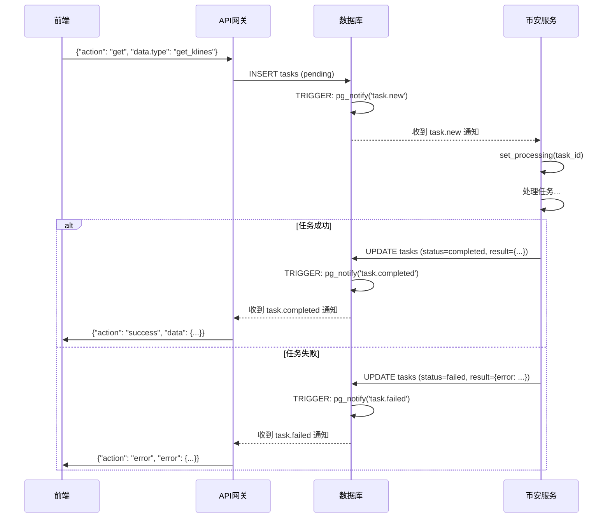
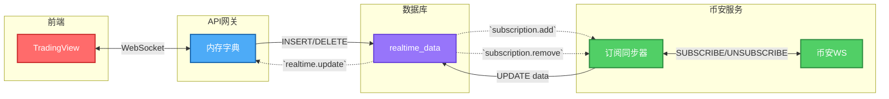
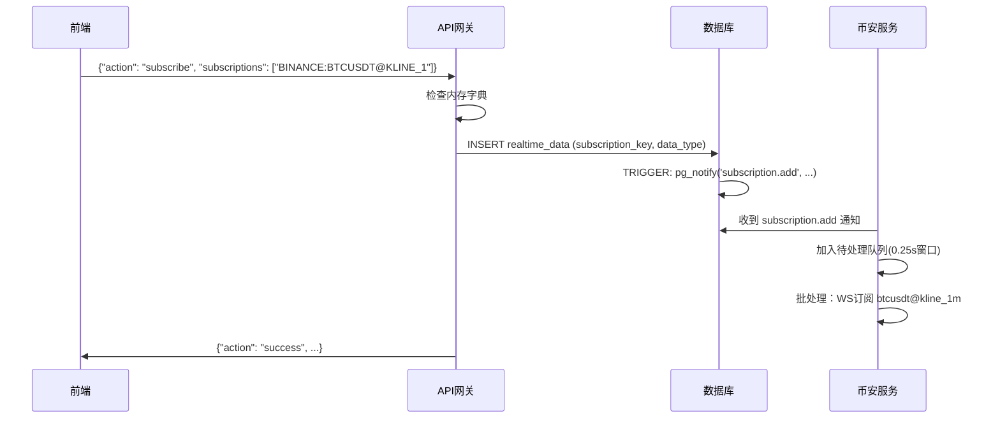
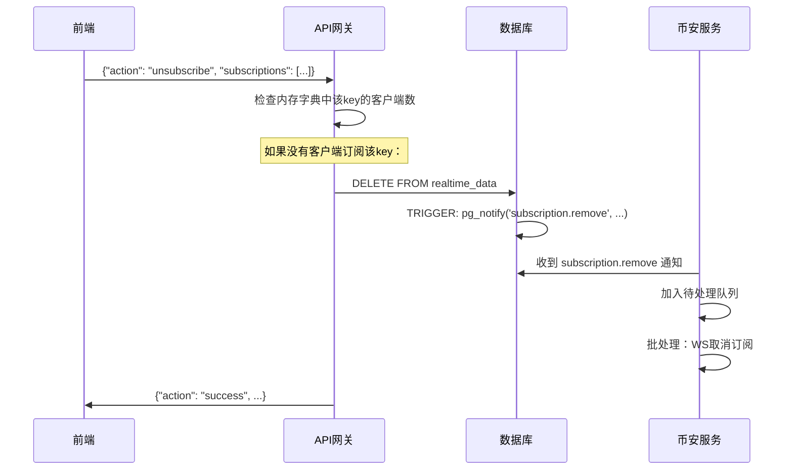
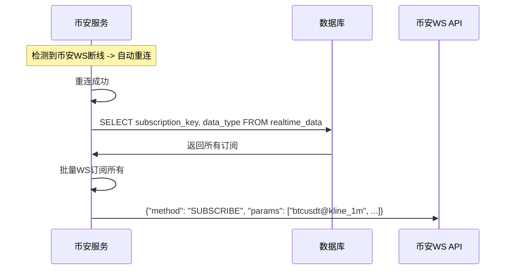
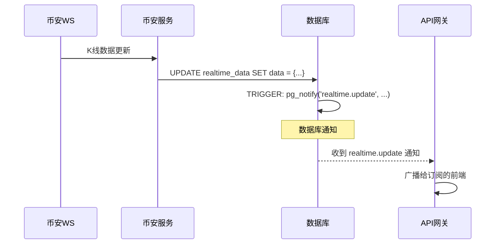
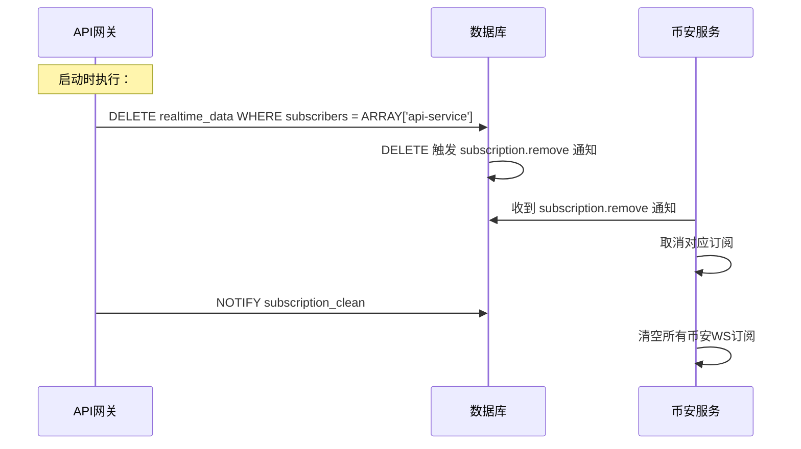
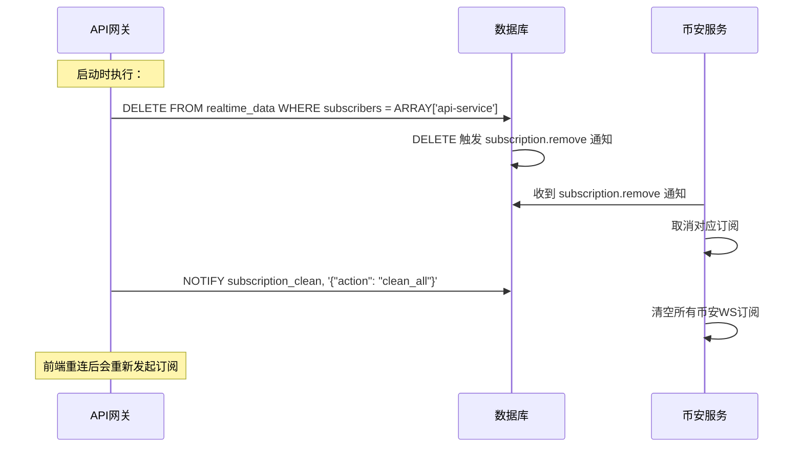

# 任务与订阅管理

## 1. 设计背景

系统区分两种不同类型的数据交互：

| 类型 | 特点 | 处理方式 |
|------|------|----------|
| **一次性请求** | 前端发起一次请求，获取一次响应 | 通过 `action: "get"` + `data.type` 格式，放入 `tasks` 表 |
| **持续订阅** | 前端订阅后持续接收更新 | 通过 `realtime_data` 表 + 触发器管理 |

**一次性请求包括**：
- K线历史数据
- 实时报价
- 服务器时间
- 账户信息（现货/期货）

**API网关直接查询**（不生成任务）：
- 交易对搜索/解析

**持续订阅包括**：
- K线实时更新
- 报价实时更新
- 成交实时更新

## 2. 核心数据模型

### 2.1 tasks 任务表

用于处理一次性请求，通过数据库触发器实现任务通知。

```sql
-- tasks 任务表（用于触发通知，结果内嵌）
CREATE TABLE IF NOT EXISTS tasks (
    id              BIGSERIAL PRIMARY KEY,
    type            VARCHAR(50) NOT NULL,        -- 任务类型：get_klines, get_server_time, get_quotes
    payload         JSONB NOT NULL DEFAULT '{}', -- 任务参数
    result          JSONB,                       -- 结果数据（币安服务填写）
    status          VARCHAR(20) NOT NULL DEFAULT 'pending', -- pending, processing, completed
    created_at      TIMESTAMPTZ DEFAULT NOW(),
    updated_at      TIMESTAMPTZ DEFAULT NOW()
);

-- 转换为 TimescaleDB Hypertable
SELECT create_hypertable('tasks', 'created_at');

-- 索引
CREATE INDEX IF NOT EXISTS idx_tasks_type ON tasks (type);
CREATE INDEX IF NOT EXISTS idx_tasks_status ON tasks (status);
CREATE INDEX IF NOT EXISTS idx_tasks_created ON tasks (created_at DESC);
```

**状态流转**：
- `pending`：任务创建，等待处理
- `processing`：币安服务正在处理
- `completed`：处理完成，结果已填入 `result` 字段
- `failed`：处理失败，`result` 字段包含错误信息

#### 2.1.1 统一通知格式

所有数据库通知采用统一的包装格式，便于消费者统一处理：

```json
{
    "event_id": "0189a1b3-c4d5-6e7f-8901-bcde23456789",
    "event_type": "task.new",
    "timestamp": "2026-02-05T10:30:00Z",
    "data": {
        "id": 12345,
        "type": "get_klines",
        "payload": {
            "symbol": "BINANCE:BTCUSUSDT",
            "interval": "60",
            "from_time": 1703123456000,
            "to_time": 1703209856000
        },
        "status": "pending",
        "created_at": "2026-02-05T10:30:00Z"
    }
}
```

**字段说明**：
- `event_id`：全局唯一事件ID（UUIDv7），用于事件追踪和幂等去重
- `event_type`：事件类型，采用 `{资源}.{操作}` 命名风格（如 `task.new`、`subscription.add`）
- `timestamp`：事件发生时间（ISO 8601 格式）
- `data`：业务数据，包含触发通知的表记录字段

**task.completed 通知**：UPDATE status=completed 时触发，通知 API 网关任务完成

```json
{
    "event_id": "0189a1b3-c4d5-6e7f-8901-bcde2345678a",
    "event_type": "task.completed",
    "timestamp": "2026-02-05T10:30:05Z",
    "data": {
        "id": 12345,
        "type": "get_klines",
        "payload": {
            "symbol": "BTCUSDT",
            "interval": "1",
            "from_time": 1700000000000,
            "to_time": 1700001000000,
            "requestId": "req_1700123456789_001"
        },
        "result": null,
        "status": "completed",
        "updated_at": "2026-02-05T10:30:05Z"
    }
}
```

> **说明**：
> - `payload`：包含原始请求参数和 `requestId`，API 网关无需再查询数据库
> - `result`：任务执行结果
>   - `get_klines` 任务为 `null`（数据已写入 `klines_history` 表）
>   - 其他任务类型包含实际结果（如 `get_server_time`、`get_quotes`）

**task.failed 通知**：UPDATE status=failed 时触发，通知 API 网关任务失败

```json
{
    "event_id": "0189a1b3-c4d5-6e7f-8901-bcde2345678b",
    "event_type": "task.failed",
    "timestamp": "2026-02-05T10:30:05Z",
    "data": {
        "id": 12345,
        "type": "get_klines",
        "payload": {
            "symbol": "BTCUSDT",
            "interval": "1",
            "requestId": "req_1700123456789_001"
        },
        "result": {
            "error": "Binance API error",
            "code": -1102,
            "message": "Mandatory parameter 'symbol' was not sent, was empty/null, or malformed."
        },
        "status": "failed",
        "updated_at": "2026-02-05T10:30:05Z"
    }
}
```

> **失败处理说明**：
> - `result`：包含错误信息对象 `{error, code, message}`
> - 任务失败后不会重试，需要前端重新发起请求

#### 2.1.2 触发器实现

```sql
-- 任务创建通知（统一包装格式）
CREATE OR REPLACE FUNCTION notify_task_new()
RETURNS TRIGGER AS $$
BEGIN
    PERFORM pg_notify('task.new', jsonb_build_object(
        'event_id', uuidv7()::TEXT,
        'event_type', 'task.new',
        'timestamp', NOW()::TEXT,
        'data', jsonb_build_object(
            'id', NEW.id,
            'type', NEW.type,
            'payload', NEW.payload,
            'status', NEW.status,
            'created_at', NEW.created_at::TEXT
        )
    )::TEXT);
    RETURN NEW;
END;
$$ LANGUAGE plpgsql;

DROP TRIGGER IF EXISTS trigger_task_new ON tasks;
CREATE TRIGGER trigger_task_new
    AFTER INSERT ON tasks
    FOR EACH ROW
    EXECUTE FUNCTION notify_task_new();

-- 任务状态变更通知（统一包装格式）
-- 支持 completed 和 failed 两种状态
-- payload 包含 requestId，result 包含任务结果
CREATE OR REPLACE FUNCTION notify_task_status_change()
RETURNS TRIGGER AS $$
DECLARE
    event_type TEXT;
BEGIN
    -- 确定事件类型
    IF NEW.status = 'completed' THEN
        event_type := 'task.completed';
    ELSIF NEW.status = 'failed' THEN
        event_type := 'task.failed';
    ELSE
        -- 其他状态不发送通知
        RETURN NEW;
    END IF;

    PERFORM pg_notify(event_type, jsonb_build_object(
        'event_id', uuidv7()::TEXT,
        'event_type', event_type,
        'timestamp', NOW()::TEXT,
        'data', jsonb_build_object(
            'id', NEW.id,
            'type', NEW.type,
            'payload', NEW.payload,
            'result', NEW.result,
            'status', NEW.status,
            'updated_at', NEW.updated_at::TEXT
        )
    )::TEXT);
    RETURN NEW;
END;
$$ LANGUAGE plpgsql;

DROP TRIGGER IF EXISTS trigger_task_completed ON tasks;
CREATE TRIGGER trigger_task_completed
    AFTER UPDATE ON tasks
    FOR EACH ROW
    WHEN (OLD.status IS DISTINCT FROM NEW.status AND NEW.status IN ('completed', 'failed'))
    EXECUTE FUNCTION notify_task_status_change();

-- 保留策略（7天）
SELECT add_retention_policy('tasks', INTERVAL '7 days');
```

**设计说明**：
- **状态驱动**：通过 `status` 字段控制任务生命周期
- **结果内嵌**：`result` 字段直接存储执行结果
- **多次通知**：
  - `task.new`：触发任务处理
  - `task.completed`：任务成功完成
  - `task.failed`：任务处理失败

**账户信息任务处理流程**：

```
1. 前端请求账户信息 (get_futures_account / get_spot_account)
2. api-service 创建异步任务 (INSERT tasks)
3. binance-service 监听 task.new 通知
4. binance-service 获取账户信息，写入 account_info 表
5. binance-service 更新 tasks.status = completed (result 为 null)
6. api-service 监听 task.completed 通知
7. api-service 查询 account_info 表，推送给前端
```

> **重要**：账户信息数据量较大（包含持仓、资产列表），无法通过 PostgreSQL NOTIFY 的 8KB payload 传输，因此采用独立表存储 + 完成后查询的方案。

### 2.2 account_info 账户信息表

存储现货/期货账户原始数据，解决 PostgreSQL NOTIFY 8KB payload 限制问题：

```sql
CREATE TABLE IF NOT EXISTS account_info (
    id BIGSERIAL PRIMARY KEY,

    -- 账户类型: SPOT, FUTURES
    account_type VARCHAR(20) NOT NULL,

    -- 原始数据（完整保存，前端自行解析）
    data JSONB NOT NULL,

    -- 币安返回的更新时间
    update_time BIGINT,

    -- 时间戳
    created_at TIMESTAMPTZ DEFAULT NOW(),
    updated_at TIMESTAMPTZ DEFAULT NOW(),

    -- 唯一约束（每个账户类型只有一条记录）
    UNIQUE(account_type)
);

CREATE INDEX IF NOT EXISTS idx_account_info_type ON account_info (account_type);
```

**设计说明**：
- **数据一致性**：binance-service 先写入 account_info 表，再更新 tasks.status = completed
- **覆盖更新**：使用 `INSERT ... ON CONFLICT (account_type) DO UPDATE` 实现覆盖更新
- **简化处理**：表中保存原始数据，前端自行解析处理
- **无触发器**：账户信息表暂无触发器，由 binance-service 负责写入

### 2.3 klines_history K线历史表

扁平化K线历史数据表，用于长期存储已闭合的K线数据：

```sql
CREATE TABLE IF NOT EXISTS klines_history (
    id BIGSERIAL PRIMARY KEY,

    -- 扁平化K线字段（查询速度优先）
    symbol VARCHAR(50) NOT NULL,      -- 格式：BINANCE:BNBUSDT, BINANCE:BTCUSDT.PERP
    interval TEXT NOT NULL,           -- 格式：1, 5, 15, 60, 240, D, W, M
    open_time TIMESTAMPTZ NOT NULL,
    close_time TIMESTAMPTZ NOT NULL,
    open_price NUMERIC(24,12) NOT NULL,
    high_price NUMERIC(24,12) NOT NULL,
    low_price NUMERIC(24,12) NOT NULL,
    close_price NUMERIC(24,12) NOT NULL,
    volume NUMERIC(24,12) NOT NULL,
    quote_volume NUMERIC(24,12) NOT NULL,
    number_of_trades INTEGER NOT NULL,
    taker_buy_base_volume NUMERIC(24,12) NOT NULL,
    taker_buy_quote_volume NUMERIC(24,12) NOT NULL,
    created_at TIMESTAMPTZ DEFAULT NOW(),

    CONSTRAINT uk_klines_history UNIQUE (symbol, open_time, interval)
);

SELECT create_hypertable('klines_history', 'open_time');
CREATE INDEX IF NOT EXISTS idx_klines_history_symbol_time
    ON klines_history (symbol, open_time DESC);
CREATE INDEX IF NOT EXISTS idx_klines_history_interval
    ON klines_history (interval);
```

**数据来源**：
1. **实时K线**：通过 `realtime_data` 表上的 `trigger_archive_closed_kline` 触发器自动归档，当K线闭合时自动写入此表
2. **历史K线**：`get_klines` 任务直接写入 `klines_history` 表

**字段格式说明**：
- `symbol`: 交易所前缀+交易对符号，支持永续合约（.PERP后缀）
  - 示例：`BINANCE:BNBUSDT`, `BINANCE:BTCUSDT`, `BINANCE:BTCUSDT.PERP`
- `interval`: K线周期，支持分钟、小时、天等单位
  - 示例：1, 5, 15, 60, 240, D, W, M

### 2.4 realtime_data 实时数据表

**设计说明**：
- **状态表设计**：`realtime_data` 是状态表，每个 `subscription_key` 只有一条记录
- **非 TimescaleDB 超表**：因为是状态表，不需要时间分区，使用简单 UNIQUE 约束
- **订阅源数组**：`subscribers` 字段追踪多个服务的订阅状态

```sql
CREATE TABLE IF NOT EXISTS realtime_data (
    id BIGSERIAL PRIMARY KEY,

    -- 订阅键格式：{EXCHANGE}:{SYMBOL}[.{产品后缀}]@{DATA_TYPE}[_{INTERVAL}]
    -- 示例：BINANCE:BTCUSDT@KLINE_1m, BINANCE:BTCUSDT@QUOTES
    -- 注意：interval 使用 TradingView 官方格式（1, 5, 15, 60, 240, D, W, M）
    subscription_key VARCHAR(255) NOT NULL UNIQUE,

    -- 数据类型
    data_type VARCHAR(50) NOT NULL,  -- KLINE, QUOTES, TRADE

    -- 具体数据（格式由币安服务决定）
    data JSONB NOT NULL,

    -- 事件时间
    event_time TIMESTAMPTZ,

    -- 订阅源数组（用于区分不同服务的订阅）
    -- 例如：ARRAY['api-service'] 或 ARRAY['api-service', 'signal-service']
    subscribers TEXT[] DEFAULT '{}',

    -- 时间戳
    created_at TIMESTAMPTZ DEFAULT NOW(),
    updated_at TIMESTAMPTZ DEFAULT NOW()
);

-- 索引
CREATE INDEX IF NOT EXISTS idx_realtime_data_data_type ON realtime_data (data_type);
CREATE INDEX IF NOT EXISTS idx_realtime_data_subscribers ON realtime_data USING GIN (subscribers);
CREATE INDEX IF NOT EXISTS idx_realtime_data_updated ON realtime_data (updated_at DESC);
```

#### 2.3.1 subscribers 订阅源字段设计

**设计背景**：当多个服务（api-service、signal-service）都需要订阅同一数据时，需要区分订阅来源，避免：
- api-service 重启时删除 signal-service 创建的订阅
- 取消订阅时无法精确控制删除范围

**订阅源标识**：
| 标识 | 服务 | 说明 |
|------|------|------|
| `api-service` | API 网关 | 处理前端订阅请求 |
| `signal-service` | 信号服务 | 订阅K线数据用于策略计算 |

**操作语义**：
```sql
-- 添加订阅（指定订阅源）
-- 使用 ON CONFLICT DO UPDATE 实现 UPSERT，确保同一 subscription_key 只有一行
INSERT INTO realtime_data (subscription_key, data_type, data, subscribers)
VALUES ('BINANCE:BTCUSDT@KLINE_1m', 'KLINE', '{}'::jsonb, ARRAY['api-service'])
ON CONFLICT (subscription_key)
DO UPDATE SET subscribers = ARRAY_APPEND(realtime_data.subscribers, 'api-service');

-- 移除指定订阅源
UPDATE realtime_data
SET subscribers = ARRAY_REMOVE(subscribers, 'api-service')
WHERE subscription_key = 'BINANCE:BTCUSDT@KLINE_1m';

-- 如果订阅源列表为空，删除数据行
DELETE FROM realtime_data WHERE subscription_key = '...'
  AND (subscribers IS NULL OR cardinality(subscribers) = 0);

-- 只清理 api-service 的订阅（保留其他服务的）
DELETE FROM realtime_data WHERE subscribers = ARRAY['api-service'];
```

#### 2.3.2 通知设计

| 操作 | 触发器 | 通知频道 | 接收者 | 通知内容 |
|------|--------|----------|--------|----------|
| INSERT | AFTER INSERT | `subscription.add` | 币安服务 | subscription_key, data_type |
| UPDATE data | AFTER UPDATE | `realtime.update` | API 网关 | subscription_key, data, event_time |
| DELETE | AFTER DELETE | `subscription.remove` | 币安服务 | subscription_key, data_type |
| DELETE (cleanup) | AFTER DELETE | `subscription.remove` | 币安服务 | subscription_key, data_type |

#### 2.3.3 触发器实现

> **设计原则**：INSERT 时只发送 `subscription.add` 通知，不发送 `realtime.update` 通知。
> 原因：INSERT 时 `data` 字段为空对象 `{}`，推送空数据给客户端没有意义。
> `realtime.update` 只在 UPDATE 时发送（当数据实际变化时）。

```sql
-- INSERT：通知币安服务新增订阅（统一包装格式）
-- 注意：INSERT 时只发送 subscription.add 通知，不发送 realtime.update
CREATE OR REPLACE FUNCTION notify_subscription_add()
RETURNS TRIGGER AS $$
BEGIN
    PERFORM pg_notify('subscription.add', jsonb_build_object(
        'event_id', uuidv7()::TEXT,
        'event_type', 'subscription.add',
        'timestamp', NOW()::TEXT,
        'data', jsonb_build_object(
            'subscription_key', NEW.subscription_key,
            'data_type', NEW.data_type,
            'created_at', NOW()::TEXT
        )
    )::TEXT);
    RETURN NEW;
END;
$$ LANGUAGE plpgsql;

DROP TRIGGER IF EXISTS trigger_realtime_data_add ON realtime_data;
CREATE TRIGGER trigger_realtime_data_add
    AFTER INSERT ON realtime_data
    FOR EACH ROW
    EXECUTE FUNCTION notify_subscription_add();

-- UPDATE：通知 API 网关数据更新（使用 WHEN 条件过滤）
CREATE OR REPLACE FUNCTION notify_realtime_update()
RETURNS TRIGGER AS $$
BEGIN
    PERFORM pg_notify('realtime.update', jsonb_build_object(
        'event_id', uuidv7()::TEXT,
        'event_type', 'realtime.update',
        'timestamp', NOW()::TEXT,
        'data', jsonb_build_object(
            'subscription_key', NEW.subscription_key,
            'data_type', NEW.data_type,
            'data', NEW.data,
            'event_time', NEW.event_time::TEXT
        )
    )::TEXT);
    RETURN NEW;
END;
$$ LANGUAGE plpgsql;

DROP TRIGGER IF EXISTS trigger_realtime_data_update ON realtime_data;
CREATE TRIGGER trigger_realtime_data_update
    AFTER UPDATE ON realtime_data
    FOR EACH ROW
    WHEN (OLD.data IS DISTINCT FROM NEW.data)
    EXECUTE FUNCTION notify_realtime_update();

-- DELETE：通知币安服务取消订阅（统一包装格式）
CREATE OR REPLACE FUNCTION notify_subscription_remove()
RETURNS TRIGGER AS $$
BEGIN
    PERFORM pg_notify('subscription.remove', jsonb_build_object(
        'event_id', uuidv7()::TEXT,
        'event_type', 'subscription.remove',
        'timestamp', NOW()::TEXT,
        'data', jsonb_build_object(
            'subscription_key', OLD.subscription_key,
            'data_type', OLD.data_type,
            'created_at', NOW()::TEXT
        )
    )::TEXT);
    RETURN OLD;
END;
$$ LANGUAGE plpgsql;

DROP TRIGGER IF EXISTS trigger_realtime_data_remove ON realtime_data;
CREATE TRIGGER trigger_realtime_data_remove
    AFTER DELETE ON realtime_data
    FOR EACH ROW
    EXECUTE FUNCTION notify_subscription_remove();

-- TRUNCATE：通知币安服务清空所有订阅（API网关重启时）（统一包装格式）
CREATE OR REPLACE FUNCTION notify_subscription_clean()
RETURNS TRIGGER AS $$
BEGIN
    PERFORM pg_notify('subscription.clean', jsonb_build_object(
        'event_id', uuidv7()::TEXT,
        'event_type', 'subscription.clean',
        'timestamp', NOW()::TEXT,
        'data', jsonb_build_object(
            'action', 'clean_all'
        )
    )::TEXT);
    RETURN NULL;
END;
$$ LANGUAGE plpgsql;

DROP TRIGGER IF EXISTS trigger_realtime_data_clean ON realtime_data;
CREATE TRIGGER trigger_realtime_data_clean
    AFTER TRUNCATE ON realtime_data
    FOR EACH STATEMENT
    EXECUTE FUNCTION notify_subscription_clean();

-- 归档已关闭的K线数据（实时K线数据更准确，有冲突时更新）
CREATE OR REPLACE FUNCTION archive_closed_kline()
RETURNS TRIGGER AS $$
BEGIN
    IF NEW.data_type = 'KLINE' AND (NEW.data->'k'->>'x')::boolean = true THEN
        INSERT INTO klines_history (
            symbol, interval,
            open_time, close_time,
            open_price, high_price, low_price, close_price,
            volume, quote_volume, number_of_trades,
            taker_buy_base_volume, taker_buy_quote_volume
        )
        VALUES (
            'BINANCE:' || (NEW.data->>'s'),                                    -- symbol: 需添加"BINANCE:"前缀
            CASE (NEW.data->'k'->>'i')
                WHEN '1m' THEN '1'
                WHEN '3m' THEN '3'
                WHEN '5m' THEN '5'
                WHEN '15m' THEN '15'
                WHEN '30m' THEN '30'
                WHEN '1h' THEN '60'
                WHEN '2h' THEN '120'
                WHEN '4h' THEN '240'
                WHEN '6h' THEN '360'
                WHEN '8h' THEN '480'
                WHEN '12h' THEN '720'
                WHEN '1d' THEN '1D'
                WHEN '3d' THEN '3D'
                WHEN '1w' THEN '1W'
                WHEN '1M' THEN '1M'
                ELSE (NEW.data->'k'->>'i')
            END,                                                                  -- interval: 转换为TV格式
            to_timestamp((NEW.data->'k'->>'t')::bigint / 1000),             -- open_time (毫秒转秒)
            to_timestamp((NEW.data->'k'->>'T')::bigint / 1000),             -- close_time (毫秒转秒)
            (NEW.data->'k'->>'o')::numeric,                                  -- open_price
            (NEW.data->'k'->>'h')::numeric,                                   -- high_price
            (NEW.data->'k'->>'l')::numeric,                                  -- low_price
            (NEW.data->'k'->>'c')::numeric,                                   -- close_price
            (NEW.data->'k'->>'v')::numeric,                                  -- volume
            (NEW.data->'k'->>'q')::numeric,                                  -- quote_volume
            (NEW.data->'k'->>'n')::integer,                                  -- number_of_trades
            (NEW.data->'k'->>'V')::numeric,                                  -- taker_buy_base_volume
            (NEW.data->'k'->>'Q')::numeric                                   -- taker_buy_quote_volume
        )
        ON CONFLICT (symbol, open_time, interval) DO UPDATE SET
            close_time = EXCLUDED.close_time,
            open_price = EXCLUDED.open_price,
            high_price = EXCLUDED.high_price,
            low_price = EXCLUDED.low_price,
            close_price = EXCLUDED.close_price,
            volume = EXCLUDED.volume,
            quote_volume = EXCLUDED.quote_volume,
            number_of_trades = EXCLUDED.number_of_trades,
            taker_buy_base_volume = EXCLUDED.taker_buy_base_volume,
            taker_buy_quote_volume = EXCLUDED.taker_buy_quote_volume;
    END IF;
    RETURN NEW;
END;
$$ LANGUAGE plpgsql;

DROP TRIGGER IF EXISTS trigger_archive_closed_kline ON realtime_data;
CREATE TRIGGER trigger_archive_closed_kline
    AFTER UPDATE ON realtime_data
    FOR EACH ROW
    WHEN (NEW.data_type = 'KLINE' AND (NEW.data->'k'->>'x')::boolean = true)
    EXECUTE FUNCTION archive_closed_kline();
```

#### 2.3.4 数据类型与订阅键映射

| data_type | subscription_key 示例 |
|-----------|----------------------|
| `KLINE` | `BINANCE:BTCUSDT@KLINE_1` |
| `QUOTES` | `BINANCE:BTCUSDT@QUOTES` |
| `TRADE` | `BINANCE:BTCUSDT@TRADE` |

### 2.5 exchange_info 交易所信息表

```sql
CREATE TABLE IF NOT EXISTS exchange_info (
    id BIGSERIAL PRIMARY KEY,

    -- 基本信息
    exchange VARCHAR(50) NOT NULL DEFAULT 'BINANCE',
    market_type VARCHAR(20) NOT NULL,           -- SPOT, FUTURES
    symbol VARCHAR(50) NOT NULL,                -- symbol
    base_asset VARCHAR(20) NOT NULL,            -- baseAsset
    quote_asset VARCHAR(20) NOT NULL,           -- quoteAsset
    status VARCHAR(20) NOT NULL DEFAULT 'TRADING',  -- status

    -- 精度信息（基于币安API完整字段）
    base_asset_precision INTEGER NOT NULL DEFAULT 8,         -- baseAssetPrecision
    quote_precision INTEGER NOT NULL DEFAULT 8,              -- quotePrecision
    quote_asset_precision INTEGER NOT NULL DEFAULT 8,        -- quoteAssetPrecision
    base_commission_precision INTEGER NOT NULL DEFAULT 8,    -- baseCommissionPrecision
    quote_commission_precision INTEGER NOT NULL DEFAULT 8,  -- quoteCommissionPrecision

    -- 交易规则过滤器
    filters JSONB NOT NULL DEFAULT '{}',        -- filters

    -- 交易选项
    order_types JSONB NOT NULL DEFAULT '[]',    -- orderTypes
    permissions JSONB NOT NULL DEFAULT '[]',   -- permissions

    -- 特殊选项（基于币安API字段）
    iceberg_allowed BOOLEAN NOT NULL DEFAULT FALSE,            -- icebergAllowed
    oco_allowed BOOLEAN NOT NULL DEFAULT FALSE,               -- ocoAllowed
    oto_allowed BOOLEAN NOT NULL DEFAULT FALSE,              -- otoAllowed
    opo_allowed BOOLEAN NOT NULL DEFAULT FALSE,              -- opoAllowed
    quote_order_qty_market_allowed BOOLEAN NOT NULL DEFAULT FALSE,  -- quoteOrderQtyMarketAllowed
    allow_trailing_stop BOOLEAN NOT NULL DEFAULT FALSE,      -- allowTrailingStop
    cancel_replace_allowed BOOLEAN NOT NULL DEFAULT FALSE,   -- cancelReplaceAllowed
    amend_allowed BOOLEAN NOT NULL DEFAULT FALSE,            -- amendAllowed
    peg_instructions_allowed BOOLEAN NOT NULL DEFAULT FALSE, -- pegInstructionsAllowed

    -- 交易权限（基于币安API字段）
    is_spot_trading_allowed BOOLEAN NOT NULL DEFAULT TRUE,       -- isSpotTradingAllowed
    is_margin_trading_allowed BOOLEAN NOT NULL DEFAULT FALSE,     -- isMarginTradingAllowed

    -- 权限管理（基于币安API字段）
    permission_sets JSONB NOT NULL DEFAULT '[]',  -- permissionSets

    -- 自成交防护（基于币安API字段）
    default_self_trade_prevention_mode VARCHAR NOT NULL DEFAULT 'NONE',  -- defaultSelfTradePreventionMode
    allowed_self_trade_prevention_modes JSONB NOT NULL DEFAULT '[]',  -- allowedSelfTradePreventionModes

    -- 更新时间
    last_updated TIMESTAMPTZ DEFAULT NOW(),

    -- 唯一约束
    CONSTRAINT uk_exchange_info UNIQUE (exchange, market_type, symbol)
);

CREATE INDEX IF NOT EXISTS idx_exchange_info_symbol ON exchange_info (symbol);
CREATE INDEX IF NOT EXISTS idx_exchange_info_market ON exchange_info (market_type);
```

#### 2.4.1 交易所信息同步策略

交易所信息采用**全量替换**模式，确保数据库中的信息与币安API完全同步。

**upsert_exchange_info() 存储过程**：
```sql
CREATE OR REPLACE FUNCTION upsert_exchange_info(
    -- 基本信息
    p_exchange VARCHAR,
    p_market_type VARCHAR,
    p_symbol VARCHAR,
    p_base_asset VARCHAR,
    p_quote_asset VARCHAR,
    p_status VARCHAR,

    -- 精度信息（基于币安API字段）
    p_base_asset_precision INTEGER DEFAULT 8,
    p_quote_precision INTEGER DEFAULT 8,
    p_quote_asset_precision INTEGER DEFAULT 8,
    p_base_commission_precision INTEGER DEFAULT 8,
    p_quote_commission_precision INTEGER DEFAULT 8,

    -- 交易规则过滤器
    p_filters JSONB,

    -- 交易选项
    p_order_types JSONB,
    p_permissions JSONB,

    -- 特殊选项（基于币安API字段）
    p_iceberg_allowed BOOLEAN DEFAULT FALSE,
    p_oco_allowed BOOLEAN DEFAULT FALSE,
    p_oto_allowed BOOLEAN DEFAULT FALSE,
    p_opo_allowed BOOLEAN DEFAULT FALSE,
    p_quote_order_qty_market_allowed BOOLEAN DEFAULT FALSE,
    p_allow_trailing_stop BOOLEAN DEFAULT FALSE,
    p_cancel_replace_allowed BOOLEAN DEFAULT FALSE,
    p_amend_allowed BOOLEAN DEFAULT FALSE,
    p_peg_instructions_allowed BOOLEAN DEFAULT FALSE,

    -- 交易权限（基于币安API字段）
    p_is_spot_trading_allowed BOOLEAN DEFAULT TRUE,
    p_is_margin_trading_allowed BOOLEAN DEFAULT FALSE,

    -- 权限管理（基于币安API字段）
    p_permission_sets JSONB DEFAULT '[]',

    -- 自成交防护（基于币安API字段）
    p_default_self_trade_prevention_mode VARCHAR DEFAULT 'NONE',
    p_allowed_self_trade_prevention_modes JSONB DEFAULT '[]'
) RETURNS BIGINT AS $$
DECLARE
    v_id BIGINT;
BEGIN
    INSERT INTO exchange_info (
        exchange, market_type, symbol, base_asset, quote_asset, status,
        base_asset_precision, quote_precision, quote_asset_precision,
        base_commission_precision, quote_commission_precision,
        filters, order_types, permissions,
        iceberg_allowed, oco_allowed, oto_allowed, opo_allowed,
        quote_order_qty_market_allowed, allow_trailing_stop,
        cancel_replace_allowed, amend_allowed, peg_instructions_allowed,
        is_spot_trading_allowed, is_margin_trading_allowed,
        permission_sets,
        default_self_trade_prevention_mode, allowed_self_trade_prevention_modes,
        last_updated
    ) VALUES (
        p_exchange, p_market_type, p_symbol, p_base_asset, p_quote_asset, p_status,
        COALESCE(p_base_asset_precision, 8), COALESCE(p_quote_precision, 8),
        COALESCE(p_quote_asset_precision, 8), COALESCE(p_base_commission_precision, 8),
        COALESCE(p_quote_commission_precision, 8),
        p_filters, p_order_types, p_permissions,
        p_iceberg_allowed, p_oco_allowed, p_oto_allowed, p_opo_allowed,
        p_quote_order_qty_market_allowed, p_allow_trailing_stop,
        p_cancel_replace_allowed, p_amend_allowed, p_peg_instructions_allowed,
        p_is_spot_trading_allowed, p_is_margin_trading_allowed,
        p_permission_sets,
        p_default_self_trade_prevention_mode, p_allowed_self_trade_prevention_modes,
        NOW()
    )
    ON CONFLICT (exchange, market_type, symbol) DO UPDATE SET
        base_asset = p_base_asset,
        quote_asset = p_quote_asset,
        status = p_status,
        -- 更新所有字段
        base_asset_precision = COALESCE(p_base_asset_precision, 8),
        quote_precision = COALESCE(p_quote_precision, 8),
        quote_asset_precision = COALESCE(p_quote_asset_precision, 8),
        base_commission_precision = COALESCE(p_base_commission_precision, 8),
        quote_commission_precision = COALESCE(p_quote_commission_precision, 8),
        filters = p_filters,
        order_types = p_order_types,
        permissions = p_permissions,
        iceberg_allowed = p_iceberg_allowed,
        oco_allowed = p_oco_allowed,
        oto_allowed = p_oto_allowed,
        opo_allowed = p_opo_allowed,
        quote_order_qty_market_allowed = p_quote_order_qty_market_allowed,
        allow_trailing_stop = p_allow_trailing_stop,
        cancel_replace_allowed = p_cancel_replace_allowed,
        amend_allowed = p_amend_allowed,
        peg_instructions_allowed = p_peg_instructions_allowed,
        is_spot_trading_allowed = p_is_spot_trading_allowed,
        is_margin_trading_allowed = p_is_margin_trading_allowed,
        permission_sets = p_permission_sets,
        default_self_trade_prevention_mode = p_default_self_trade_prevention_mode,
        allowed_self_trade_prevention_modes = p_allowed_self_trade_prevention_modes,
        last_updated = NOW()
    RETURNING id INTO v_id;

    RETURN v_id;
END;
$$ LANGUAGE plpgsql;
```

**对比：增量更新 vs 全量替换**：

| 特性 | 增量更新 | 全量替换 |
|------|----------|----------|
| 数据一致性 | 可能保留过期数据 | 完全同步 |
| 数据清理 | 需要手动清理 | 自动清理 |
| 性能开销 | 较低 | 较高 |
| 适用规模 | 数万级交易对 | 数千级交易对 |
| 实现复杂度 | 简单 | 简单 |

## 3. 一次性请求设计

### 3.1 payload 负载格式

```json
// get_klines
{
    "symbol": "BINANCE:BTCUSDT",
    "interval": "60",
    "from_time": 1703123456000,
    "to_time": 1703209856000,
    "requestId": "req_1703123456789_004"
}

// get_server_time
{
    "requestId": "req_1703123456789_005"
}

// get_quotes
{
    "symbols": ["BINANCE:BTCUSDT", "BINANCE:ETHUSDT"],
    "requestId": "req_1703123456789_006"
}
```

> **说明**: `requestId` 由前端生成，用于三阶段模式中关联请求和响应。所有请求类型都必须包含 requestId。

| 字段 | 类型 | 说明 |
|------|------|------|
| `requestId` | string | 请求ID（前端生成，用于关联 ack/response） |
| `symbol` | string | 交易对符号（get_klines必填） |
| `interval` | string | K线周期：1, 5, 15, 60, 240, 1D 等（get_klines必填，与数据库字段一致） |
| `from_time` | int | 起始时间戳（毫秒，get_klines可选） |
| `to_time` | int | 结束时间戳（毫秒，get_klines可选） |
| `symbols` | string[] | 交易对列表（get_quotes必填） |

### 3.2 任务类型分类

| type | payload 字段 | 说明 |
|------|-------------|------|
| `get_klines` | `symbol`, `interval`, `from_time`, `to_time` | K线数据 |
| `get_server_time` | - | 服务器时间 |
| `get_quotes` | `symbols` | 报价数据 |
| `get_futures_account` | - | 期货账户信息 |
| `get_spot_account` | - | 现货账户信息 |

### 3.3 任务处理分类

> **重要**：所有请求类型都遵循"先返回 ack，确认收到请求"的原则。

| type | 数据源 | 处理流程 |
|------|--------|----------|
| `get_config` | 硬编码 | 收到请求 -> ack -> 返回 success |
| `get_search_symbols` | exchange_info 表 | 收到请求 -> ack -> 查询 -> 返回 success |
| `get_resolve_symbol` | exchange_info 表 | 收到请求 -> ack -> 查询 -> 返回 success |
| `subscriptions` | API网关内存字典 | 收到请求 -> ack -> 查询 -> 返回 success |
| `get_klines` | tasks表 + 币安服务 | 收到请求 -> ack -> 检查缓存 -> 命中则同步返回，未命中则异步处理后返回 success |
| `get_server_time` | tasks表 + 币安服务 | 收到请求 -> ack -> 异步处理 -> 返回 success |
| `get_quotes` | tasks表 + 币安服务 | 收到请求 -> ack -> 异步处理 -> 返回 success |
| `get_futures_account` | tasks表 + 币安服务 | 收到请求 -> ack -> 异步处理 -> 返回 success |
| `get_spot_account` | tasks表 + 币安服务 | 收到请求 -> ack -> 异步处理 -> 返回 success |

### 3.4 任务失败处理

币安服务在处理任务时，如果发生异常，会调用 `TasksRepository.fail()` 方法将任务状态标记为 `failed`：

```python
# 币安服务任务处理器中的错误处理
async def _handle_get_klines(self, payload: TaskPayload) -> None:
    task_id = payload.task_id

    # 标记任务为处理中
    await self._tasks_repo.set_processing(task_id)

    try:
        # 处理任务...
        result = await self._fetch_klines(...)
        await self._tasks_repo.complete(task_id, result)
    except Exception as e:
        # 任务失败，标记状态为 failed
        await self._tasks_repo.fail(task_id, str(e))
```

**失败处理流程**：



**失败结果格式**：

```json
{
    "error": "Binance API error",
    "code": -1102,
    "message": "Mandatory parameter 'symbol' was not sent, was empty/null, or malformed."
}
```

**失败重试策略**：
- 任务失败后不会自动重试
- 前端需要根据错误信息判断是否重新发起请求
- 某些可恢复错误（如网络超时）可由前端自动重试

### 3.5 账户信息请求格式

账户信息请求遵循标准的任务请求格式，通过 `data.type` 字段区分不同类型。

**支持的账户类型**：
- `get_futures_account` - 获取期货账户信息
- `get_spot_account` - 获取现货账户信息

> **详细协议格式**请参考 [07-websocket-protocol.md](./07-websocket-protocol.md) 中的「获取期货/现货账户信息」章节。

> **注意**：现货账户的 `balances` 字段会过滤掉零余额资产，以避免 PostgreSQL JSONB 字段大小限制（~1MB）。

## 4. 订阅管理设计

### 4.1 设计背景

原有的订阅管理方案存在以下问题：
- API网关和币安服务各自维护内存订阅状态
- 断线重连后无法恢复订阅
- 缺乏统一的状态同步机制

新的设计采用**realtime_data 统一表 + 内存字典 + 通知机制**：



### 4.2 核心组件职责

| 组件 | 职责 |
|------|------|
| **API网关** | 管理内存字典 `subscription_key -> {client_ids}`<br>判断何时新增/删除订阅键<br>INSERT/DELETE `realtime_data` 表<br>**INSERT/DELETE 触发器自动发送通知** |
| **数据库** | 持久化 `realtime_data` 表<br>**INSERT 触发器发送** `subscription.add` 通知<br>**DELETE 触发器发送** `subscription.remove` 通知 |
| **币安服务** | `SubscriptionSync` 监听 `subscription.add`/`subscription.remove`<br>执行币安WS订阅/取消<br>断线重连后主动查询数据库恢复<br>更新 `realtime_data.data` 触发 `realtime.update` 通知 |

### 4.3 订阅类型

订阅通过直接 INSERT/DELETE `realtime_data` 表管理：

**订阅键格式**: `{EXCHANGE}:{SYMBOL}[.{产品后缀}]@{DATA_TYPE}[_{INTERVAL}]`

| 订阅类型 | 订阅键示例 | data_type |
|---------|-----------|-----------|
| KLINE | `BINANCE:BTCUSDT@KLINE_1` | KLINE |
| KLINE（永续） | `BINANCE:BTCUSDT.PERP@KLINE_60` | KLINE |
| QUOTES | `BINANCE:BTCUSDT@QUOTES` | QUOTES |
| TRADE | `BINANCE:BTCUSDT@TRADE` | TRADE |

### 4.4 订阅流程

#### 4.4.1 前端订阅



#### 4.4.2 前端取消订阅



#### 4.4.3 币安客户端断线重连



#### 4.4.4 币安服务推送实时数据



#### 4.4.5 API网关启动



**说明**：API网关启动时会：
1. 精确删除 `api-service` 创建的订阅（`subscribers = ARRAY['api-service']`）
2. 发送 `subscription.clean` 通知给币安服务清空WS连接

**设计优势**：
- 保留 `signal-service` 等其他服务创建的订阅
- 避免误删其他服务的订阅数据
- 前端重连后会重新发起订阅

### 4.5 关键设计决策

| 场景 | 设计决策 |
|------|----------|
| **取消订阅通知** | 从 `subscribers` 数组移除订阅源，如果数组变空则删除行并通知 |
| **API网关启动** | DELETE WHERE `subscribers = ARRAY['api-service']`，发送 `subscription.clean` 通知 |
| **币安重连恢复** | 主动查询 realtime_data 重新订阅 |
| **批处理窗口** | 0.25秒聚合多个订阅请求 |
| **实时数据推送** | UPDATE realtime_data.data 触发 realtime.update 通知 |
| **多服务订阅** | 使用 `subscribers` 数组追踪多个订阅源，避免相互覆盖 |

### 4.6 API网关启动与清理

#### 4.6.1 启动清理流程



**设计说明**：
- **DELETE 而非 TRUNCATE**：精确删除 `api-service` 创建的订阅，保留 `signal-service` 的订阅
- **删除后发送清理通知**：通知币安服务清空所有WS连接，避免残留
- **复合操作**：
  1. `remove_api_service_subscriptions()` - 删除 api-service 的订阅（触发 `subscription.remove`）
  2. `NOTIFY subscription_clean` - 清理币安WS连接

#### 4.6.2 Repository 层实现

```python
class RealtimeDataRepository:
    async def remove_api_service_subscriptions(self) -> int:
        """清理 api-service 创建的所有订阅（保留其他订阅源的数据）"""
        query = """
            DELETE FROM realtime_data
            WHERE subscribers = ARRAY['api-service']
            RETURNING id
        """
        async with self._pool.acquire() as conn:
            rows = await conn.fetch(query)
            return len(rows)
```

#### 4.6.3 SubscriptionManager 层实现

```python
class SubscriptionManager:
    SUBSCRIBER_ID = "api-service"  # 订阅源标识

    async def truncate_and_notify_clean(self) -> None:
        """清空所有订阅并发送clean通知"""
        async with self._lock:
            self._subscriptions.clear()
            self._db_keys.clear()

        # 只删除 api-service 创建的订阅（保留其他服务创建的）
        removed_count = await self._repository.remove_api_service_subscriptions()

        # 发送 clean_all 通知
        await self._publish_clean_notification()

        logger.info(f"已清理 {removed_count} 条 api-service 订阅记录并发送 clean 通知")
```

## 相关文档

- [QUANT_TRADING_SYSTEM_ARCHITECTURE.md](./QUANT_TRADING_SYSTEM_ARCHITECTURE.md) - 完整实施文档
- [02-dataflow.md](./02-dataflow.md) - 数据流设计
- [03-kline-collector.md](./03-kline-collector.md) - K线采集设计
- [04-dataprocessor.md](./04-dataprocessor.md) - DataProcessor设计

---

**版本**：v3.1
**更新**：2026-02-21
