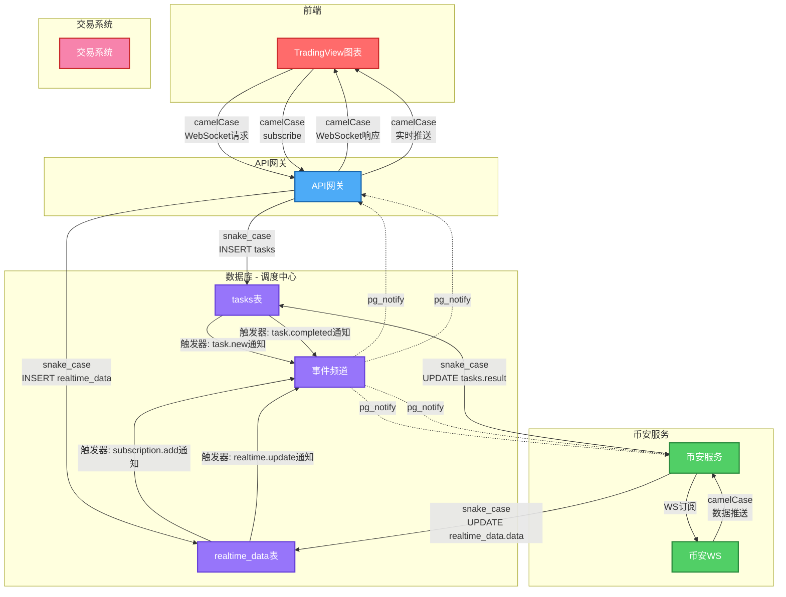
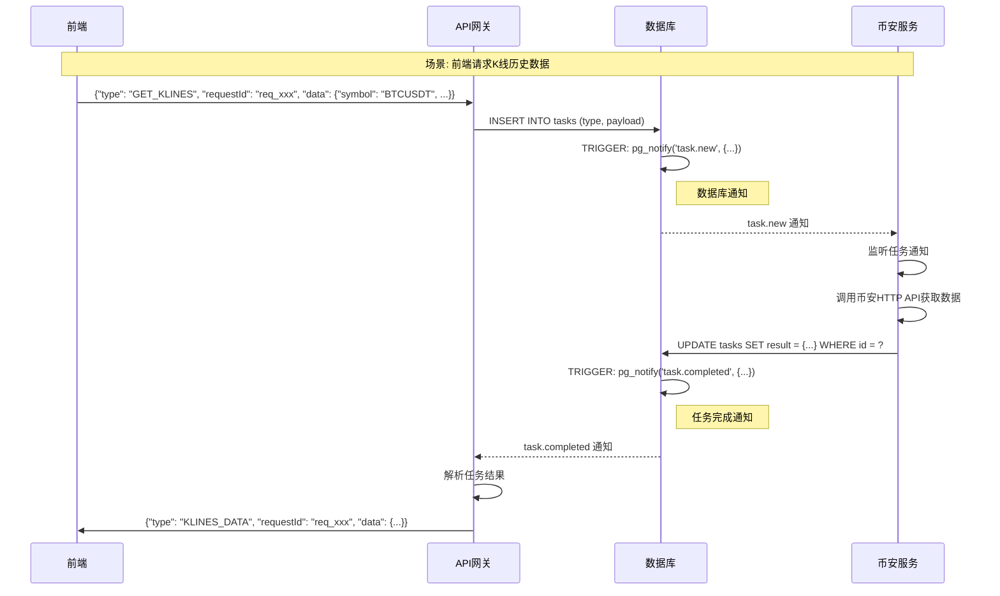
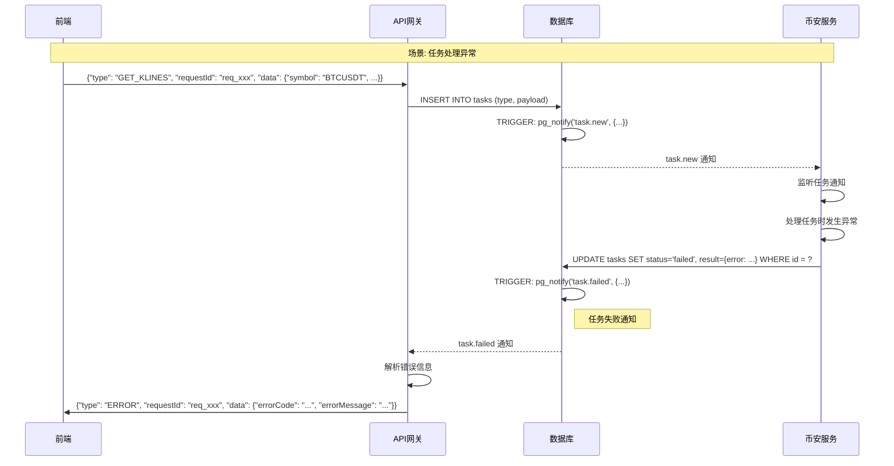
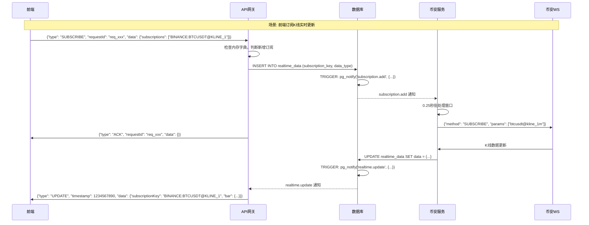
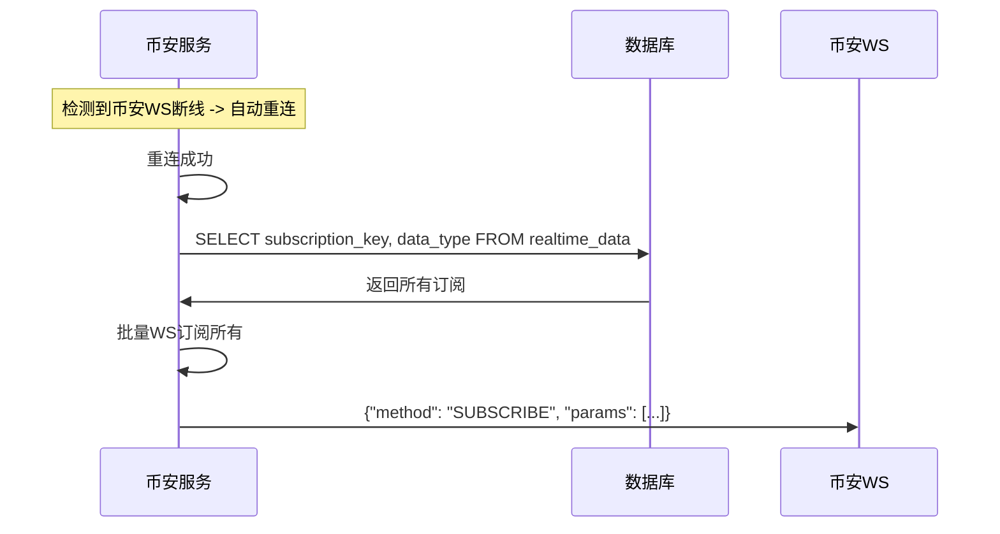
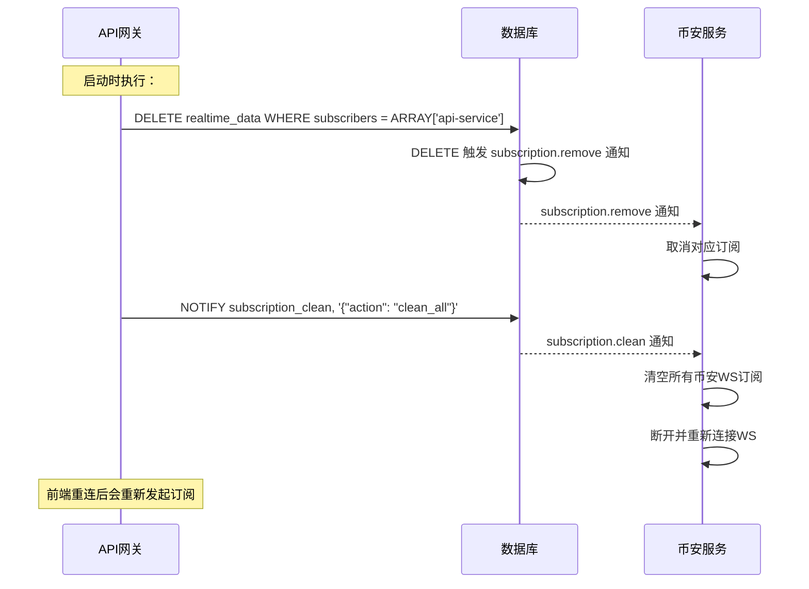
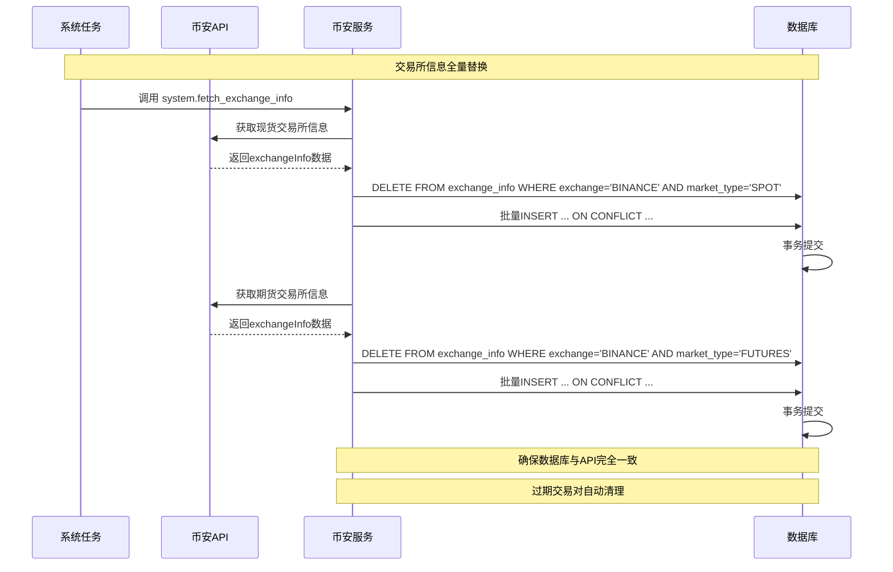
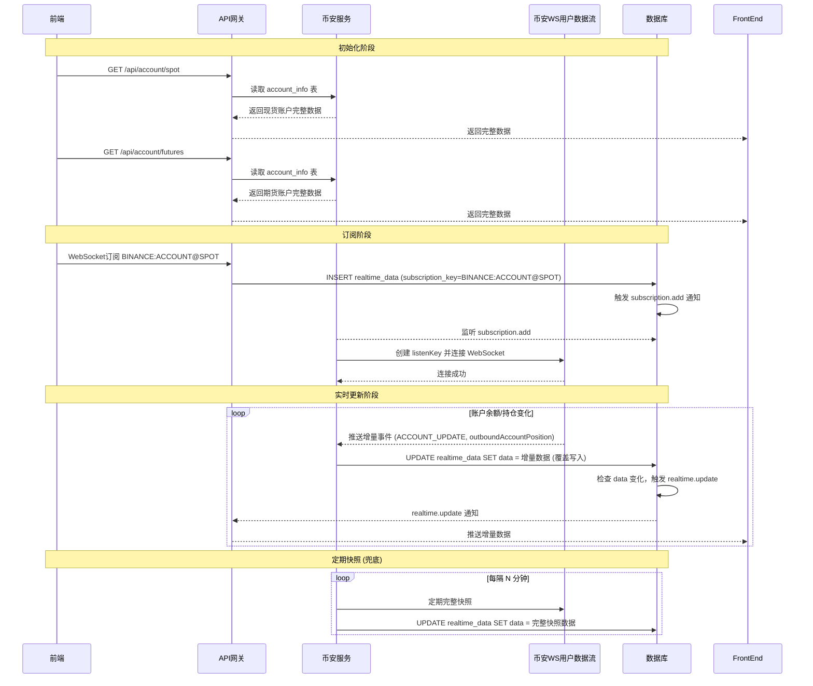
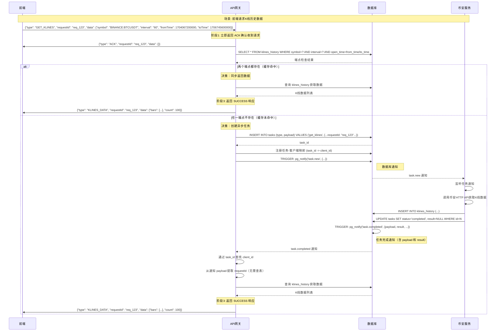
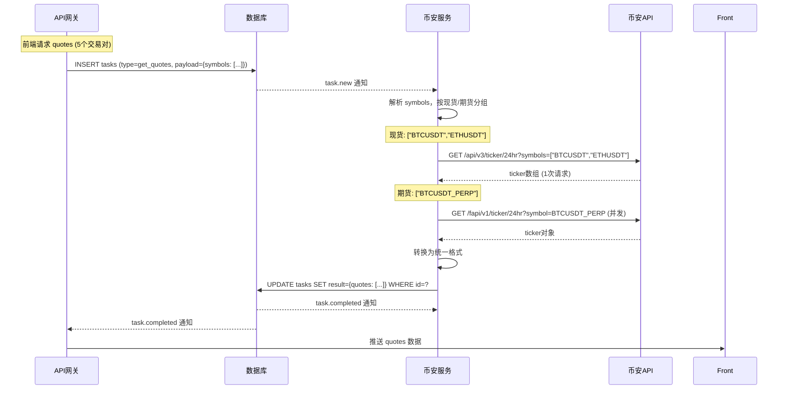

# 数据流设计

## 1. 概述

本文档描述系统中的数据流动路径和事件链机制，遵循 DATABASE_COORDINATED_ARCHITECTURE.md 中定义的 **"数据库即调度中心"** 架构，核心模式为：**写入 -> 触发 -> 通知 -> 订阅**。

## 2. 整体数据流架构



> **命名转换说明**：
> - 前端 ↔ API网关：camelCase ↔ snake_case（使用 Pydantic to_camel/to_snake）
> - API服务 ↔ 数据库：snake_case（无转换，服务内部使用蛇形命名）
> - 币安WS ↔ 币安服务：camelCase（无转换，币安 API 标准）
> - 详细设计见 [DATABASE_COORDINATED_ARCHITECTURE.md](./DATABASE_COORDINATED_ARCHITECTURE.md#44-数据命名规范)

## 3. 核心事件通知通道

系统使用 PostgreSQL NOTIFY/LISTEN 机制实现服务间松耦合通信：

| 通知频道 | 触发时机 | 发送者 | 接收者 | 通知内容 |
|---------|---------|-------|-------|----------|
| `task.new` | INSERT tasks | 数据库 | 币安服务 | 任务ID、类型、payload |
| `task.completed` | UPDATE tasks.status=completed | 数据库 | API网关 | 任务ID、类型、**payload（含requestId）、result** |
| `task.failed` | UPDATE tasks.status=failed | 数据库 | API网关 | 任务ID、类型、错误信息 |
| `subscription.add` | INSERT realtime_data | 数据库 | 币安服务 | 订阅键、数据类型 |
| `subscription.remove` | DELETE realtime_data | 数据库 | 币安服务 | 订阅键、数据类型 |
| `subscription.clean` | API网关手动通知 | API网关 | 币安服务 | 清空所有订阅（API网关重启） |
| `realtime.update` | UPDATE realtime_data.data (仅当data变化时) | 数据库 | API网关/信号服务 | 订阅键、数据、事件时间 |

> **重要说明**：`realtime.update` 只在 UPDATE 且 data 字段实际变化时触发，INSERT 时不触发。
> 这样可以避免向客户端推送空数据。

> **task_completed 优化说明**：
> - 通知包含 `payload`（requestId 等）和 `result`（任务结果）
> - API 网关无需再查询 `tasks` 表获取这些信息
> - `get_klines` 任务的 `result` 为 `null`（需查询 `klines_history` 表获取数据）

> **subscription_clean 变化**：
> - 原来是 TRUNCATE 触发器自动发送
> - 现在是 API 网关在清理 api-service 订阅后手动发送

## 4. 一次性请求详细流程



**任务失败流程**（当币安服务处理异常时）：



## 5. 实时订阅详细流程



## 6. 币安服务断线重连恢复



## 7. API网关启动流程



**关键变化**：
- **DELETE 而非 TRUNCATE**：精确清理 api-service 的订阅
- **保留 signal-service 订阅**：其他服务的订阅不会被误删

## 8. 数据流与组件映射表

| 数据流类型 | 起点 | 中间节点 | 终点 | 触发器/监听 |
|-----------|------|---------|------|-----------|
| 一次性请求-任务创建 | 前端 | API网关 | tasks表 | 无 |
| 一次性请求-任务通知 | tasks表 | pg_notify | 币安服务 | INSERT触发器 |
| 一次性请求-结果写入 | 币安服务 | UPDATE | tasks表 | 无 |
| 一次性请求-完成通知 | tasks表 | pg_notify | API网关 | UPDATE触发器 |
| 订阅-新增 | 前端 | API网关 | realtime_data表 | 无 |
| 订阅-新增通知 | realtime_data表 | pg_notify | 币安服务 | INSERT触发器 |
| 订阅-实时更新 | 币安WS | 币安服务 | realtime_data表 | 无 |
| 订阅-更新通知 | realtime_data表 | pg_notify | API网关 | UPDATE触发器 |
| 订阅-取消 | API网关 | DELETE | realtime_data表 | 无 |
| 订阅-取消通知 | realtime_data表 | pg_notify | 币安服务 | DELETE触发器 |
| 交易所信息-全量替换 | 系统任务 | DELETE+INSERT | exchange_info表 | 无 |
| 交易所信息-自动清理 | exchange_info表 | 自动 | 无 | 无 |

## 9. 交易所信息全量替换流程



**触发时机**：
- **系统启动**：执行一次全量替换，确保初始数据正确
- **定时任务**：每天凌晨执行（如02:00）
- **手动触发**：通过API调用

**优势**：
- 数据完全一致：数据库信息与币安API实时同步
- 自动清理：已移除的交易对会被自动删除
- 状态准确：交易对状态变化会准确反映
- 事务保证：整个替换过程具有原子性

## 10. 账户订阅数据流

### 10.1 设计原则

账户订阅采用"GET 完整 + 订阅增量"的策略：
- **完整数据**：通过 REST API 获取，存储到 `account_info` 表
- **增量更新**：通过 WebSocket 用户数据流推送，直接覆盖写入 `realtime_data` 表
- **定期快照**：每隔 N 分钟调用 REST API 获取完整快照，覆盖写入 `realtime_data` 表（兜底）

### 10.2 数据存储位置

| 数据类型 | 存储位置 | 用途 |
|---------|---------|------|
| 完整账户信息 | `account_info` 表 | 前端 GET 请求获取 |
| 实时增量数据 | `realtime_data` 表 | WebSocket 订阅推送 |

### 10.3 订阅键格式

| 账户类型 | 订阅键 | 数据类型 |
|---------|--------|---------|
| 现货账户 | `BINANCE:ACCOUNT@SPOT` | `ACCOUNT` |
| 期货账户 | `BINANCE:ACCOUNT@FUTURES` | `ACCOUNT` |

### 10.4 数据流流程



### 10.5 增量数据说明

**重要**：币安 WebSocket 用户数据流推送的是**增量数据**：

| 事件 | 推送内容 | 说明 |
|------|---------|------|
| `outboundAccountPosition` (现货) | 变化的资产 | 仅推送本次余额变化的资产 |
| `ACCOUNT_UPDATE` (期货) | 变化的余额/持仓 | 仅推送本次变化的余额和持仓 |

因此：
- `realtime_data` 表中的数据是**增量数据的直接覆盖**
- 前端必须先 GET 完整数据初始化，再通过订阅增量更新
- 定期完整快照作为兜底，确保数据一致性

### 10.6 前端使用约定

```javascript
// 正确的初始化流程
async function init() {
  // 1. GET 完整数据
  const spotAccount = await api.getSpotAccount();
  const futuresAccount = await api.getFuturesAccount();

  render(spotAccount, futuresAccount);

  // 2. 订阅增量更新
  ws.subscribe('BINANCE:ACCOUNT@SPOT', (data) => {
    // 增量更新
    updateSpotAccount(data);
  });

  ws.subscribe('BINANCE:ACCOUNT@FUTURES', (data) => {
    // 增量更新
    updateFuturesAccount(data);
  });
}
```

## 12. 获取历史K线流程

### 10.1 设计背景

前端获取 K 线历史数据的请求需要优化处理流程：
- **问题**：大数据（如500条K线）存入 `tasks.result` 字段造成性能问题
- **解决**：`klines_history` 表作为唯一数据源，任务完成后 `result=NULL`
- **优势**：避免大数据存储，api-service 二次查询获取最新数据

### 10.2 核心设计原则

1. **只有 `get_klines` 任务特殊处理**
   - 其他任务（`get_quotes`, `get_server_time`）保持原设计，result 字段照常使用

2. **任务完成后 result 字段可以为空**
   - api-service 收到通知后会二次查询 klines_history 表获取数据

3. **数据源唯一**
   - `klines_history` 表作为 K 线历史数据的唯一数据源
   - 实时订阅的 K 线通过 `trigger_archive_closed_kline` 触发器归档到此表
   - get_klines 任务获取的数据也写入此表

### 10.3 TasksRepository 新增方法

```python
class TasksRepository:
    async def check_kline_endpoints_exist(
        self,
        symbol: str,
        interval: str,
        from_time: int,
        to_time: int,
    ) -> dict[str, Any]:
        """检查K线端点是否存在

        检查指定时间点的K线数据是否存在于klines_history表中。
        用于判断是同步返回数据还是创建异步任务。

        Returns:
            {
                "from_exists": bool,
                "to_exists": bool,
                "from_bar": dict | None,  # 起始K线数据
                "to_bar": dict | None,    # 结束K线数据
            }
        """

    async def query_klines_range(
        self,
        symbol: str,
        interval: str,
        from_time: int,
        to_time: int,
    ) -> list[dict[str, Any]]:
        """查询指定时间范围内的K线数据

        用于同步返回K线数据场景。
        """
```

### 10.4 完整数据流程

> **重要设计**：所有请求都必须先返回 ack 确认收到请求，然后再执行后续处理逻辑。



### 10.5 任务结果处理

| 任务类型 | result 来源 | 数据库查询 | 推送内容 |
|---------|------------|-----------|----------|
| `GET_KLINES` | 通知中为 NULL | 查询 klines_history | 从 klines_history 查询完整数据 |
| `GET_SERVER_TIME` | 通知中已包含 | 无需查询 | 直接推送 result |
| `GET_QUOTES` | 通知中已包含 | 无需查询 | 直接推送 result |
| 失败任务 | 通知中包含 | 无需查询 | 推送错误消息 |

> **实现说明**：任务结果处理由 DataProcessor._on_task_notification() 统一负责，不再使用独立的 TaskResultHandler。

### 10.6 端点检查逻辑

```python
# TaskRouter._handle_get("klines")
endpoint_check = await tasks_repo.check_kline_endpoints_exist(
    symbol=symbol,
    interval=interval,
    from_time=from_time,
    to_time=to_time,
)

if endpoint_check["from_exists"] and endpoint_check["to_exists"]:
    # 两个端点都存在 -> 同步返回
    klines = await tasks_repo.query_klines_range(...)
    return {"type": "KLINES_DATA", "data": {"bars": klines, "count": len(klines)}}
else:
    # 任一不存在 -> 创建异步任务
    return await _create_async_task(task_type="get_klines", payload=..., store_result=False)
```

### 10.7 设计优势

| 优势 | 说明 |
|-----|------|
| **避免大数据存储** | 500条K线不再存入 tasks.result，避免JSONB膨胀 |
| **数据一致性** | klines_history 作为唯一数据源，实时归档+任务写入统一 |
| **减少网络开销** | 任务完成后直接推送数据（api-service二次查询），避免客户端轮询 |
| **同步优先** | 数据已存在时直接返回，无异步延迟 |

## 13. 获取实时报价流程（批量优化）

### 11.1 设计背景

前端请求多个交易对的实时报价时（如 watchlist 一次请求 5 个交易对），优化批量请求以减少 HTTP 调用次数：

- **问题**：之前逐个查询，5 个交易对 = 5 次 HTTP 请求
- **解决**：利用币安 API 批量查询能力，现货 1 次请求 / 期货并发请求

### 11.2 币安 API 批量查询支持

| 市场 | API | 批量支持 | 实现方式 |
|-----|-----|---------|----------|
| 现货 | `/api/v3/ticker/24hr` | 支持 `symbols` 参数 | 单次 HTTP 请求 |
| 期货 | `/fapi/v1/ticker/24hr` | 不支持 `symbols` 参数 | `asyncio.gather` 并发请求 |

**现货 API 参数格式**：
```
GET /api/v3/ticker/24hr?symbols=%5B%22BTCUSDT%22,%22ETHUSDT%22%5D
# 解码后: symbols=["BTCUSDT","ETHUSDT"]
```

### 11.3 批量查询流程



### 11.4 核心代码设计

**HTTP 客户端改造**（`spot_http_client.py`）：

```python
async def get_24hr_ticker(
    self,
    symbol: Optional[str] = None,
    symbols: Optional[list[str]] = None,
) -> Union[dict, list]:
    """支持单个或批量查询"""
    if symbols:
        # 批量查询：symbols 参数需 JSON 格式
        symbols_json = json.dumps(symbols_list, separators=(",", ":"))
        params = {"symbols": symbols_json}
    else:
        params = {"symbol": symbol.upper()}
    return await self._get("api/v3/ticker/24hr", params)
```

**任务处理优化**（`binance_service.py`）：

```python
async def _handle_get_quotes(self, payload: TaskPayload):
    # 1. 按现货/期货分组
    # 2. 现货批量 API 一次获取
    # 3. 期货并发请求
    # 4. 合并结果，一次性写入 tasks.result
```

### 11.5 性能对比

| 交易对数量 | 优化前 | 优化后 | 提升 |
|-----------|--------|--------|------|
| 1 | 1 次 HTTP | 1 次 HTTP | - |
| 5 | 5 次 HTTP | 1 次 HTTP | 5x |
| 10 | 10 次 HTTP | 1 次 HTTP | 10x |

### 11.6 注意事项

- 现货 API `symbols` 参数最多支持 100 个交易对
- 期货 API 不支持批量，需要使用并发请求
- 批量查询返回顺序可能与输入顺序不同，需要通过 symbol 映射

## 相关文档

- [QUANT_TRADING_SYSTEM_ARCHITECTURE.md](./QUANT_TRADING_SYSTEM_ARCHITECTURE.md) - 完整实施文档
- [01-task-subscription.md](./01-task-subscription.md) - 任务与订阅管理
- [03-kline-collector.md](./03-kline-collector.md) - K线采集设计
- [04-dataprocessor.md](./04-dataprocessor.md) - DataProcessor设计

---

**版本**：v3.3
**更新**：2026-02-27 - 添加账户订阅数据流设计
