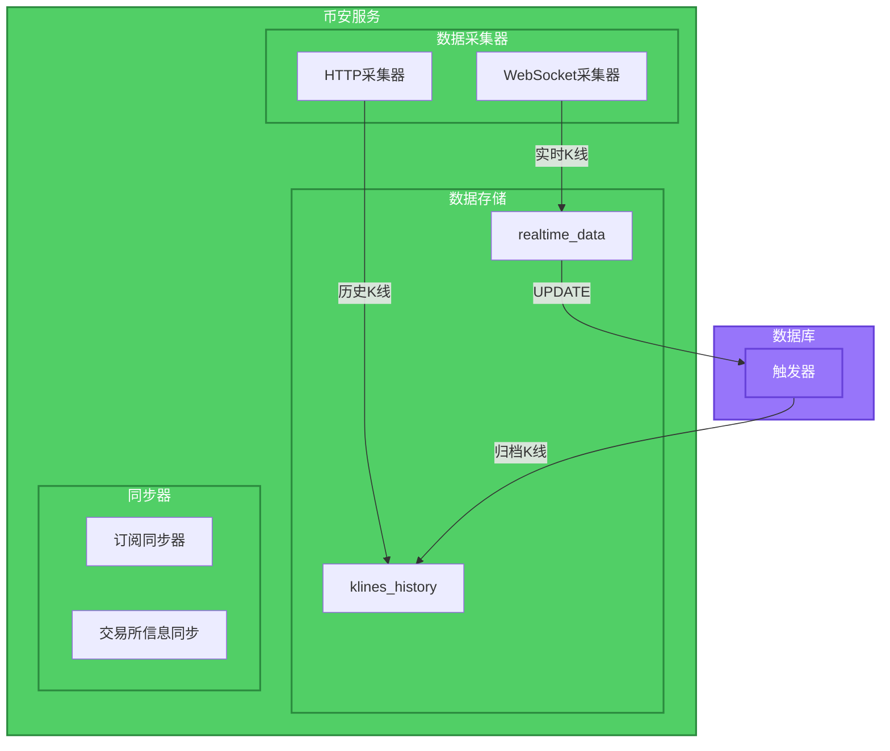
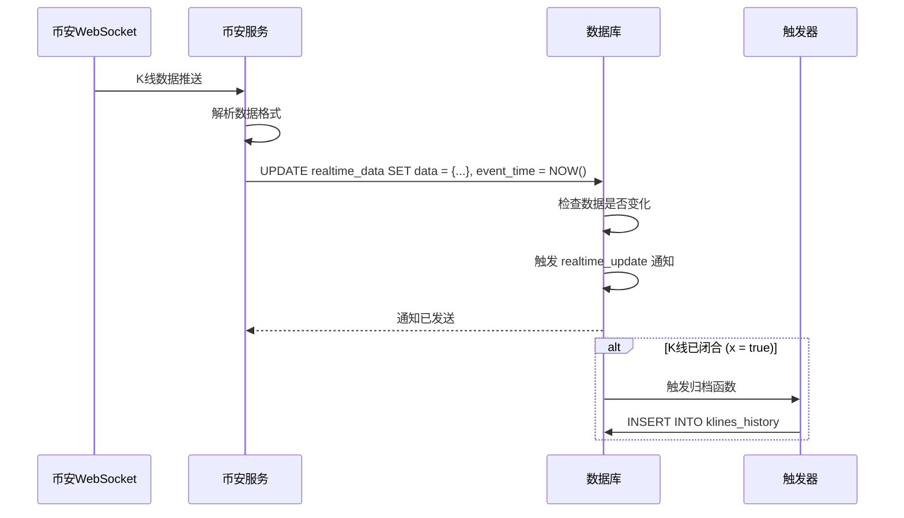
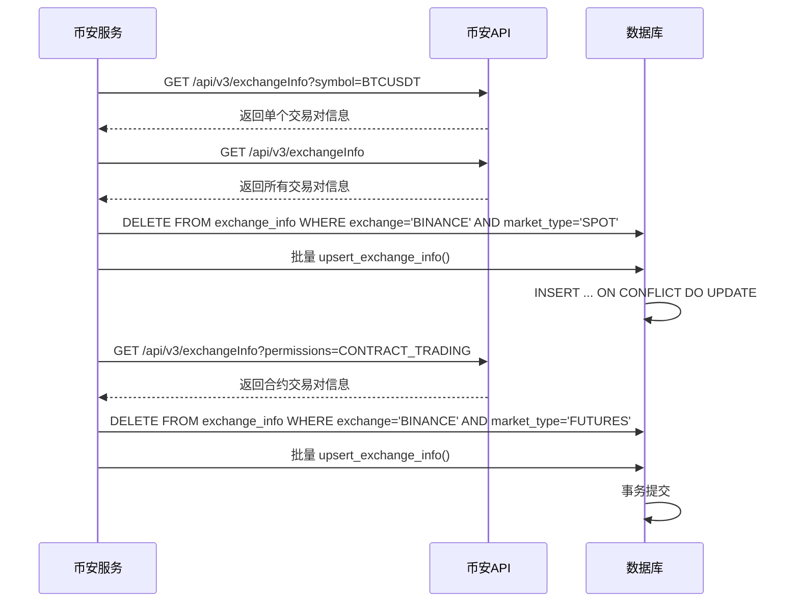
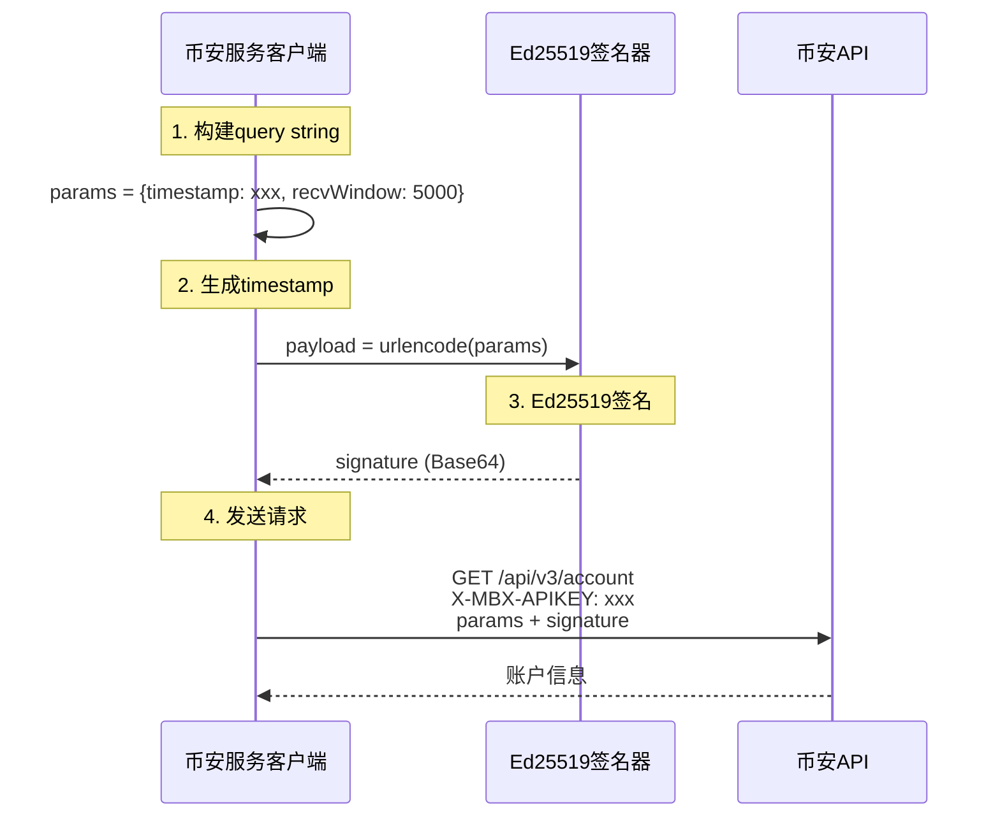
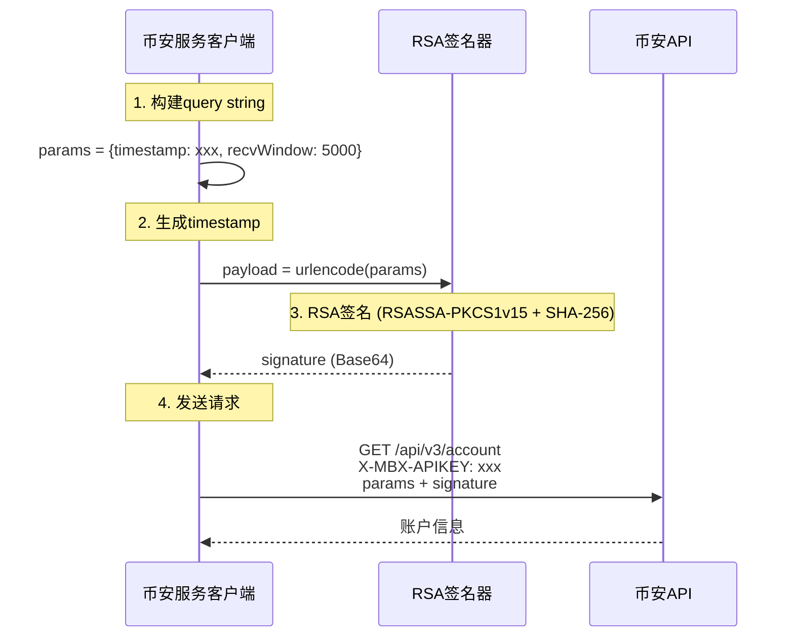
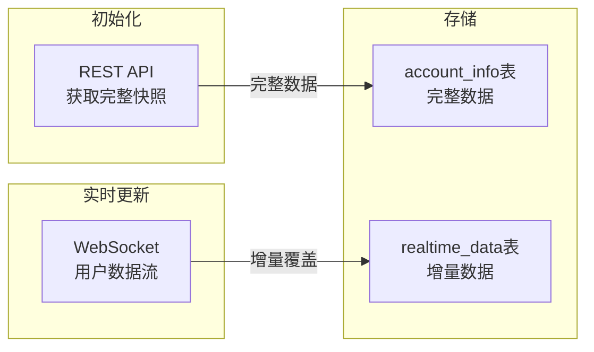
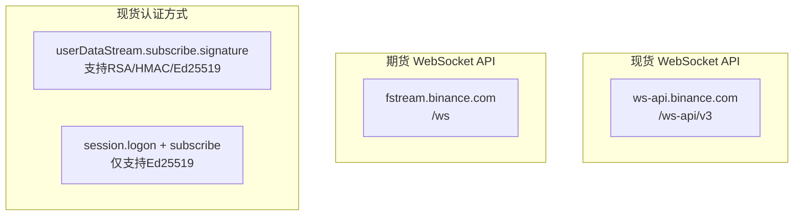

# 币安K线采集设计

## 1. 设计概述

本文档描述币安服务中的K线数据采集机制，包括实时数据订阅、历史数据获取和交易所信息同步。

## 2. 采集架构



## 3. 实时K线采集

### 3.1 WebSocket采集器

币安WebSocket用于接收实时K线数据推送。

**订阅格式**：
```json
{
    "method": "SUBSCRIBE",
    "params": ["btcusdt@kline_1m", "ethusdt@kline_5m"],
    "id": 1
}
```

**接收数据格式**：
```json
{
    "e": "kline",
    "s": "BTCUSDT",
    "k": {
        "t": 1672531200000,
        "T": 1672531259999,
        "s": "BTCUSDT",
        "i": "1m",
        "f": 100,
        "L": 200,
        "o": "16500.00",
        "c": "16510.00",
        "h": "16520.00",
        "l": "16490.00",
        "v": "100.5",
        "n": 150,
        "x": true,
        "q": "1652500.00",
        "V": "50.3",
        "Q": "826250.00"
    }
}
```

### 3.2 数据写入流程



### 3.3 实时数据表更新

```python
async def update_realtime_kline(self, symbol: str, kline_data: dict) -> None:
    """更新实时K线数据到数据库"""
    subscription_key = f"BINANCE:{symbol}@KLINE_{self._interval_to_tv(kline_data['k']['i'])}"

    query = """
        INSERT INTO realtime_data (subscription_key, data_type, data, event_time)
        VALUES ($1, 'KLINE', $2, NOW())
        ON CONFLICT (subscription_key)
        DO UPDATE SET data = EXCLUDED.data, event_time = EXCLUDED.event_time
    """

    await self._pool.execute(query, subscription_key, kline_data)
```

## 4. 历史K线采集

### 4.1 HTTP采集器

用于获取历史K线数据，通过任务系统触发。

**API调用**：
```
GET https://api.binance.com/api/v3/klines?symbol=BTCUSDT&interval=1h&startTime=1672531200000&endTime=1672617600000
```

### 4.2 数据写入

```python
async def fetch_and_store_klines(
    self,
    symbol: str,
    interval: str,
    start_time: int,
    end_time: int
) -> list[dict]:
    """获取并存储K线数据"""

    # 调用币安API
    klines = await self._fetch_klines(symbol, interval, start_time, end_time)

    # 转换为数据库格式
    records = self._convert_to_history_records(symbol, interval, klines)

    # 批量写入
    async with self._pool.acquire() as conn:
        async with conn.transaction():
            for record in records:
                await conn.fetchval("""
                    INSERT INTO klines_history (
                        symbol, interval, open_time, close_time,
                        open_price, high_price, low_price, close_price,
                        volume, quote_volume, number_of_trades,
                        taker_buy_base_volume, taker_buy_quote_volume
                    ) VALUES ($1, $2, $3, $4, $5, $6, $7, $8, $9, $10, $11, $12, $13)
                    ON CONFLICT (symbol, open_time, interval)
                    DO UPDATE SET
                        close_time = EXCLUDED.close_time,
                        open_price = EXCLUDED.open_price,
                        high_price = EXCLUDED.high_price,
                        low_price = EXCLUDED.low_price,
                        close_price = EXCLUDED.close_price,
                        volume = EXCLUDED.volume,
                        quote_volume = EXCLUDED.quote_volume,
                        number_of_trades = EXCLUDED.number_of_trades,
                        taker_buy_base_volume = EXCLUDED.taker_buy_base_volume,
                        taker_buy_quote_volume = EXCLUDED.taker_buy_quote_volume
                """, *record)

    return records
```

## 5. 交易所信息同步

### 5.1 全量替换策略

交易所信息采用**全量替换**模式，确保数据库中的信息与币安API完全同步。

**设计优势**：
- 数据一致性：数据库信息与币安API完全同步
- 自动清理：已移除的交易对会被自动删除
- 状态准确：交易对状态变化会准确反映

### 5.2 同步流程



### 5.3 同步时机

| 触发方式 | 说明 |
|---------|------|
| **系统启动** | 执行一次全量替换，确保初始数据正确 |
| **定时任务** | 每天凌晨执行（如02:00） |
| **手动触发** | 通过API调用 |

### 5.4 upsert_exchange_info() 存储过程

```sql
CREATE OR REPLACE FUNCTION upsert_exchange_info(
    p_exchange VARCHAR,
    p_market_type VARCHAR,
    p_symbol VARCHAR,
    p_base_asset VARCHAR,
    p_quote_asset VARCHAR,
    p_status VARCHAR,
    p_base_asset_precision INTEGER DEFAULT 8,
    p_quote_precision INTEGER DEFAULT 8,
    p_quote_asset_precision INTEGER DEFAULT 8,
    p_base_commission_precision INTEGER DEFAULT 8,
    p_quote_commission_precision INTEGER DEFAULT 8,
    p_filters JSONB,
    p_order_types JSONB,
    p_permissions JSONB,
    p_iceberg_allowed BOOLEAN DEFAULT FALSE,
    p_oco_allowed BOOLEAN DEFAULT FALSE,
    p_oto_allowed BOOLEAN DEFAULT FALSE,
    p_opo_allowed BOOLEAN DEFAULT FALSE,
    p_quote_order_qty_market_allowed BOOLEAN DEFAULT FALSE,
    p_allow_trailing_stop BOOLEAN DEFAULT FALSE,
    p_cancel_replace_allowed BOOLEAN DEFAULT FALSE,
    p_amend_allowed BOOLEAN DEFAULT FALSE,
    p_peg_instructions_allowed BOOLEAN DEFAULT FALSE,
    p_is_spot_trading_allowed BOOLEAN DEFAULT TRUE,
    p_is_margin_trading_allowed BOOLEAN DEFAULT FALSE,
    p_permission_sets JSONB DEFAULT '[]',
    p_default_self_trade_prevention_mode VARCHAR DEFAULT 'NONE',
    p_allowed_self_trade_prevention_modes JSONB DEFAULT '[]'
) RETURNS BIGINT AS $$
DECLARE
    v_id BIGINT;
BEGIN
    INSERT INTO exchange_info (
        exchange, market_type, symbol, base_asset, quote_asset, status,
        base_asset_precision, quote_precision, quote_asset_precision,
        base_commission_precision, quote_commission_precision,
        filters, order_types, permissions,
        iceberg_allowed, oco_allowed, oto_allowed, opo_allowed,
        quote_order_qty_market_allowed, allow_trailing_stop,
        cancel_replace_allowed, amend_allowed, peg_instructions_allowed,
        is_spot_trading_allowed, is_margin_trading_allowed,
        permission_sets,
        default_self_trade_prevention_mode, allowed_self_trade_prevention_modes,
        last_updated
    ) VALUES (
        p_exchange, p_market_type, p_symbol, p_base_asset, p_quote_asset, p_status,
        COALESCE(p_base_asset_precision, 8), COALESCE(p_quote_precision, 8),
        COALESCE(p_quote_asset_precision, 8), COALESCE(p_base_commission_precision, 8),
        COALESCE(p_quote_commission_precision, 8),
        p_filters, p_order_types, p_permissions,
        p_iceberg_allowed, p_oco_allowed, p_oto_allowed, p_opo_allowed,
        p_quote_order_qty_market_allowed, p_allow_trailing_stop,
        p_cancel_replace_allowed, p_amend_allowed, p_peg_instructions_allowed,
        p_is_spot_trading_allowed, p_is_margin_trading_allowed,
        p_permission_sets,
        p_default_self_trade_prevention_mode, p_allowed_self_trade_prevention_modes,
        NOW()
    )
    ON CONFLICT (exchange, market_type, symbol) DO UPDATE SET
        base_asset = p_base_asset,
        quote_asset = p_quote_asset,
        status = p_status,
        base_asset_precision = COALESCE(p_base_asset_precision, 8),
        quote_precision = COALESCE(p_quote_precision, 8),
        quote_asset_precision = COALESCE(p_quote_asset_precision, 8),
        base_commission_precision = COALESCE(p_base_commission_precision, 8),
        quote_commission_precision = COALESCE(p_quote_commission_precision, 8),
        filters = p_filters,
        order_types = p_order_types,
        permissions = p_permissions,
        iceberg_allowed = p_iceberg_allowed,
        oco_allowed = p_oco_allowed,
        oto_allowed = p_oto_allowed,
        opo_allowed = p_opo_allowed,
        quote_order_qty_market_allowed = p_quote_order_qty_market_allowed,
        allow_trailing_stop = p_allow_trailing_stop,
        cancel_replace_allowed = p_cancel_replace_allowed,
        amend_allowed = p_amend_allowed,
        peg_instructions_allowed = p_peg_instructions_allowed,
        is_spot_trading_allowed = p_is_spot_trading_allowed,
        is_margin_trading_allowed = p_is_margin_trading_allowed,
        permission_sets = p_permission_sets,
        default_self_trade_prevention_mode = p_default_self_trade_prevention_mode,
        allowed_self_trade_prevention_modes = p_allowed_self_trade_prevention_modes,
        last_updated = NOW()
    RETURNING id INTO v_id;

    RETURN v_id;
END;
$$ LANGUAGE plpgsql;
```

### 5.5 对比：增量更新 vs 全量替换

| 特性 | 增量更新 | 全量替换 |
|------|----------|----------|
| 数据一致性 | 可能保留过期数据 | 完全同步 |
| 数据清理 | 需要手动清理 | 自动清理 |
| 性能开销 | 较低 | 较高 |
| 适用规模 | 数万级交易对 | 数千级交易对 |
| 实现复杂度 | 简单 | 简单 |

## 6. 订阅同步器

### 6.1 功能职责

订阅同步器负责：
1. 监听数据库订阅变更通知
2. 执行币安WebSocket订阅/取消操作
3. 断线重连后恢复订阅

### 6.2 监听频道

| 频道 | 操作 |
|------|------|
| `subscription_add` | 执行WS订阅 |
| `subscription_remove` | 执行WS取消订阅 |
| `subscription_clean` | 清空所有订阅并重连 |

### 6.3 批处理优化

为减少WebSocket请求次数，订阅同步器使用0.25秒批处理窗口：

```python
class SubscriptionSync:
    def __init__(self):
        self._pending_subscribe: set[str] = set()
        self._pending_unsubscribe: set[str] = set()
        self._flush_task: asyncio.Task | None = None

    async def subscribe(self, subscription_key: str) -> None:
        """添加订阅到待处理队列"""
        self._pending_subscribe.add(self._to_binance_format(subscription_key))
        self._schedule_flush()

    async def unsubscribe(self, subscription_key: str) -> None:
        """添加取消订阅到待处理队列"""
        self._pending_unsubscribe.add(self._to_binance_format(subscription_key))
        self._schedule_flush()

    def _schedule_flush(self) -> None:
        """调度批量执行"""
        if self._flush_task is None or self._flush_task.done():
            self._flush_task = asyncio.create_task(self._flush_after(0.25))

    async def _flush_after(self, delay: float) -> None:
        """延迟后批量执行"""
        await asyncio.sleep(delay)
        await self._execute_batch()
```

## 7. 数据转换

### 7.1 K线周期转换

币安API使用不同的周期格式，需要转换为TradingView格式：

| 币安格式 | TV格式 |
|---------|--------|
| 1m | 1 |
| 3m | 3 |
| 5m | 5 |
| 15m | 15 |
| 30m | 30 |
| 1h | 60 |
| 2h | 120 |
| 4h | 240 |
| 6h | 360 |
| 8h | 480 |
| 12h | 720 |
| 1d | 1D |
| 3d | 3D |
| 1w | 1W |
| 1M | 1M |

### 7.2 Symbol格式转换

数据库存储格式与币安API格式转换：

| 场景 | 格式 |
|------|------|
| 数据库 | `BINANCE:BTCUSDT` |
| 币安API | `BTCUSDT` |
| 永续合约 | `BINANCE:BTCUSDT.PERP` |
| 币安永续 | `BTCUSDT_PERP` |

### 7.3 Pydantic 命名转换

系统使用 Pydantic v2 的 `alias_generators` 实现自动命名转换：

#### 命名约定

| 模型类型 | 命名风格 | 说明 |
|---------|----------|------|
| 内部模型 | snake_case | Python 惯例 |
| 币安API | camelCase | 交易所标准 |
| 数据库 | snake_case | PostgreSQL 惯例 |

#### 转换实现

```python
from pydantic import BaseModel, ConfigDict
from pydantic.alias_generators import to_camel, to_snake

# 请求模型基类（接收外部输入，自动将 camelCase 转为 snake_case）
class SnakeCaseModel(BaseModel):
    """请求模型基类 - 接收 camelCase 自动转为 snake_case"""
    model_config = ConfigDict(
        alias_generator=to_snake,
        populate_by_name=True,
    )


# 响应模型基类（序列化时自动转为 camelCase）
class CamelCaseModel(BaseModel):
    """响应模型基类 - 序列化时自动转为 camelCase"""
    model_config = ConfigDict(
        alias_generator=to_camel,
        populate_by_name=True,
        by_alias=True,
    )


# 内部模型（使用 snake_case）
class KlineData(SnakeCaseModel):
    """K线数据 - 内部使用"""
    open_time: int
    open_price: float
    high_price: float
    low_price: float
    close_price: float
    volume: float


# 币安API模型（使用 camelCase）
class BinanceKline(CamelCaseModel):
    """K线数据 - 币安API格式"""
    open_time: int
    open_price: float
    high_price: float
    low_price: float
    close_price: float
    volume: float
```

#### 数据流向

```
币安交易所 (camelCase)
    ↓ 无转换
币安客户端 (camelCase)
    ↓ to_snake 转换
币安服务 (snake_case)
    ↓ 无转换
数据库 (snake_case)
```

> **设计原则**：转换发生在服务边界，核心业务逻辑"不知道"转换的存在。
> 见 [DATABASE_COORDINATED_ARCHITECTURE.md](./DATABASE_COORDINATED_ARCHITECTURE.md#44-数据命名规范)

### 7.4 命名风格规范

与API服务保持一致的命名风格：

| 类型 | 命名风格 | 示例 |
|------|----------|------|
| K线类 | KlineXxx (l小写) | KlineData, KlineBar, KlineBars |
| 报价类 | QuotesXxx | QuotesValue, QuotesData |
| 账户类 | XxxAccountInfo | SpotAccountInfo, FuturesAccountInfo |
| 文件名 | snake_case | kline_models.py, quote_models.py |

> 注意：K线类统一使用 KlineXxx（小写l）风格。

### 7.5 数据模型目录结构

币安服务采用扁平化结构，根据数据来源划分：

```
models/
├── __init__.py           # 统一导出
├── base.py              # 基类定义（SnakeCaseModel, CamelCaseModel）
├── kline_models.py      # K线数据模型（API响应 + 数据库）
├── ticker_models.py     # 行情数据模型（API响应）
├── account_models.py    # 账户数据模型（API响应 + 数据库）
└── exchange_models.py   # 交易所信息模型（API响应 + 数据库）
```

> 说明：币安服务是数据采集服务，目录结构按数据类型扁平划分，无需API服务的 db/trading/protocol 分层。

## 8. 私有API认证

### 8.1 认证架构

币安私有API使用Ed25519签名认证，参考官方文档：[REST API/请求鉴权类型.md](../../../binance-docs/binance_spot_docs/REST%20API/请求鉴权类型.md)



### 8.2 签名流程

**关键点**：
1. 参数按**添加顺序**构建query string（不排序）
2. 使用`urllib.parse.urlencode(params, encoding='UTF-8')`构建payload
3. 使用ASCII编码签名：`private_key.sign(payload.encode('ASCII'))`
4. Base64编码签名
5. httpx会自动处理签名的URL编码

```python
# 正确的签名流程
import base64
import urllib.parse
from cryptography.hazmat.primitives.serialization import load_pem_private_key

# 1. 构建参数（按添加顺序）
params = {
    'timestamp': str(int(time.time() * 1000)),
    'recvWindow': '5000'
}

# 2. 构建payload（不排序）
payload = urllib.parse.urlencode(params, encoding='UTF-8')
# 结果: timestamp=1771796666082&recvWindow=5000

# 3. 签名（ASCII编码）
private_key = load_pem_private_key(private_key_pem, password=None)
signature_bytes = private_key.sign(payload.encode('ASCII'))

# 4. Base64编码
signature = base64.b64encode(signature_bytes).decode('utf-8')

# 5. 发送请求（httpx自动处理URL编码）
response = await client.get(url, params={**params, 'signature': signature}, headers=headers)
```

### 8.3 密钥管理

**密钥文件结构**：
```
services/binance-service/keys/
├── private_key.pem    # Ed25519私钥（PEM格式）
├── public_key.pem     # Ed25519公钥
├── private_rsa.pem   # RSA私钥（PEM格式，PKCS#8）
└── public_rsa.pem    # RSA公钥
```

**密钥加载**：
```python
from cryptography.hazmat.primitives.serialization import load_pem_private_key

with open("keys/private_key.pem", "rb") as f:
    private_key_pem = f.read()

private_key = load_pem_private_key(private_key_pem, password=None)
```

**公钥绑定**：
1. 登录币安账户
2. 进入 API 管理页面
3. 创建新API Key，选择Ed25519
4. 绑定公钥内容（去除PEM头尾）

### 8.4 客户端组件

**BinanceSpotPrivateHTTPClient**：

```python
class BinanceSpotPrivateHTTPClient(BinanceHTTPClient):
    """私有API HTTP客户端（支持Ed25519和RSA签名）"""

    VALID_SIGNATURE_TYPES = {"ed25519", "rsa"}

    def __init__(
        self,
        api_key: str,
        private_key_pem: bytes,
        signature_type: str = "ed25519",
        timeout: float = 10.0,
        proxy_url: Optional[str] = None,
    ) -> None:
        super().__init__(timeout=timeout, proxy_url=proxy_url)
        self.api_key = api_key

        # 根据签名类型选择签名器
        if signature_type.lower() == "rsa":
            self._signer = RSASigner(private_key_pem)
        else:
            self._signer = Ed25519Signer(private_key_pem)

    async def get_account_info(self) -> BinanceAccountInfo:
        """获取账户信息 - GET /api/v3/account"""
        return await self._signed_request(
            method="GET",
            path="api/v3/account",
            params={},
        )
```

### 8.5 RSA签名认证

币安API同时支持Ed25519和RSA两种签名方式。RSA签名使用PKCS#8格式的私钥。

#### 8.5.1 RSA签名流程



#### 8.5.2 RSA签名实现

```python
import base64
from cryptography.hazmat.primitives import hashes, serialization
from cryptography.hazmat.primitives.asymmetric import padding
from cryptography.hazmat.backends import default_backend

class RSASigner:
    """RSA签名器 - 使用RSASSA-PKCS1-v1_5 + SHA-256"""

    def __init__(self, private_key_pem: bytes) -> None:
        self._private_key = serialization.load_pem_private_key(
            private_key_pem,
            password=None,
            backend=default_backend()
        )

    def sign(self, payload: str) -> str:
        """对payload进行RSA签名"""
        # 使用SHA-256进行签名
        signature = self._private_key.sign(
            payload.encode('ascii'),
            padding.PKCS1v15(),
            hashes.SHA256()
        )
        # Base64编码
        return base64.b64encode(signature).decode('ascii')
```

#### 8.5.3 RSA密钥生成

```bash
# 生成RSA私钥 (PKCS#8格式)
openssl genrsa -out private_rsa.pem 2048

# 转换为PKCS#8格式 (币安要求)
openssl pkcs8 -topk8 -inform PEM -in private_rsa.pem -out private_rsa_pkcs8.pem -nocrypt

# 生成公钥
openssl rsa -in private_rsa.pem -pubout -out public_rsa.pem
```

#### 8.5.4 签名类型对比

| 特性 | Ed25519 | RSA |
|------|---------|-----|
| 密钥长度 | 256位 | 2048/4096位 |
| 签名长度 | 64字节 | 256/512字节 |
| 性能 | 更快 | 较慢 |
| 密钥管理 | 需要绑定公钥 | 只需提供私钥 |
| 兼容性 | 较新 | 更广泛支持 |

#### 8.5.5 使用RSA签名

```python
from clients.spot_private_http_client import BinanceSpotPrivateHTTPClient

# 使用RSA签名
client = BinanceSpotPrivateHTTPClient(
    api_key="your_api_key",
    private_key_pem=private_key_pem,  # RSA私钥PEM
    signature_type="rsa",
    proxy_url="http://proxy:7890",
)

account = await client.get_account_info()
```

### 8.6 支持的私有API

| API | 用途 | 鉴权类型 |
|-----|------|----------|
| GET /api/v3/account | 获取账户信息 | USER_DATA |
| GET /api/v3/order | 查询订单 | USER_DATA |
| GET /api/v3/openOrders | 当前挂单 | USER_DATA |
| GET /api/v3/allOrders | 历史订单 | USER_DATA |
| POST /api/v3/order | 下单 | TRADE |
| DELETE /api/v3/order | 取消订单 | TRADE |

### 8.7 数据模型

#### 现货账户 (Spot)

对应 API：**GET /api/v3/account**

官方文档：[账户信息 (USER_DATA)](https://developers.binance.com/zh-CN/simple-endpoints/account-endpoints/account-information)

**BinanceAccountInfo 响应示例**：
```json
{
    "makerCommission": 15,
    "takerCommission": 15,
    "buyerCommission": 0,
    "sellerCommission": 0,
    "commissionRates": {
        "maker": "0.00150000",
        "taker": "0.00150000",
        "buyer": "0.00000000",
        "seller": "0.00000000"
    },
    "canTrade": true,
    "canWithdraw": true,
    "canDeposit": true,
    "brokered": false,
    "requireSelfTradePrevention": false,
    "preventSor": false,
    "updateTime": 123456789,
    "accountType": "SPOT",
    "balances": [
        {
            "asset": "BTC",
            "free": "4723846.89208129",
            "locked": "0.00000000"
        },
        {
            "asset": "LTC",
            "free": "4763368.68006011",
            "locked": "0.00000000"
        }
    ],
    "permissions": ["SPOT"],
    "uid": 354937868
}
```

**字段说明**：

| 字段 | 类型 | 说明 |
|------|------|------|
| `makerCommission` | int | 挂单手续费率 |
| `takerCommission` | int | 吃单手续费率 |
| `buyerCommission` | int | 买入手续费率 |
| `sellerCommission` | int | 卖出手续费率 |
| `commissionRates` | object | 详细手续费率 |
| `commissionRates.maker` | string | 挂单手续费率 |
| `commissionRates.taker` | string | 吃单手续费率 |
| `commissionRates.buyer` | string | 买入手续费率 |
| `commissionRates.seller` | string | 卖出手续费率 |
| `canTrade` | boolean | 是否可交易 |
| `canWithdraw` | boolean | 是否可提现 |
| `canDeposit` | boolean | 是否可充值 |
| `brokered` | boolean | 是否经纪商 |
| `requireSelfTradePrevention` | boolean | 是否需要自成交预防 |
| `preventSor` | boolean | 是否阻止SOR订单 |
| `updateTime` | long | 最后更新时间戳 |
| `accountType` | string | 账户类型 |
| `balances` | array | 余额列表 |
| `balances[].asset` | string | 资产名称 |
| `balances[].free` | string | 可用数量 |
| `balances[].locked` | string | 锁定数量 |
| `permissions` | array | 账户权限列表 |
| `uid` | long | 用户ID |

#### 期货账户 (Futures)

对应 API：**GET /fapi/v3/account** (V3版本)

官方文档：[账户信息V3 (USER_DATA)](https://developers.binance.com/docs/derivatives/usds-margined-futures/account/rest-api/Account-Information-V3)

**重要说明**：系统使用V3版本的账户信息API，该版本返回核心的保证金相关字段。V3与V2版本的主要区别是V3不返回手续费等级、交易权限等字段。

**FuturesAccountInfo 响应示例（单资产模式）**：
```json
{
    "totalInitialMargin": "0.00000000",
    "totalMaintMargin": "0.00000000",
    "totalWalletBalance": "103.12345678",
    "totalUnrealizedProfit": "0.00000000",
    "totalMarginBalance": "103.12345678",
    "totalPositionInitialMargin": "0.00000000",
    "totalOpenOrderInitialMargin": "0.00000000",
    "totalCrossWalletBalance": "103.12345678",
    "totalCrossUnPnl": "0.00000000",
    "availableBalance": "103.12345678",
    "maxWithdrawAmount": "103.12345678",
    "assets": [
        {
            "asset": "USDT",
            "walletBalance": "23.72469206",
            "unrealizedProfit": "0.00000000",
            "marginBalance": "23.72469206",
            "maintMargin": "0.00000000",
            "initialMargin": "0.00000000",
            "positionInitialMargin": "0.00000000",
            "openOrderInitialMargin": "0.00000000",
            "crossWalletBalance": "23.72469206",
            "crossUnPnl": "0.00000000",
            "availableBalance": "23.72469206",
            "maxWithdrawAmount": "23.72469206",
            "updateTime": 1625474304765
        },
        {
            "asset": "USDC",
            "walletBalance": "103.12345678",
            "unrealizedProfit": "0.00000000",
            "marginBalance": "103.12345678",
            "maintMargin": "0.00000000",
            "initialMargin": "0.00000000",
            "positionInitialMargin": "0.00000000",
            "openOrderInitialMargin": "0.00000000",
            "crossWalletBalance": "103.12345678",
            "crossUnPnl": "0.00000000",
            "availableBalance": "126.72469206",
            "maxWithdrawAmount": "103.12345678",
            "updateTime": 1625474304765
        }
    ],
    "positions": [
        {
            "symbol": "BTCUSDT",
            "positionSide": "BOTH",
            "positionAmt": "1.000",
            "unrealizedProfit": "0.00000000",
            "isolatedMargin": "0.00000000",
            "notional": "0",
            "isolatedWallet": "0",
            "initialMargin": "0",
            "maintMargin": "0",
            "updateTime": 0
        }
    ]
}
```

**字段说明**：

| 字段 | 类型 | 说明 |
|------|------|------|
| `totalInitialMargin` | string | 当前所需起始保证金总额（存在逐仓请忽略），仅计算USDT资产 |
| `totalMaintMargin` | string | 维持保证金总额，仅计算USDT资产 |
| `totalWalletBalance` | string | 账户总余额，仅计算USDT资产 |
| `totalUnrealizedProfit` | string | 持仓未实现盈亏总额，仅计算USDT资产 |
| `totalMarginBalance` | string | 保证金总余额，仅计算USDT资产 |
| `totalPositionInitialMargin` | string | 持仓所需起始保证金（基于最新标记价格），仅计算USDT资产 |
| `totalOpenOrderInitialMargin` | string | 当前挂单所需起始保证金（基于最新标记价格），仅计算USDT资产 |
| `totalCrossWalletBalance` | string | 全仓账户余额，仅计算USDT资产 |
| `totalCrossUnPnl` | string | 全仓持仓未实现盈亏总额，仅计算USDT资产 |
| `availableBalance` | string | 可用余额，仅计算USDT资产 |
| `maxWithdrawAmount` | string | 最大可转出余额，仅计算USDT资产 |
| `assets` | array | 资产列表 |
| `positions` | array | 持仓列表（仅返回有持仓或挂单的交易对） |

**FuturesAsset 字段**（assets 数组元素）：

| 字段 | 类型 | 说明 |
|------|------|------|
| `asset` | string | 资产名称 |
| `walletBalance` | string | 余额 |
| `unrealizedProfit` | string | 未实现盈亏 |
| `marginBalance` | string | 保证金余额 |
| `maintMargin` | string | 维持保证金 |
| `initialMargin` | string | 当前所需起始保证金 |
| `positionInitialMargin` | string | 持仓所需起始保证金（基于最新标记价格） |
| `openOrderInitialMargin` | string | 当前挂单所需起始保证金（基于最新标记价格） |
| `crossWalletBalance` | string | 全仓账户余额 |
| `crossUnPnl` | string | 全仓持仓未实现盈亏 |
| `availableBalance` | string | 可用余额 |
| `maxWithdrawAmount` | string | 最大可转出余额 |
| `updateTime` | long | 更新时间 |

**FuturesPosition 字段**（positions 数组元素）：

| 字段 | 类型 | 说明 |
|------|------|------|
| `symbol` | string | 交易对 |
| `positionSide` | string | 持仓方向（BOTH/LONG/SHORT） |
| `positionAmt` | string | 持仓数量 |
| `unrealizedProfit` | string | 持仓未实现盈亏 |
| `isolatedMargin` | string | 逐仓保证金 |
| `notional` | string | 名义价值 |
| `isolatedWallet` | string | 逐仓钱包余额 |
| `initialMargin` | string | 持仓所需起始保证金（基于最新标记价格） |
| `maintMargin` | string | 维持保证金 |
| `updateTime` | long | 更新时间 |

**注意**：期货V3 API不返回以下字段（这些是V2才有的）：
- `feeTier` - 手续费等级
- `feeBurn` - 手续费抵扣开关
- `canTrade`、`canDeposit`、`canWithdraw` - 交易权限
- `multiAssetsMargin` - 多资产保证金模式
- `tradeGroupId` - 交易组ID
- `updateTime`（账户顶层）- 保留字段，请忽略（更新时间在 assets/positions 中返回）

### 8.8 账户信息获取

币安服务支持通过私有API获取账户信息，供前端账户信息页面使用。

#### 8.8.1 任务类型

| 任务类型 | 说明 | 数据来源 |
|----------|------|----------|
| `get_futures_account` | 获取期货账户信息 | Binance 合约账户 API |
| `get_spot_account` | 获取现货账户信息 | Binance 现货账户 API |

#### 8.8.2 数据流

```
前端 → WebSocket请求 → api-service → tasks表 → task_new通知
                                                    ↓
                                              binance-service (监听处理)
                                                    ↓
                                              写入 result → task_completed通知
                                                    ↓
                                              api-service → WebSocket推送 → 前端
```

#### 8.8.3 数据优化

现货账户的 `balances` 字段包含所有交易对，大量零余额资产会导致 PostgreSQL JSONB 字段超限（`payload string too long`）。

**优化策略**：仅返回有余额的资产：

```python
if account_data.get("balances"):
    non_zero_balances = [
        b for b in account_data["balances"]
        if float(b.get("free", "0") or "0") > 0 or float(b.get("locked", "0") or "0") > 0
    ]
    account_data["balances"] = non_zero_balances
    account_data["balances_count"] = len(non_zero_balances)
```

#### 8.8.6 环境配置

账户信息功能需要配置以下环境变量：

| 环境变量 | 说明 | 示例 |
|----------|------|------|
| `BINANCE_API_KEY` | 现货 API Key | `O8ewxuQPnTEdperT...` |
| `BINANCE_FUTURES_API_KEY` | 期货 API Key（可选，默认同现货） | 同上 |
| `BINANCE_PRIVATE_KEY_PATH` | 私钥文件路径 | `/app/keys/private_rsa.pem` |
| `BINANCE_SIGNATURE_TYPE` | 签名类型 | `rsa` 或 `ed25519` |

#### 8.8.7 前端集成

前端通过 `account-store.ts` 管理账户状态，使用 WebSocket 与后端通信：

```typescript
// 获取期货账户
await accountStore.fetchFuturesAccount()

// 获取现货账户
await accountStore.fetchSpotAccount()

// 刷新全部账户
await accountStore.refreshAccounts()
```

## 8.9 账户订阅服务

### 8.9.1 设计概述

账户订阅服务通过 WebSocket 用户数据流实现账户信息的实时推送，采用"GET 完整 + 订阅增量"的策略确保数据一致性。

**设计原则**：
- 完整数据通过 REST API 获取，存储到 `account_info` 表（透传模式）
- 增量更新通过 WebSocket 用户数据流推送，直接覆盖写入 `realtime_data` 表
- 前端先 GET 初始化，再订阅增量更新

### 8.9.2 订阅键格式

| 账户类型 | 订阅键 | 数据来源 |
|---------|--------|----------|
| 现货账户 | `BINANCE:ACCOUNT@SPOT` | 用户数据流 (stream.binance.com) |
| 期货账户 | `BINANCE:ACCOUNT@FUTURES` | 用户数据流 (fstream.binance.com) |

### 8.9.3 数据更新策略



**数据一致性保障**：
1. **启动时**：获取完整快照（REST API）→ 写入 `account_info` 表
2. **实时推送**：WebSocket 增量事件 → 直接覆盖写入 `realtime_data` 表
3. **定期快照**：每隔 N 分钟调用 REST API 获取完整快照 → 覆盖写入 `realtime_data` 表（兜底）

### 8.9.4 币安 WebSocket 用户数据流

账户订阅服务统一使用 **WebSocket API** 管理用户数据流，实现更优雅的连接管理。

#### 架构设计



**设计优势**：
- 单一连接完成所有操作（认证、订阅、续期、关闭）
- 无需额外的 HTTP 请求
- 更适合与行情 WebSocket 共用连接

#### 现货用户数据流

**WebSocket API 端点**：`wss://ws-api.binance.com:443/ws-api/v3`

**重要**：现货 WebSocket API 支持**两种**认证方式：

| 认证方式 | 适用密钥类型 | 说明 |
|---------|-------------|------|
| `userDataStream.subscribe.signature` | **RSA, HMAC, Ed25519** | 推荐，无需事先认证，直接签名订阅 |
| `session.logon` + `userDataStream.subscribe` | 仅 Ed25519 | 需要先通过 Ed25519 密钥认证 |

**推荐**：使用 `userDataStream.subscribe.signature`，因为该方式支持 RSA/HMAC 密钥，无需事先认证。

**账户数据订阅**：
| 操作 | WebSocket 方法 | 说明 |
|------|---------------|------|
| 订阅 | `userDataStream.subscribe.signature` | 直接签名订阅，支持所有密钥类型 |
| 取消订阅 | `userDataStream.unsubscribe` | 取消账户数据订阅 |

**请求示例 - 签名订阅（推荐，用于RSA/HMAC密钥）**：
```json
{
    "id": "d3df8a22-98ea-4fe0-9f4e-0fcea5d418b7",
    "method": "userDataStream.subscribe.signature",
    "params": {
        "apiKey": "您的API Key",
        "timestamp": 1747385641636,
        "signature": "您的RSA/HMAC签名"
    }
}
```

**请求参数**：
| 参数 | 类型 | 必需 | 说明 |
|------|------|------|------|
| apiKey | STRING | 是 | API密钥 |
| timestamp | LONG | 是 | 时间戳（毫秒） |
| signature | STRING | 是 | RSA/HMAC/Ed25519 签名 |
| recvWindow | DECIMAL | 否 | 接收窗口（默认5000ms） |

**签名方法**（与 REST API 相同）：
```
签名内容 = "timestamp=" + timestamp + "&apiKey=" + apiKey
使用 RSA/HMAC 算法对签名内容进行签名
```

**事件类型**：
| 事件 | 说明 |
|------|------|
| `outboundAccountPosition` | 账户余额变化（**仅推送变化的资产**） |
| `balanceUpdate` | 充值/提取/划转 |
| `executionReport` | 订单更新 |
| `eventStreamTerminated` | 订阅终止事件（listenKey过期或主动取消） |

#### 期货用户数据流

**WebSocket 基础端点**：`wss://fstream.binance.com`

**注意**：期货 WebSocket API 与现货不同，**不需要签名认证**，只需要 apiKey 参数：

**listenKey 有效期**：
- listenKey 有效期为 **60分钟**
- 需要在过期前续期
- 整个连接有效期不超过 **24小时**

**listenKey 管理**：
| 操作 | WebSocket 方法 | 说明 |
|------|---------------|------|
| 创建 | `userDataStream.start` | 创建 listenKey（仅需 apiKey） |
| 续期 | `userDataStream.ping` | 延长60分钟有效期（仅需 apiKey），建议提前5分钟续期 |
| 关闭 | `userDataStream.stop` | 关闭 listenKey（仅需 apiKey） |

**请求示例 - 创建 listenKey**：
```json
{
    "method": "userDataStream.start",
    "params": {
        "apiKey": "xxx"
    },
    "id": 1
}
```

**订阅方式**：期货需要通过**独立的 WebSocket 连接**订阅账户数据流：
```
wss://fstream.binance.com/ws/<listenKey>
```

**事件类型**：
| 事件 | 说明 |
|------|------|
| `ACCOUNT_UPDATE` | 账户余额和持仓变化（**仅推送变化的持仓**） |
| `ORDER_TRADE_UPDATE` | 订单和成交更新 |
| `listenKeyExpired` | listenKey 过期事件 |

**ACCOUNT_UPDATE 事件触发原因**（字段 `m`）：
| 原因 | 说明 |
|------|------|
| `DEPOSIT` | 充值 |
| `WITHDRAW` | 提现 |
| `ORDER` | 订单变动 |
| `FUNDING_FEE` | 资金费用 |
| `MARGIN_TRANSFER` | 保证金划转 |
| `MARGIN_TYPE_CHANGE` | 保证金模式变更 |
| `ASSET_TRANSFER` | 资产划转 |
| `OPTIONS_PREMIUM_FEE` | 期权溢价费用 |
| `OPTIONS_SETTLE_PROFIT` | 期权结算盈利 |

**增量数据说明**：
- `ACCOUNT_UPDATE`：仅推送**本次变化的资产和持仓**
- `ORDER_TRADE_UPDATE`：每次订单状态变化都会推送
- 全仓持仓的 FUNDING_FEE 仅推送相关资产余额，不推送持仓信息

#### 与 REST API 对比

| 特性 | REST API | WebSocket API |
|------|----------|---------------|
| 连接数 | 需要额外的 HTTP 连接 | 统一在 WebSocket 连接中 |
| 认证方式 | 签名在 HTTP 头 | 签名在 WebSocket 消息中 |
| 适用场景 | 简单场景 | 需要同时处理行情和账户数据 |
| 代码复杂度 | 较低 | 较高 |

**兼容性**：当前设计优先使用 WebSocket API，REST API 作为备用方案。

### 8.9.5 增量数据说明

**重要**：币安 WebSocket 用户数据流推送的是**增量数据**，而非完整数据：

- 现货 `outboundAccountPosition`：仅包含本次余额变化的资产
- 期货 `ACCOUNT_UPDATE`：仅包含本次余额/持仓变化的资产

因此：
- `realtime_data` 表中的数据是**增量数据的直接覆盖**
- 前端需要先 GET 完整数据（初始化），再通过订阅增量更新
- 定期完整快照作为兜底机制，确保数据不会丢失

### 8.9.6 实现组件

**用户数据流客户端**：
```python
# 现货用户数据流客户端
from clients.spot_user_stream_client import SpotUserStreamClient

client = SpotUserStreamClient(
    api_key="xxx",
    private_key_pem=private_key_pem,
)
client.set_data_callback(handle_data)
await client.start()

# 期货用户数据流客户端
from clients.futures_user_stream_client import FuturesUserStreamClient

client = FuturesUserStreamClient(
    api_key="xxx",
    private_key_pem=private_key_pem,
)
client.set_data_callback(handle_data)
await client.start()
```

**账户订阅服务**：
```python
from services.account_subscription_service import AccountSubscriptionService

service = AccountSubscriptionService(
    pool=pool,
    api_key=api_key,
    futures_api_key=futures_api_key,
    private_key_pem=private_key_pem,
    snapshot_interval=300,  # 5分钟
)
await service.start()
```

### 8.9.7 环境配置

| 环境变量 | 说明 | 默认值 |
|----------|------|--------|
| `ACCOUNT_SNAPSHOT_INTERVAL` | 完整快照间隔（秒） | 300 |

### 8.9.8 前端使用约定

```javascript
// 前端正确用法
async function init() {
  // 1. 先 GET 完整数据（初始化）
  const account = await api.getAccountInfo();
  render(account);

  // 2. 再订阅增量更新
  ws.subscribe('BINANCE:ACCOUNT@SPOT', (data) => {
    // 增量更新 - 直接覆盖
    updateAccount(data);
  });
}
```

## 8.10 交易功能设计

### 8.10.1 设计概述

交易功能通过私有API实现期货和现货的下单、撤单、查询等操作。采用任务驱动模式，参考 [04-trading-orders.md](./04-trading-orders.md) 详细设计。

**核心原则**：订单状态以交易所为准，本地不维护"当前状态"

**数据流**：
- 订单操作通过 `order_tasks` 表执行
- 状态获取通过 WebSocket 订阅或任务查询

**支持的交易功能**：
| 功能 | 期货API | 现货API |
|------|---------|---------|
| 下单 | POST /fapi/v1/order | POST /api/v3/order |
| 测试下单 | POST /fapi/v1/order/test | POST /api/v3/order/test |
| 撤销订单 | DELETE /fapi/v1/order | DELETE /api/v3/order |
| 查询订单 | GET /fapi/v1/order | GET /api/v3/order |
| 查询所有订单 | GET /fapi/v1/allOrders | GET /api/v3/allOrders |
| 查询挂单 | GET /fapi/v1/openOrders | GET /api/v3/openOrders |

**Demo网vs生产环境**：
| 对比项 | Demo网 | 生产环境 |
|--------|--------|----------|
| 期货BASE_URL | `https://demo-fapi.binance.com` | `https://fapi.binance.com` |
| 现货BASE_URL | `https://demo-api.binance.com` | `https://api.binance.com` |
| 最小下单金额 | 100 USDT (期货) | 视交易对而定 |
| 价格限制 | 限价单价格不能超过市价约5% | 正常市价波动范围 |
| 资金 | 虚拟资金，无实际风险 | 真实资金 |

### 8.10.2 订单任务执行流程

binance-service 监听 `order_tasks` 表的任务事件，执行实际的下单、撤单、查询操作。

#### 8.10.2.1 订单创建流程

```
1. 前端发送 CREATE_ORDER 请求 → API服务
2. API服务写入 order_tasks 表 (task_type=order.create, status=pending)
3. INSERT 触发 notify_order_task_new() → binance-service
4. binance-service 读取 order_tasks 表，获取下单参数
5. binance-service 调用币安API下单:
   - 成功: UPDATE result=API响应, binance_order_id=xxx, status=completed
   - 失败: UPDATE result=错误信息, status=failed
6. UPDATE 触发 notify_order_task_completed / notify_order_task.failed → API服务
7. API服务推送结果给前端
```

#### 8.10.2.2 订单状态查询流程

```
方式A: WebSocket订阅 (推荐)
  1. 前端连接 WebSocket
  2. 订阅订单更新频道 (ORDER_TRADE_UPDATE)
  3. 币安 WS 推送订单状态变化
  4. 前端实时更新订单状态

方式B: 任务查询 (兜底)
  1. 前端发送 QUERY_ORDER 请求 → API服务
  2. API服务写入 order_tasks 表 (task_type=order.query, status=pending)
  3. binance-service 读取 order_tasks 表
  4. binance-service 调用币安API查询订单
  5. 返回当前订单状态
  6. 前端更新显示
```

#### 8.10.2.3 撤销订单流程

```
1. 前端发送 CANCEL_ORDER 请求 → API服务
2. API服务写入 order_tasks 表 (task_type=order.cancel, status=pending)
3. INSERT 触发 notify_order_task_new() → binance-service
4. binance-service 读取 order_tasks 表，获取撤单参数
5. binance-service 调用币安API撤单:
   - 成功: UPDATE result=API响应, status=completed
   - 失败: UPDATE result=错误信息, status=failed
6. UPDATE 触发通知 → API服务
7. API服务推送结果给前端
```

#### 8.10.2.4 监听频道

binance-service 需要监听以下数据库通知频道：

| 频道 | 触发条件 | 处理动作 |
|------|---------|----------|
| `order_task_new` | INSERT order_tasks | 读取任务，调用币安API执行 |
| WebSocket用户数据流 | ORDER_TRADE_UPDATE | 实时推送订单状态（可选） |

#### 8.10.2.5 任务状态说明

| order_tasks.status | 说明 |
|-------------------|------|
| pending | 等待处理 |
| processing | 处理中（已发送到交易所） |
| completed | 成功（result 包含订单信息） |
| failed | 失败（result 包含错误信息） |

**重要**：不再维护订单的"当前状态"，始终以交易所返回的信息为准。

### 8.10.3 期货交易接口

#### 8.10.2.1 创建订单 POST /fapi/v1/order

**HTTP请求**：`POST /fapi/v1/order`

**请求参数**：

| 参数 | 类型 | 必需 | 说明 |
|------|------|------|------|
| symbol | STRING | 是 | 交易对，如 BTCUSDT |
| side | ENUM | 是 | 订单方向：BUY, SELL |
| type | ENUM | 是 | 订单类型：LIMIT, MARKET, STOP, TAKE_PROFIT等 |
| positionSide | ENUM | 否 | 持仓方向：BOTH(默认), LONG, SHORT（对冲模式必需） |
| quantity | DECIMAL | 条件必需 | 订单数量 |
| price | DECIMAL | 条件必需 | 订单价格（限价单必需） |
| timeInForce | ENUM | 条件必需 | 时间策略：GTC, IOC, FOK, GTD |
| reduceOnly | STRING | 否 | 是否仅减仓："true"或"false"，默认"false" |
| stopPrice | DECIMAL | 条件必需 | 止损/止盈价格（条件单必需） |
| newClientOrderId | STRING | 否 | 客户端订单ID，默认自动生成 |
| newOrderRespType | ENUM | 否 | 响应类型：ACK, RESULT, FULL，默认ACK |
| priceMatch | ENUM | 否 | 价格匹配模式：OPPONENT/OPPONENT_5/OPPONENT_10等 |
| selfTradePreventionMode | ENUM | 否 | 自成交防止模式：EXPIRE_TAKER, EXPIRE_MAKER, EXPIRE_BOTH |
| goodTillDate | LONG | 条件必需 | GTD订单过期时间（timeInForce=GTD时必需） |
| recvWindow | LONG | 否 | 接收窗口时间 |
| timestamp | LONG | 是 | 时间戳（毫秒） |

**各订单类型必需参数**：

| 订单类型 | 必需参数 |
|----------|----------|
| LIMIT | timeInForce, quantity, price |
| MARKET | quantity |
| STOP | quantity, stopPrice |
| TAKE_PROFIT | quantity, stopPrice |

**响应示例**（RESULT类型）：
```json
{
    "orderId": 22542179,
    "clientOrderId": "testOrder",
    "symbol": "BTCUSDT",
    "side": "BUY",
    "positionSide": "BOTH",
    "type": "LIMIT",
    "origQty": "10",
    "price": "50000",
    "avgPrice": "0.00000",
    "stopPrice": "0",
    "executedQty": "0",
    "cumQty": "0",
    "cumQuote": "0",
    "status": "NEW",
    "timeInForce": "GTC",
    "reduceOnly": false,
    "closePosition": false,
    "workingType": "CONTRACT_PRICE",
    "priceProtect": false,
    "newOrderRespType": "RESULT",
    "updateTime": 1566818724722
}
```

#### 8.10.2.2 测试订单 POST /fapi/v1/order/test

用于测试订单参数是否正确，不会真正下单。

**HTTP请求**：`POST /fapi/v1/order/test`

**参数**：与创建订单相同

#### 8.10.2.3 撤销订单 DELETE /fapi/v1/order

**HTTP请求**：`DELETE /fapi/v1/order`

**请求参数**：

| 参数 | 类型 | 必需 | 说明 |
|------|------|------|------|
| symbol | STRING | 是 | 交易对 |
| orderId | LONG | 条件必需 | 订单ID（与clientOrderId二选一） |
| clientOrderId | STRING | 条件必需 | 客户端订单ID |
| recvWindow | LONG | 否 | 接收窗口时间 |
| timestamp | LONG | 是 | 时间戳 |

#### 8.10.2.4 查询订单 GET /fapi/v1/order

**HTTP请求**：`GET /fapi/v1/order`

**请求参数**：

| 参数 | 类型 | 必需 | 说明 |
|------|------|------|------|
| symbol | STRING | 是 | 交易对 |
| orderId | LONG | 条件必需 | 订单ID |
| clientOrderId | STRING | 条件必需 | 客户端订单ID |
| recvWindow | LONG | 否 | 接收窗口时间 |
| timestamp | LONG | 是 | 时间戳 |

### 8.10.3 现货交易接口

#### 8.10.3.1 创建订单 POST /api/v3/order

**HTTP请求**：`POST /api/v3/order`

**请求参数**：

| 参数 | 类型 | 必需 | 说明 |
|------|------|------|------|
| symbol | STRING | 是 | 交易对，如 BTCUSDT |
| side | ENUM | 是 | 订单方向：BUY, SELL |
| type | ENUM | 是 | 订单类型 |
| quantity | DECIMAL | 条件必需 | 订单数量 |
| quoteOrderQty | DECIMAL | 条件必需 | 市价买单金额（如100表示使用100 USDT买入） |
| price | DECIMAL | 条件必需 | 订单价格（限价单必需） |
| timeInForce | ENUM | 条件必需 | 时间策略：GTC, IOC, FOK |
| stopPrice | DECIMAL | 条件必需 | 止损价格 |
| icebergQty | DECIMAL | 否 | 冰山订单数量 |
| newClientOrderId | STRING | 否 | 客户端订单ID |
| newOrderRespType | ENUM | 否 | 响应类型：ACK, RESULT, FULL |
| selfTradePreventionMode | ENUM | 否 | 自成交防止模式 |
| recvWindow | DECIMAL | 否 | 接收窗口时间（最大60000） |
| timestamp | LONG | 是 | 时间戳 |

**现货市价单特殊说明**：
- 使用 `quantity` 指定要买入/卖出的基础资产数量
- 使用 `quoteOrderQty` 指定要花费/获得的报价资产金额
- 例如：BUY + quoteOrderQty=100 表示使用100 USDT买入BTC

**各订单类型必需参数**：

| 订单类型 | 必需参数 |
|----------|----------|
| LIMIT | timeInForce, quantity, price |
| MARKET | quantity 或 quoteOrderQty（二选一） |
| STOP_LOSS | quantity, stopPrice 或 trailingDelta |
| STOP_LOSS_LIMIT | timeInForce, quantity, price, stopPrice |
| TAKE_PROFIT | quantity, stopPrice 或 trailingDelta |
| TAKE_PROFIT_LIMIT | timeInForce, quantity, price, stopPrice |
| LIMIT_MAKER | quantity, price |

#### 8.10.3.2 撤销订单 DELETE /api/v3/order

**HTTP请求**：`DELETE /api/v3/order`

**请求参数**：

| 参数 | 类型 | 必需 | 说明 |
|------|------|------|------|
| symbol | STRING | 是 | 交易对 |
| orderId | LONG | 条件必需 | 订单ID |
| clientOrderId | STRING | 条件必需 | 客户端订单ID |
| recvWindow | LONG | 否 | 接收窗口时间 |
| timestamp | LONG | 是 | 时间戳 |

### 8.10.4 订单参数详解

#### 8.10.4.1 订单类型 (type)

| 类型 | 说明 | 期货 | 现货 |
|------|------|------|------|
| LIMIT | 限价单 | 支持 | 支持 |
| MARKET | 市价单 | 支持 | 支持 |
| STOP | 止损单 | 支持 | 支持 |
| STOP_LOSS | 止损单 | 支持 | 支持 |
| STOP_LOSS_LIMIT | 止损限价单 | 支持 | 支持 |
| TAKE_PROFIT | 止盈单 | 支持 | 支持 |
| TAKE_PROFIT_LIMIT | 止盈限价单 | 支持 | 支持 |
| LIMIT_MAKER | 被动限价单 | 支持 | 支持 |
| TRAILING_STOP_MARKET | 追踪止损 | 支持 | 不支持 |

#### 8.10.4.2 时间策略 (timeInForce)

| 值 | 说明 | 适用订单类型 |
|----|------|-------------|
| GTC | Good Till Cancel - 成交为止 | LIMIT, STOP_LOSS_LIMIT, TAKE_PROFIT_LIMIT |
| IOC | Immediate or Cancel - 立即成交，否则取消 | LIMIT, MARKET |
| FOK | Fill or Kill - 全部成交，否则取消 | LIMIT, MARKET |
| GTD | Good Till Date - 指定日期前有效 | 期货专用 |

#### 8.10.4.3 持仓方向 (positionSide)

| 值 | 说明 | 适用场景 |
|----|------|----------|
| BOTH | 单向持仓模式 | 默认模式 |
| LONG | 多头持仓 | 对冲模式 |
| SHORT | 空头持仓 | 对冲模式 |

**重要**：
- 单向持仓模式（BOTH）：默认模式，一个交易对只能有一个持仓
- 对冲模式（HEDGE）：需要先调用API设置对冲模式，可同时持有多头和空头

#### 8.10.4.4 响应类型 (newOrderRespType)

| 值 | 说明 | 响应内容 |
|----|------|----------|
| ACK | 仅确认 | 仅返回订单确认信息（orderId, clientOrderId） |
| RESULT | 执行结果 | 返回订单执行结果（含价格、数量等） |
| FULL | 完整信息 | 返回完整信息 + fills数组（包含每笔成交明细） |

### 8.10.5 响应模型

#### 8.10.5.1 期货订单响应 (FuturesOrderResponse)

```python
class FuturesOrderResponse(BaseModel):
    """期货订单响应"""
    # 订单标识
    order_id: int = Field(..., alias="orderId")
    client_order_id: str = Field(..., alias="clientOrderId")
    symbol: str

    # 订单方向和类型
    side: str  # BUY/SELL
    position_side: Optional[str] = Field(None, alias="positionSide")
    order_type: str = Field(..., alias="type")
    orig_type: Optional[str] = Field(None, alias="origType")

    # 数量和价格
    orig_qty: str = Field(..., alias="origQty")
    price: str
    avg_price: str = Field(..., alias="avgPrice")
    stop_price: Optional[str] = Field(None, alias="stopPrice")

    # 成交情况
    executed_qty: str = Field(..., alias="executedQty")
    cum_qty: str = Field(..., alias="cumQty")
    cum_quote: str = Field(..., alias="cumQuote")

    # 订单状态
    status: str  # NEW/PARTIALLY_FILLED/FILLED/CANCELED/REJECTED/EXPIRED

    # 时间策略
    time_in_force: Optional[str] = Field(None, alias="timeInForce")

    # 其他标志
    reduce_only: bool = Field(..., alias="reduceOnly")
    close_position: bool = Field(..., alias="closePosition")
    working_type: str = Field(..., alias="workingType")
    price_protect: bool = Field(..., alias="priceProtect")
    price_match: Optional[str] = Field(None, alias="priceMatch")
    self_trade_prevention_mode: Optional[str] = Field(None, alias="selfTradePreventionMode")
    good_till_date: Optional[int] = Field(None, alias="goodTillDate")

    # 时间戳
    update_time: int = Field(..., alias="updateTime")
```

#### 8.10.5.2 现货订单响应 (SpotOrderResponse)

```python
class SpotOrderResponse(BaseModel):
    """现货订单响应"""
    # 订单标识
    order_id: int = Field(..., alias="orderId")
    client_order_id: str = Field(..., alias="clientOrderId")
    symbol: str
    transaction_time: int = Field(..., alias="transactionTime")

    # 订单方向和类型
    side: str
    order_type: str = Field(..., alias="type")

    # 数量和价格
    orig_qty: str = Field(..., alias="origQty")
    price: str
    executed_qty: str = Field(..., alias="executedQty")
    cummulative_quote_qty: str = Field(..., alias="cummulativeQuoteQty")

    # 订单状态
    status: str

    # 时间策略
    time_in_force: str = Field(..., alias="timeInForce")

    # 冰山订单
    iceberg_qty: Optional[str] = Field(None, alias="icebergQty")

    # 时间戳
    update_time: int = Field(..., alias="updateTime")
    is_working: bool = Field(..., alias="isWorking")
```

#### 8.10.5.3 撤销订单响应 (CancelOrderResponse)

```python
class CancelOrderResponse(BaseModel):
    """撤销订单响应"""
    order_id: int = Field(..., alias="orderId")
    client_order_id: str = Field(..., alias="clientOrderId")
    symbol: str
    side: str
    order_type: str = Field(..., alias="type")
    orig_qty: str = Field(..., alias="origQty")
    executed_qty: str = Field(..., alias="executedQty")
    price: str
    status: str  # CANCELED
    update_time: int = Field(..., alias="updateTime")
```

### 8.10.6 Demo网限制说明

基于实际测试结果：

| 限制项 | 期货 | 现货 |
|--------|------|------|
| 最小下单金额 | 100 USDT | 无明确限制 |
| 价格限制 | 限价单价格不能超过当前价格约5% | 正常波动范围 |
| 订单有效期 | GTC订单会一直存在 | GTC订单会一直存在 |
| 测试资金 | 虚拟资金池 | 虚拟资金池 |

**实测下单示例**（期货）：
```python
# 市价买入 100 USDT
await client.create_order(
    symbol="BTCUSDT",
    side="BUY",
    order_type="MARKET",
    quantity=0.002,  # 约100 USDT (当前价格约50000)
    new_order_resp_type="RESULT",
)

# 限价单（需注意价格限制）
await client.create_order(
    symbol="BTCUSDT",
    side="BUY",
    order_type="LIMIT",
    quantity=0.002,
    price=50000.0,  # 不能超过市价太多
    time_in_force="GTC",
    new_order_resp_type="RESULT",
)
```

### 8.10.7 实现组件

#### 8.10.7.1 订单数据模型

位于 `src/models/trading_order.py`：

```python
from dataclasses import dataclass
from enum import Enum
from typing import Optional
from pydantic import BaseModel, Field

class OrderType(str, Enum):
    """订单类型"""
    LIMIT = "LIMIT"
    MARKET = "MARKET"
    STOP_LOSS = "STOP_LOSS"
    STOP_LOSS_LIMIT = "STOP_LOSS_LIMIT"
    TAKE_PROFIT = "TAKE_PROFIT"
    TAKE_PROFIT_LIMIT = "TAKE_PROFIT_LIMIT"
    LIMIT_MAKER = "LIMIT_MAKER"
    TRAILING_STOP_MARKET = "TRAILING_STOP_MARKET"

class OrderSide(str, Enum):
    """订单方向"""
    BUY = "BUY"
    SELL = "SELL"

class PositionSide(str, Enum):
    """持仓方向（对冲模式）"""
    LONG = "LONG"
    SHORT = "SHORT"
    BOTH = "BOTH"

class TimeInForce(str, Enum):
    """时间策略"""
    GTC = "GTC"
    IOC = "IOC"
    FOK = "FOK"
    GTD = "GTD"

class OrderResponseType(str, Enum):
    """订单响应类型"""
    ACK = "ACK"
    RESULT = "RESULT"
    FULL = "FULL"

class OrderStatus(str, Enum):
    """订单状态"""
    NEW = "NEW"
    PARTIALLY_FILLED = "PARTIALLY_FILLED"
    FILLED = "FILLED"
    CANCELED = "CANCELED"
    PENDING_CANCEL = "PENDING_CANCEL"
    REJECTED = "REJECTED"
    EXPIRED = "EXPIRED"
```

#### 8.10.7.2 期货私有HTTP客户端

位于 `src/clients/futures_private_http_client.py`：

```python
class BinanceFuturesPrivateHTTPClient:
    """期货私有API客户端"""

    async def create_order(
        self,
        symbol: str,
        side: str,
        order_type: str,
        quantity: float,
        price: Optional[float] = None,
        time_in_force: Optional[str] = None,
        stop_price: Optional[float] = None,
        reduce_only: bool = False,
        position_side: Optional[str] = None,
        new_client_order_id: Optional[str] = None,
        new_order_resp_type: str = "ACK",
        recv_window: Optional[int] = None,
    ) -> dict:
        """创建新订单"""

    async def cancel_order(
        self,
        symbol: str,
        order_id: Optional[str] = None,
        client_order_id: Optional[str] = None,
        recv_window: Optional[int] = None,
    ) -> dict:
        """撤销订单"""

    async def get_order(
        self,
        symbol: str,
        order_id: Optional[str] = None,
        client_order_id: Optional[str] = None,
        recv_window: Optional[int] = None,
    ) -> dict:
        """查询订单"""

    async def get_open_orders(
        self,
        symbol: Optional[str] = None,
        recv_window: Optional[int] = None,
    ) -> list[dict]:
        """查询当前挂单"""
```

#### 8.10.7.3 现货私有HTTP客户端

位于 `src/clients/spot_private_http_client.py`：

```python
class BinanceSpotPrivateHTTPClient:
    """现货私有API客户端"""

    async def create_order(
        self,
        symbol: str,
        side: str,
        order_type: str,
        quantity: Optional[float] = None,
        quote_order_qty: Optional[float] = None,
        price: Optional[float] = None,
        time_in_force: Optional[str] = None,
        stop_price: Optional[float] = None,
        iceberg_qty: Optional[float] = None,
        new_client_order_id: Optional[str] = None,
        new_order_resp_type: str = "ACK",
        recv_window: Optional[int] = None,
    ) -> dict:
        """创建新订单"""
        # 现货市价单可使用 quote_order_qty 指定金额

    async def cancel_order(
        self,
        symbol: str,
        order_id: Optional[str] = None,
        client_order_id: Optional[str] = None,
        recv_window: Optional[int] = None,
    ) -> dict:
        """撤销订单"""

    async def get_order(
        self,
        symbol: str,
        order_id: Optional[str] = None,
        client_order_id: Optional[str] = None,
        recv_window: Optional[int] = None,
    ) -> dict:
        """查询订单"""

    async def get_open_orders(
        self,
        symbol: Optional[str] = None,
        recv_window: Optional[int] = None,
    ) -> list[dict]:
        """查询当前挂单"""
```

### 8.10.8 错误处理

交易API错误响应格式：

```json
{
    "code": -1013,
    "msg": "Invalid quantity."
}
```

常见错误码：

| 错误码 | 说明 |
|--------|------|
| -1013 | 无效数量 |
| -1111 | 无效 priceMatch 参数 |
| -2011 | 订单类型不存在 |
| -2015 | 无效 clientOrderId 格式 |
| -4028 | 无效 positionSide 参数 |
| -4046 | 数量小于最小值 |

### 8.10.9 测试用例

#### 8.10.9.1 期货交易测试

位于 `test_trading_futures.py`：

```python
async def test_market_buy():
    """测试市价买入 - 100 USDT"""
    client = create_client()

    result = await client.create_order(
        symbol="BTCUSDT",
        side="BUY",
        order_type="MARKET",
        quantity=0.002,  # 约100 USDT
        new_order_resp_type="RESULT",
    )
    print(f"订单ID: {result.get('orderId')}")
    print(f"状态: {result.get('status')}")

async def test_cancel_order():
    """测试撤销订单"""
    client = create_client()

    # 下限价单
    order_result = await client.create_order(
        symbol="BTCUSDT",
        side="BUY",
        order_type="LIMIT",
        quantity=0.002,
        price=50000.0,
        time_in_force="GTC",
    )

    # 撤销订单
    cancel_result = await client.cancel_order(
        symbol="BTCUSDT",
        order_id=str(order_result.get("orderId")),
    )
    print(f"撤销成功: {cancel_result.get('status')}")
```

#### 8.10.9.2 现货交易测试

位于 `test_trading_spot.py`：

```python
async def test_market_buy():
    """测试市价买入 - 100 USDT"""
    client = create_client()

    # 使用 quoteOrderQty 指定USDT金额
    result = await client.create_order(
        symbol="BTCUSDT",
        side="BUY",
        order_type="MARKET",
        quantity=None,
        quote_order_qty=100.0,  # 100 USDT
        new_order_resp_type="FULL",
    )
    print(f"订单ID: {result.get('orderId')}")
    print(f"成交数量: {result.get('executedQty')}")
```

## 相关文档

- [QUANT_TRADING_SYSTEM_ARCHITECTURE.md](./QUANT_TRADING_SYSTEM_ARCHITECTURE.md) - 完整实施文档
- [01-task-subscription.md](./01-task-subscription.md) - 任务与订阅管理
- [02-dataflow.md](./02-dataflow.md) - 数据流设计
- [04-dataprocessor.md](./04-dataprocessor.md) - DataProcessor设计

---

**版本**：v2.3
**更新**：2026-03-02 - 添加交易功能设计（8.10节）
