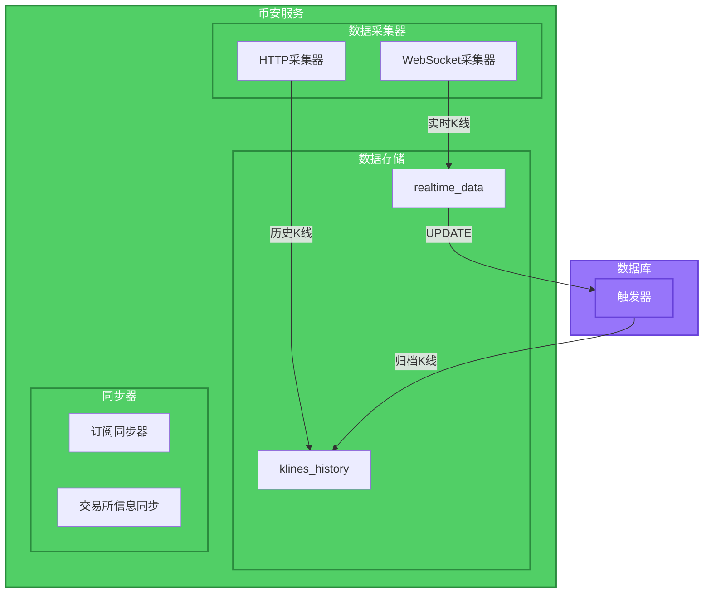
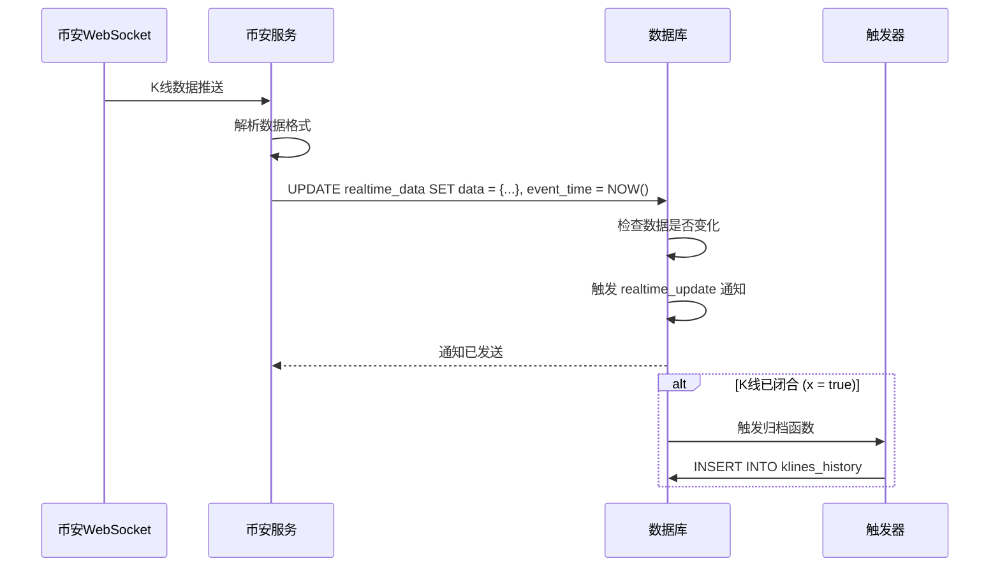
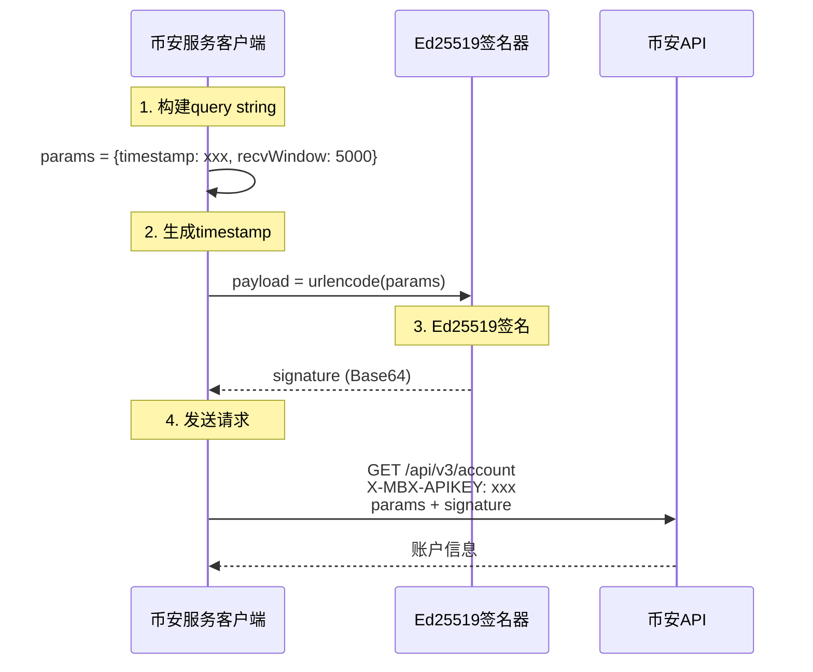
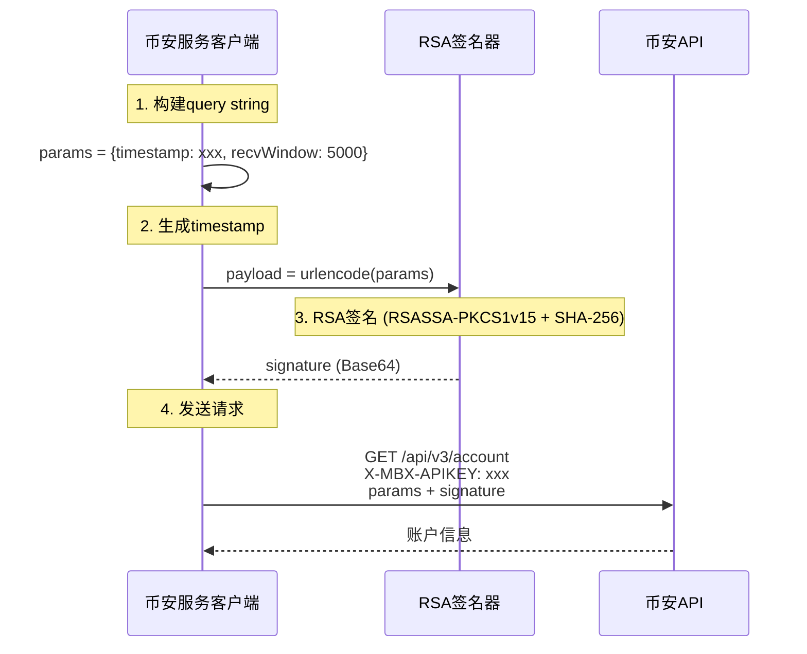
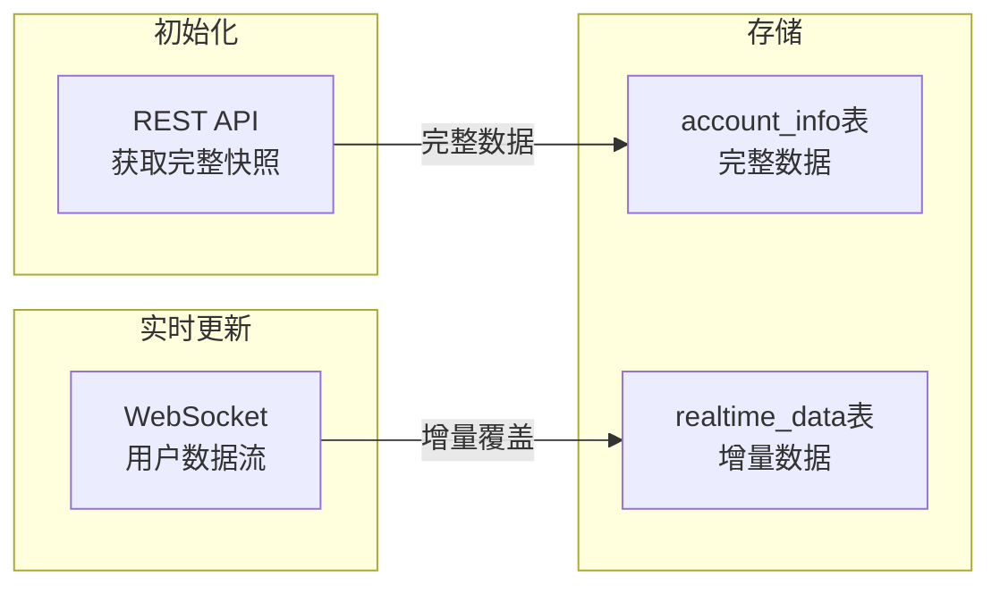
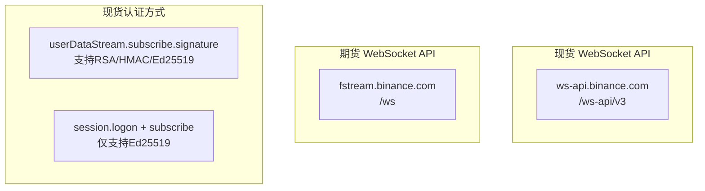

# 币安K线采集设计

## 1. 设计概述

本文档描述币安服务中的K线数据采集机制，包括实时数据订阅、历史数据获取和交易所信息同步。

## 2. 采集架构


```mermaid
flowchart TB
    classDef binance fill:#51cf66,stroke:#2b8a3e,stroke-width:2px,color:#fff
    classDef database fill:#9775fa,stroke:#6741d9,stroke-width:2px,color:#fff

    subgraph BinanceService[币安服务]
        subgraph Collectors[数据采集器]
            WS[WebSocket采集器]
            HTTP[HTTP采集器]
        end

        subgraph Storage[数据存储]
            RT[realtime_data]
            KH[klines_history]
        end

        subgraph Sync[同步器]
            Sub[订阅同步器]
            Ex[交易所信息同步]
        end
    end

    subgraph Database[数据库]
        Triggers[触发器]
    end

    WS -->|实时K线| RT
    HTTP -->|历史K线| KH
    RT -->|UPDATE| Triggers
    Triggers -->|归档K线| KH

    class BinanceService,Collectors,Storage,Sync binance
    class Database,Triggers database
```

## 3. 实时K线采集

### 3.1 WebSocket采集器

币安WebSocket用于接收实时K线数据推送。

**订阅格式**：
```json
{
    "method": "SUBSCRIBE",
    "params": ["btcusdt@kline_1m", "ethusdt@kline_5m"],
    "id": 1
}
```

**接收数据格式**：
```json
{
    "e": "kline",
    "s": "BTCUSDT",
    "k": {
        "t": 1672531200000,
        "T": 1672531259999,
        "s": "BTCUSDT",
        "i": "1m",
        "f": 100,
        "L": 200,
        "o": "16500.00",
        "c": "16510.00",
        "h": "16520.00",
        "l": "16490.00",
        "v": "100.5",
        "n": 150,
        "x": true,
        "q": "1652500.00",
        "V": "50.3",
        "Q": "826250.00"
    }
}
```

### 3.2 数据写入流程


```mermaid
sequenceDiagram
    participant BWS as 币安WebSocket
    participant BN as 币安服务
    participant DB as 数据库
    participant Trigger as 触发器

    BWS->>BN: K线数据推送
    BN->>BN: 解析数据格式
    BN->>DB: UPDATE realtime_data SET data = {...}, event_time = NOW()
    DB->>DB: 检查数据是否变化
    DB->>DB: 触发 realtime_update 通知
    DB-->>BN: 通知已发送

    alt K线已闭合 (x = true)
        DB->>Trigger: 触发归档函数
        Trigger->>DB: INSERT INTO klines_history
    end
```

### 3.3 实时数据表更新

```python
async def update_realtime_kline(self, symbol: str, kline_data: dict) -> None:
    """更新实时K线数据到数据库"""
    subscription_key = f"BINANCE:{symbol}@KLINE_{self._interval_to_tv(kline_data['k']['i'])}"

    query = """
        INSERT INTO realtime_data (subscription_key, data_type, data, event_time)
        VALUES ($1, 'KLINE', $2, NOW())
        ON CONFLICT (subscription_key)
        DO UPDATE SET data = EXCLUDED.data, event_time = EXCLUDED.event_time
    """

    await self._pool.execute(query, subscription_key, kline_data)
```

## 4. 历史K线采集

### 4.1 HTTP采集器

用于获取历史K线数据，通过任务系统触发。

**API调用**：
```
GET https://api.binance.com/api/v3/klines?symbol=BTCUSDT&interval=1h&startTime=1672531200000&endTime=1672617600000
```

### 4.2 数据写入

```python
async def fetch_and_store_klines(
    self,
    symbol: str,
    interval: str,
    start_time: int,
    end_time: int
) -> list[dict]:
    """获取并存储K线数据"""

    # 调用币安API
    klines = await self._fetch_klines(symbol, interval, start_time, end_time)

    # 转换为数据库格式
    records = self._convert_to_history_records(symbol, interval, klines)

    # 批量写入
    async with self._pool.acquire() as conn:
        async with conn.transaction():
            for record in records:
                await conn.fetchval("""
                    INSERT INTO klines_history (
                        symbol, interval, open_time, close_time,
                        open_price, high_price, low_price, close_price,
                        volume, quote_volume, number_of_trades,
                        taker_buy_base_volume, taker_buy_quote_volume
                    ) VALUES ($1, $2, $3, $4, $5, $6, $7, $8, $9, $10, $11, $12, $13)
                    ON CONFLICT (symbol, open_time, interval)
                    DO UPDATE SET
                        close_time = EXCLUDED.close_time,
                        open_price = EXCLUDED.open_price,
                        high_price = EXCLUDED.high_price,
                        low_price = EXCLUDED.low_price,
                        close_price = EXCLUDED.close_price,
                        volume = EXCLUDED.volume,
                        quote_volume = EXCLUDED.quote_volume,
                        number_of_trades = EXCLUDED.number_of_trades,
                        taker_buy_base_volume = EXCLUDED.taker_buy_base_volume,
                        taker_buy_quote_volume = EXCLUDED.taker_buy_quote_volume
                """, *record)

    return records
```

## 5. 交易所信息同步

> **设计原则**：数据模型严格遵循币安官方文档的数据格式...

**交易所信息数据模型已迁移至独立文档，详见：**
**[09-binance-models.md](./09-binance-models.md)**

### 5.1 现货交易所信息

**GET 模型**: `BinanceSpotExchangeInfoGetModel`
**文档来源**: `binance_spot_docs/01_REST API/General endpoints.md`

### 5.2 期货交易所信息

**GET 模型**: `BinanceFuturesExchangeInfoGetModel`
**文档来源**: `binance_futures_docs/01_U本位合约/02_行情接口/03_REST API/获取交易规则和交易对.md`

---

## 6. 订阅同步器

### 6.1 功能职责

订阅同步器负责：
1. 监听数据库订阅变更通知
2. 执行币安WebSocket订阅/取消操作
3. 断线重连后恢复订阅

### 6.2 监听频道

| 频道 | 操作 |
|------|------|
| `subscription_add` | 执行WS订阅 |
| `subscription_remove` | 执行WS取消订阅 |
| `subscription_clean` | 清空所有订阅并重连 |

### 6.3 批处理优化

为减少WebSocket请求次数，订阅同步器使用0.25秒批处理窗口：

```python
class SubscriptionSync:
    def __init__(self):
        self._pending_subscribe: set[str] = set()
        self._pending_unsubscribe: set[str] = set()
        self._flush_task: asyncio.Task | None = None

    async def subscribe(self, subscription_key: str) -> None:
        """添加订阅到待处理队列"""
        self._pending_subscribe.add(self._to_binance_format(subscription_key))
        self._schedule_flush()

    async def unsubscribe(self, subscription_key: str) -> None:
        """添加取消订阅到待处理队列"""
        self._pending_unsubscribe.add(self._to_binance_format(subscription_key))
        self._schedule_flush()

    def _schedule_flush(self) -> None:
        """调度批量执行"""
        if self._flush_task is None or self._flush_task.done():
            self._flush_task = asyncio.create_task(self._flush_after(0.25))

    async def _flush_after(self, delay: float) -> None:
        """延迟后批量执行"""
        await asyncio.sleep(delay)
        await self._execute_batch()
```

## 7. 数据转换

### 7.1 K线周期转换

币安API使用不同的周期格式，需要转换为TradingView格式：

| 币安格式 | TV格式 |
|---------|--------|
| 1m | 1 |
| 3m | 3 |
| 5m | 5 |
| 15m | 15 |
| 30m | 30 |
| 1h | 60 |
| 2h | 120 |
| 4h | 240 |
| 6h | 360 |
| 8h | 480 |
| 12h | 720 |
| 1d | 1D |
| 3d | 3D |
| 1w | 1W |
| 1M | 1M |

### 7.2 Symbol格式转换

数据库存储格式与币安API格式转换：

| 场景 | 格式 |
|------|------|
| 数据库 | `BINANCE:BTCUSDT` |
| 币安API | `BTCUSDT` |
| 永续合约 | `BINANCE:BTCUSDT.PERP` |
| 币安永续 | `BTCUSDT_PERP` |

### 7.3 市场数据模型

市场数据模型已迁移至独立文档，详见：

**[09-binance-models.md](./09-binance-models.md)** - 币安数据模型设计文档

该文档包含：
- 现货 K线 (GET/WS)
- 现货 24hr Ticker (GET/WS)
- 期货 K线 (GET/WS)
- 期货 24hr Ticker (GET/WS)
- 现货账户信息 (GET)
- 现货订单执行报告 (WS)
- 现货交易所信息 (GET)
- 期货账户信息 (GET)
- 期货订单成交更新 (WS)
- 期货交易所信息 (GET)

## 8. 私有API认证

### 8.1 认证架构

币安私有API使用Ed25519签名认证，参考官方文档：[REST API/请求鉴权类型.md](../../../binance-docs/binance_spot_docs/REST%20API/请求鉴权类型.md)


```mermaid
sequenceDiagram
    participant Client as 币安服务客户端
    participant Signer as Ed25519签名器
    participant Binance as 币安API

    Note over Client: 1. 构建query string
    Client->>Client: params = {timestamp: xxx, recvWindow: 5000}
    Note over Client: 2. 生成timestamp
    Client->>Signer: payload = urlencode(params)
    Note over Signer: 3. Ed25519签名
    Signer-->>Client: signature (Base64)
    Note over Client: 4. 发送请求
    Client->>Binance: GET /api/v3/account<br/>X-MBX-APIKEY: xxx<br/>params + signature
    Binance-->>Client: 账户信息
```

### 8.2 签名流程

**关键点**：
1. 参数按**添加顺序**构建query string（不排序）
2. 使用`urllib.parse.urlencode(params, encoding='UTF-8')`构建payload
3. 使用ASCII编码签名：`private_key.sign(payload.encode('ASCII'))`
4. Base64编码签名
5. httpx会自动处理签名的URL编码

```python
# 正确的签名流程
import base64
import urllib.parse
from cryptography.hazmat.primitives.serialization import load_pem_private_key

# 1. 构建参数（按添加顺序）
params = {
    'timestamp': str(int(time.time() * 1000)),
    'recvWindow': '5000'
}

# 2. 构建payload（不排序）
payload = urllib.parse.urlencode(params, encoding='UTF-8')
# 结果: timestamp=1771796666082&recvWindow=5000

# 3. 签名（ASCII编码）
private_key = load_pem_private_key(private_key_pem, password=None)
signature_bytes = private_key.sign(payload.encode('ASCII'))

# 4. Base64编码
signature = base64.b64encode(signature_bytes).decode('utf-8')

# 5. 发送请求（httpx自动处理URL编码）
response = await client.get(url, params={**params, 'signature': signature}, headers=headers)
```

### 8.3 密钥管理

**密钥文件结构**：
```
services/binance-service/keys/
├── private_key.pem    # Ed25519私钥（PEM格式）
├── public_key.pem     # Ed25519公钥
├── private_rsa.pem   # RSA私钥（PEM格式，PKCS#8）
└── public_rsa.pem    # RSA公钥
```

**密钥加载**：
```python
from cryptography.hazmat.primitives.serialization import load_pem_private_key

with open("keys/private_key.pem", "rb") as f:
    private_key_pem = f.read()

private_key = load_pem_private_key(private_key_pem, password=None)
```

**公钥绑定**：
1. 登录币安账户
2. 进入 API 管理页面
3. 创建新API Key，选择Ed25519
4. 绑定公钥内容（去除PEM头尾）

### 8.4 客户端组件

**BinanceSpotPrivateHTTPClient**：

```python
class BinanceSpotPrivateHTTPClient(BinanceHTTPClient):
    """私有API HTTP客户端（支持Ed25519和RSA签名）"""

    VALID_SIGNATURE_TYPES = {"ed25519", "rsa"}

    def __init__(
        self,
        api_key: str,
        private_key_pem: bytes,
        signature_type: str = "ed25519",
        timeout: float = 10.0,
        proxy_url: Optional[str] = None,
    ) -> None:
        super().__init__(timeout=timeout, proxy_url=proxy_url)
        self.api_key = api_key

        # 根据签名类型选择签名器
        if signature_type.lower() == "rsa":
            self._signer = RSASigner(private_key_pem)
        else:
            self._signer = Ed25519Signer(private_key_pem)

    async def get_account_info(self) -> BinanceAccountInfo:
        """获取账户信息 - GET /api/v3/account"""
        return await self._signed_request(
            method="GET",
            path="api/v3/account",
            params={},
        )
```

### 8.5 RSA签名认证

币安API同时支持Ed25519和RSA两种签名方式。RSA签名使用PKCS#8格式的私钥。

#### 8.5.1 RSA签名流程


```mermaid
sequenceDiagram
    participant Client as 币安服务客户端
    participant Signer as RSA签名器
    participant Binance as 币安API

    Note over Client: 1. 构建query string
    Client->>Client: params = {timestamp: xxx, recvWindow: 5000}
    Note over Client: 2. 生成timestamp
    Client->>Signer: payload = urlencode(params)
    Note over Signer: 3. RSA签名 (RSASSA-PKCS1v15 + SHA-256)
    Signer-->>Client: signature (Base64)
    Note over Client: 4. 发送请求
    Client->>Binance: GET /api/v3/account<br/>X-MBX-APIKEY: xxx<br/>params + signature
    Binance-->>Client: 账户信息
```

#### 8.5.2 RSA签名实现

```python
import base64
from cryptography.hazmat.primitives import hashes, serialization
from cryptography.hazmat.primitives.asymmetric import padding
from cryptography.hazmat.backends import default_backend

class RSASigner:
    """RSA签名器 - 使用RSASSA-PKCS1-v1_5 + SHA-256"""

    def __init__(self, private_key_pem: bytes) -> None:
        self._private_key = serialization.load_pem_private_key(
            private_key_pem,
            password=None,
            backend=default_backend()
        )

    def sign(self, payload: str) -> str:
        """对payload进行RSA签名"""
        # 使用SHA-256进行签名
        signature = self._private_key.sign(
            payload.encode('ascii'),
            padding.PKCS1v15(),
            hashes.SHA256()
        )
        # Base64编码
        return base64.b64encode(signature).decode('ascii')
```

#### 8.5.3 RSA密钥生成

```bash
# 生成RSA私钥 (PKCS#8格式)
openssl genrsa -out private_rsa.pem 2048

# 转换为PKCS#8格式 (币安要求)
openssl pkcs8 -topk8 -inform PEM -in private_rsa.pem -out private_rsa_pkcs8.pem -nocrypt

# 生成公钥
openssl rsa -in private_rsa.pem -pubout -out public_rsa.pem
```

#### 8.5.4 签名类型对比

| 特性 | Ed25519 | RSA |
|------|---------|-----|
| 密钥长度 | 256位 | 2048/4096位 |
| 签名长度 | 64字节 | 256/512字节 |
| 性能 | 更快 | 较慢 |
| 密钥管理 | 需要绑定公钥 | 只需提供私钥 |
| 兼容性 | 较新 | 更广泛支持 |

#### 8.5.5 使用RSA签名

```python
from clients.spot_private_http_client import BinanceSpotPrivateHTTPClient

# 使用RSA签名
client = BinanceSpotPrivateHTTPClient(
    api_key="your_api_key",
    private_key_pem=private_key_pem,  # RSA私钥PEM
    signature_type="rsa",
    proxy_url="http://proxy:7890",
)

account = await client.get_account_info()
```

### 8.6 支持的私有API

| API | 用途 | 鉴权类型 |
|-----|------|----------|
| GET /api/v3/account | 获取账户信息 | USER_DATA |
| GET /api/v3/order | 查询订单 | USER_DATA |
| GET /api/v3/openOrders | 当前挂单 | USER_DATA |
| GET /api/v3/allOrders | 历史订单 | USER_DATA |
| POST /api/v3/order | 下单 | TRADE |
| DELETE /api/v3/order | 取消订单 | TRADE |

### 8.7 账户信息数据模型设计

> **设计原则**：数据模型严格遵循币安官方文档的数据格式，不做主观扩展。所有字段名称、类型、含义均与官方保持一致。

账户信息数据模型已迁移至独立文档，详见：

**[09-binance-models.md](./09-binance-models.md)** - 币安数据模型设计文档

该文档包含：
- 现货账户信息 GET (`BinanceSpotAccountGetModel`)
- 现货订单执行报告 WS (`BinanceSpotExecutionReportWSModel`)
- 期货账户信息 GET (`BinanceFuturesAccountGetModel`)
- 期货订单成交更新 WS (`BinanceFuturesOrderTradeUpdateWSModel`)

### 8.8 账户信息获取

币安服务支持通过私有API获取账户信息，供前端账户信息页面使用。

#### 8.8.1 任务类型

| 任务类型 | 说明 | 数据来源 |
|----------|------|----------|
| `get_futures_account` | 获取期货账户信息 | Binance 合约账户 API |
| `get_spot_account` | 获取现货账户信息 | Binance 现货账户 API |

#### 8.8.2 数据流

```
前端 → WebSocket请求 → api-service → tasks表 → task_new通知
                                                    ↓
                                              binance-service (监听处理)
                                                    ↓
                                              写入 result → task_completed通知
                                                    ↓
                                              api-service → WebSocket推送 → 前端
```

#### 8.8.3 数据优化

现货账户的 `balances` 字段包含所有交易对，大量零余额资产会导致 PostgreSQL JSONB 字段超限（`payload string too long`）。

**优化策略**：仅返回有余额的资产：

```python
if account_data.get("balances"):
    non_zero_balances = [
        b for b in account_data["balances"]
        if float(b.get("free", "0") or "0") > 0 or float(b.get("locked", "0") or "0") > 0
    ]
    account_data["balances"] = non_zero_balances
    account_data["balances_count"] = len(non_zero_balances)
```

#### 8.8.6 环境配置

账户信息功能需要配置以下环境变量：

| 环境变量 | 说明 | 示例 |
|----------|------|------|
| `BINANCE_API_KEY` | 现货 API Key | `O8ewxuQPnTEdperT...` |
| `BINANCE_FUTURES_API_KEY` | 期货 API Key（可选，默认同现货） | 同上 |
| `BINANCE_PRIVATE_KEY_PATH` | 私钥文件路径 | `/app/keys/private_rsa.pem` |
| `BINANCE_SIGNATURE_TYPE` | 签名类型 | `rsa` 或 `ed25519` |

#### 8.8.7 前端集成

前端通过 `account-store.ts` 管理账户状态，使用 WebSocket 与后端通信：

```typescript
// 获取期货账户
await accountStore.fetchFuturesAccount()

// 获取现货账户
await accountStore.fetchSpotAccount()

// 刷新全部账户
await accountStore.refreshAccounts()
```

## 8.10 用户数据订阅服务

### 8.10.1 设计概述

用户数据订阅服务通过 WebSocket 用户数据流实现实时推送，采用"GET 完整 + 订阅增量"的策略确保数据一致性。

**设计原则**：
- 完整数据通过 REST API 获取，存储到 `account_info` 表（透传模式）
- 增量更新通过 WebSocket 用户数据流推送，直接覆盖写入 `realtime_data` 表
- 前端先 GET 初始化，再订阅增量更新

### 8.10.2 订阅键格式

| 账户类型 | 订阅键 | 数据来源 |
|---------|--------|----------|
| 现货账户 | `BINANCE:SPOT@USERDATA` | 用户数据流 (stream.binance.com) |
| 期货账户 | `BINANCE:FUTURES@USERDATA` | 用户数据流 (fstream.binance.com) |

### 8.10.3 数据更新策略


```mermaid
flowchart LR
    subgraph 初始化
        REST[REST API<br/>获取完整快照]
    end

    subgraph 实时更新
        WS[WebSocket<br/>用户数据流]
    end

    subgraph 存储
        AC[account_info表<br/>完整数据]
        RT[realtime_data表<br/>增量数据]
    end

    REST -->|完整数据| AC
    WS -->|增量覆盖| RT
```

**数据一致性保障**：
1. **启动时**：获取完整快照（REST API）→ 写入 `account_info` 表
2. **实时推送**：WebSocket 增量事件 → 直接覆盖写入 `realtime_data` 表
3. **前端主动**：前端通过 GET 请求获取完整快照（需要时由前端触发）

### 8.10.4 币安 WebSocket 用户数据流

用户数据订阅服务统一使用 **WebSocket API** 管理用户数据流，实现更优雅的连接管理。

#### 架构设计


```mermaid
flowchart TB
    subgraph "现货 WebSocket API"
        SPOT_WS[ws-api.binance.com<br/>/ws-api/v3]
    end

    subgraph "期货 WebSocket API"
        FUT_WS[fstream.binance.com<br/>/ws]
    end

    subgraph "现货认证方式"
        SIG_SUB[userDataStream.subscribe.signature<br/>支持RSA/HMAC/Ed25519]
        LOGON[session.logon + subscribe<br/>仅支持Ed25519]
    end
```

**设计优势**：
- 单一连接完成所有操作（认证、订阅、续期、关闭）
- 无需额外的 HTTP 请求
- 更适合与行情 WebSocket 共用连接

#### 现货用户数据流

**WebSocket API 端点**：`wss://ws-api.binance.com:443/ws-api/v3`

**重要**：现货 WebSocket API 支持**两种**认证方式：

| 认证方式 | 适用密钥类型 | 说明 |
|---------|-------------|------|
| `userDataStream.subscribe.signature` | **RSA, HMAC, Ed25519** | 推荐，无需事先认证，直接签名订阅 |
| `session.logon` + `userDataStream.subscribe` | 仅 Ed25519 | 需要先通过 Ed25519 密钥认证 |

**推荐**：使用 `userDataStream.subscribe.signature`，因为该方式支持 RSA/HMAC 密钥，无需事先认证。

**用户数据订阅**：
| 操作 | WebSocket 方法 | 说明 |
|------|---------------|------|
| 订阅 | `userDataStream.subscribe.signature` | 直接签名订阅，支持所有密钥类型 |
| 取消订阅 | `userDataStream.unsubscribe` | 取消用户数据订阅 |

**请求示例 - 签名订阅（推荐，用于RSA/HMAC密钥）**：
```json
{
    "id": "d3df8a22-98ea-4fe0-9f4e-0fcea5d418b7",
    "method": "userDataStream.subscribe.signature",
    "params": {
        "apiKey": "您的API Key",
        "timestamp": 1747385641636,
        "signature": "您的RSA/HMAC签名"
    }
}
```

**请求参数**：
| 参数 | 类型 | 必需 | 说明 |
|------|------|------|------|
| apiKey | STRING | 是 | API密钥 |
| timestamp | LONG | 是 | 时间戳（毫秒） |
| signature | STRING | 是 | RSA/HMAC/Ed25519 签名 |
| recvWindow | DECIMAL | 否 | 接收窗口（默认5000ms） |

**签名方法**（与 REST API 相同）：
```
签名内容 = "timestamp=" + timestamp + "&apiKey=" + apiKey
使用 RSA/HMAC 算法对签名内容进行签名
```

**事件类型**：
| 事件 | 说明 |
|------|------|
| `outboundAccountPosition` | 账户余额变化（**仅推送变化的资产**） |
| `balanceUpdate` | 充值/提取/划转 |
| `executionReport` | 订单更新 |
| `eventStreamTerminated` | 订阅终止事件（listenKey过期或主动取消） |

#### 期货用户数据流

**WebSocket 基础端点**：`wss://fstream.binance.com`

**注意**：期货 WebSocket API 与现货不同，**不需要签名认证**，只需要 apiKey 参数：

**listenKey 有效期**：
- listenKey 有效期为 **60分钟**
- 需要在过期前续期
- 整个连接有效期不超过 **24小时**

**listenKey 管理**：
| 操作 | WebSocket 方法 | 说明 |
|------|---------------|------|
| 创建 | `userDataStream.start` | 创建 listenKey（仅需 apiKey） |
| 续期 | `userDataStream.ping` | 延长60分钟有效期（仅需 apiKey），建议提前5分钟续期 |
| 关闭 | `userDataStream.stop` | 关闭 listenKey（仅需 apiKey） |

**请求示例 - 创建 listenKey**：
```json
{
    "method": "userDataStream.start",
    "params": {
        "apiKey": "xxx"
    },
    "id": 1
}
```

**订阅方式**：期货需要通过**独立的 WebSocket 连接**订阅用户数据流：
```
wss://fstream.binance.com/ws/<listenKey>
```

**事件类型**：
| 事件 | 说明 |
|------|------|
| `ACCOUNT_UPDATE` | 账户余额和持仓变化（**仅推送变化的持仓**） |
| `ORDER_TRADE_UPDATE` | 订单和成交更新 |
| `listenKeyExpired` | listenKey 过期事件 |

**ACCOUNT_UPDATE 事件触发原因**（字段 `m`）：
| 原因 | 说明 |
|------|------|
| `DEPOSIT` | 充值 |
| `WITHDRAW` | 提现 |
| `ORDER` | 订单变动 |
| `FUNDING_FEE` | 资金费用 |
| `MARGIN_TRANSFER` | 保证金划转 |
| `MARGIN_TYPE_CHANGE` | 保证金模式变更 |
| `ASSET_TRANSFER` | 资产划转 |
| `OPTIONS_PREMIUM_FEE` | 期权溢价费用 |
| `OPTIONS_SETTLE_PROFIT` | 期权结算盈利 |

**增量数据说明**：
- `ACCOUNT_UPDATE`：仅推送**本次变化的资产和持仓**
- `ORDER_TRADE_UPDATE`：每次订单状态变化都会推送
- 全仓持仓的 FUNDING_FEE 仅推送相关资产余额，不推送持仓信息

#### 与 REST API 对比

| 特性 | REST API | WebSocket API |
|------|----------|---------------|
| 连接数 | 需要额外的 HTTP 连接 | 统一在 WebSocket 连接中 |
| 认证方式 | 签名在 HTTP 头 | 签名在 WebSocket 消息中 |
| 适用场景 | 简单场景 | 需要同时处理行情和账户数据 |
| 代码复杂度 | 较低 | 较高 |

**兼容性**：当前设计优先使用 WebSocket API，REST API 作为备用方案。

### 8.10.5 增量数据说明

**重要**：币安 WebSocket 用户数据流推送的是**增量数据**，而非完整数据：

- 现货 `outboundAccountPosition`：仅包含本次余额变化的资产
- 期货 `ACCOUNT_UPDATE`：仅包含本次余额/持仓变化的资产

因此：
- `realtime_data` 表中的数据是**增量数据的直接覆盖**
- 前端需要先 GET 完整数据（初始化），再通过订阅增量更新

### 8.10.6 subscriptionId 处理原则

**重要**：币安现货 WebSocket 用户数据流消息格式包含 `subscriptionId` 字段：
```json
{
    "subscriptionId": 0,
    "event": {...}
}
```

**处理原则**：
- `subscriptionId` 是币安 WebSocket 协议的内部字段，**无实际业务用途**
- 写入 `realtime_data` 表时，**只取 `event` 字段内容**，不包含 `subscriptionId`
- 这样可以保持与期货账户数据格式一致，便于后续统一处理

**数据格式对比**：

| 类型 | 币安原始格式 | 写入 realtime_data.data 的格式 |
|------|-------------|-------------------------------|
| 期货 | `{e: "...", E: ..., a: {...}}` | `{e: "...", E: ..., a: {...}}` ✅ |
| 现货 | `{subscriptionId: 0, event: {...}}` | `{e: "...", E: ..., B: [...]}` ✅ |

### 8.10.7 实现组件

**用户数据流客户端**（统一通过 `subscribe()` / `unsubscribe()` 接口）：
```python
# 现货用户数据流客户端
from clients.spot_private_ws_client import BinanceSpotPrivateWSClient

client = BinanceSpotPrivateWSClient(
    api_key="xxx",
    private_key_pem=private_key_pem,
)
await client.start()

# 期货用户数据流客户端
from clients.futures_private_ws_client import BinanceFuturesPrivateWSClient

client = BinanceFuturesPrivateWSClient(
    api_key="xxx",
    private_key_pem=private_key_pem,
)
await client.start()
```

**订阅流程**：
- 用户数据流订阅由 `WSSubscriptionManager` 统一管理
- 通过 `subscribe()` 方法触发订阅，`unsubscribe()` 方法取消订阅
- 市场数据和用户数据流使用**统一的订阅接口**

```python
# WSSubscriptionManager 统一订阅接口
await spot_private_ws.subscribe()      # 现货用户数据流
await futures_private_ws.subscribe()   # 期货用户数据流
await spot_ws.subscribe(request)        # 现货市场数据
await futures_ws.subscribe(request)     # 期货市场数据
```

### 8.10.8 前端使用约定

```javascript
// 前端正确用法
async function init() {
  // 1. 先 GET 完整数据（初始化）
  const account = await api.getAccountInfo();
  render(account);

  // 2. 再订阅增量更新
  ws.subscribe('BINANCE:SPOT@USERDATA', (data) => {
    // 增量更新 - 直接覆盖
    updateAccount(data);
  });
}
```

## 8.11 交易功能设计

### 8.11.1 设计概述

交易功能通过私有API实现期货和现货的下单、撤单、查询等操作。采用任务驱动模式，参考 [04-trading-orders.md](./04-trading-orders.md) 详细设计。

**核心原则**：订单状态以交易所为准，本地不维护"当前状态"

**数据流**：
- 订单操作通过 `order_tasks` 表执行
- 状态获取通过 WebSocket 订阅或任务查询

**支持的交易功能**：
| 功能 | 期货API | 现货API |
|------|---------|---------|
| 下单 | POST /fapi/v1/order | POST /api/v3/order |
| 测试下单 | POST /fapi/v1/order/test | POST /api/v3/order/test |
| 撤销订单 | DELETE /fapi/v1/order | DELETE /api/v3/order |
| 查询订单 | GET /fapi/v1/order | GET /api/v3/order |
| 查询所有订单 | GET /fapi/v1/allOrders | GET /api/v3/allOrders |
| 查询挂单 | GET /fapi/v1/openOrders | GET /api/v3/openOrders |

**Demo网vs生产环境**：
| 对比项 | Demo网 | 生产环境 |
|--------|--------|----------|
| 期货BASE_URL | `https://demo-fapi.binance.com` | `https://fapi.binance.com` |
| 现货BASE_URL | `https://demo-api.binance.com` | `https://api.binance.com` |
| 最小下单金额 | 100 USDT (期货) | 视交易对而定 |
| 价格限制 | 限价单价格不能超过市价约5% | 正常市价波动范围 |
| 资金 | 虚拟资金，无实际风险 | 真实资金 |

### 8.11.2 订单任务执行流程

binance-service 监听 `order_tasks` 表的任务事件，执行实际的下单、撤单、查询操作。

#### 8.11.2.1 订单创建流程

```
1. 前端发送 CREATE_ORDER 请求 → API服务
2. API服务写入 order_tasks 表 (task_type=order.create, status=pending)
3. INSERT 触发 notify_order_task_new() → binance-service
4. binance-service 读取 order_tasks 表，获取下单参数
5. binance-service 调用币安API下单:
   - 成功: UPDATE result=API响应, binance_order_id=xxx, status=completed
   - 失败: UPDATE result=错误信息, status=failed
6. UPDATE 触发 notify_order_task_completed / notify_order_task.failed → API服务
7. API服务推送结果给前端
```

#### 8.11.2.2 订单状态查询流程

```
方式A: WebSocket订阅 (推荐)
  1. 前端连接 WebSocket
  2. 订阅订单更新频道 (ORDER_TRADE_UPDATE)
  3. 币安 WS 推送订单状态变化
  4. 前端实时更新订单状态

方式B: 任务查询 (兜底)
  1. 前端发送 QUERY_ORDER 请求 → API服务
  2. API服务写入 order_tasks 表 (task_type=order.query, status=pending)
  3. binance-service 读取 order_tasks 表
  4. binance-service 调用币安API查询订单
  5. 返回当前订单状态
  6. 前端更新显示
```

#### 8.11.2.3 撤销订单流程

```
1. 前端发送 CANCEL_ORDER 请求 → API服务
2. API服务写入 order_tasks 表 (task_type=order.cancel, status=pending)
3. INSERT 触发 notify_order_task_new() → binance-service
4. binance-service 读取 order_tasks 表，获取撤单参数
5. binance-service 调用币安API撤单:
   - 成功: UPDATE result=API响应, status=completed
   - 失败: UPDATE result=错误信息, status=failed
6. UPDATE 触发通知 → API服务
7. API服务推送结果给前端
```

#### 8.11.2.4 监听频道

binance-service 需要监听以下数据库通知频道：

| 频道 | 触发条件 | 处理动作 |
|------|---------|----------|
| `order_task_new` | INSERT order_tasks | 读取任务，调用币安API执行 |
| WebSocket用户数据流 | ORDER_TRADE_UPDATE | 实时推送订单状态（可选） |

#### 8.11.2.5 任务状态说明

| order_tasks.status | 说明 |
|-------------------|------|
| pending | 等待处理 |
| processing | 处理中（已发送到交易所） |
| completed | 成功（result 包含订单信息） |
| failed | 失败（result 包含错误信息） |

**重要**：不再维护订单的"当前状态"，始终以交易所返回的信息为准。

### 8.11.3 期货交易接口

#### 8.11.2.1 创建订单 POST /fapi/v1/order

**HTTP请求**：`POST /fapi/v1/order`

**请求参数**：

| 参数 | 类型 | 必需 | 说明 |
|------|------|------|------|
| symbol | STRING | 是 | 交易对，如 BTCUSDT |
| side | ENUM | 是 | 订单方向：BUY, SELL |
| type | ENUM | 是 | 订单类型：LIMIT, MARKET, STOP, TAKE_PROFIT等 |
| positionSide | ENUM | 否 | 持仓方向：BOTH(默认), LONG, SHORT（对冲模式必需） |
| quantity | DECIMAL | 条件必需 | 订单数量 |
| price | DECIMAL | 条件必需 | 订单价格（限价单必需） |
| timeInForce | ENUM | 条件必需 | 时间策略：GTC, IOC, FOK, GTD |
| reduceOnly | STRING | 否 | 是否仅减仓："true"或"false"，默认"false" |
| stopPrice | DECIMAL | 条件必需 | 止损/止盈价格（条件单必需） |
| newClientOrderId | STRING | 否 | 客户端订单ID，默认自动生成 |
| newOrderRespType | ENUM | 否 | 响应类型：ACK, RESULT, FULL，默认ACK |
| priceMatch | ENUM | 否 | 价格匹配模式：OPPONENT/OPPONENT_5/OPPONENT_10等 |
| selfTradePreventionMode | ENUM | 否 | 自成交防止模式：EXPIRE_TAKER, EXPIRE_MAKER, EXPIRE_BOTH |
| goodTillDate | LONG | 条件必需 | GTD订单过期时间（timeInForce=GTD时必需） |
| recvWindow | LONG | 否 | 接收窗口时间 |
| timestamp | LONG | 是 | 时间戳（毫秒） |

**各订单类型必需参数**：

| 订单类型 | 必需参数 |
|----------|----------|
| LIMIT | timeInForce, quantity, price |
| MARKET | quantity |
| STOP | quantity, stopPrice |
| TAKE_PROFIT | quantity, stopPrice |

**响应示例**（RESULT类型）：
```json
{
    "orderId": 22542179,
    "clientOrderId": "testOrder",
    "symbol": "BTCUSDT",
    "side": "BUY",
    "positionSide": "BOTH",
    "type": "LIMIT",
    "origQty": "10",
    "price": "50000",
    "avgPrice": "0.00000",
    "stopPrice": "0",
    "executedQty": "0",
    "cumQty": "0",
    "cumQuote": "0",
    "status": "NEW",
    "timeInForce": "GTC",
    "reduceOnly": false,
    "closePosition": false,
    "workingType": "CONTRACT_PRICE",
    "priceProtect": false,
    "newOrderRespType": "RESULT",
    "updateTime": 1566818724722
}
```

#### 8.11.2.2 测试订单 POST /fapi/v1/order/test

用于测试订单参数是否正确，不会真正下单。

**HTTP请求**：`POST /fapi/v1/order/test`

**参数**：与创建订单相同

#### 8.11.2.3 撤销订单 DELETE /fapi/v1/order

**HTTP请求**：`DELETE /fapi/v1/order`

**请求参数**：

| 参数 | 类型 | 必需 | 说明 |
|------|------|------|------|
| symbol | STRING | 是 | 交易对 |
| orderId | LONG | 条件必需 | 订单ID（与clientOrderId二选一） |
| clientOrderId | STRING | 条件必需 | 客户端订单ID |
| recvWindow | LONG | 否 | 接收窗口时间 |
| timestamp | LONG | 是 | 时间戳 |

#### 8.11.2.4 查询订单 GET /fapi/v1/order

**HTTP请求**：`GET /fapi/v1/order`

**请求参数**：

| 参数 | 类型 | 必需 | 说明 |
|------|------|------|------|
| symbol | STRING | 是 | 交易对 |
| orderId | LONG | 条件必需 | 订单ID |
| clientOrderId | STRING | 条件必需 | 客户端订单ID |
| recvWindow | LONG | 否 | 接收窗口时间 |
| timestamp | LONG | 是 | 时间戳 |

### 8.11.3 现货交易接口

#### 8.11.3.1 创建订单 POST /api/v3/order

**HTTP请求**：`POST /api/v3/order`

**请求参数**：

| 参数 | 类型 | 必需 | 说明 |
|------|------|------|------|
| symbol | STRING | 是 | 交易对，如 BTCUSDT |
| side | ENUM | 是 | 订单方向：BUY, SELL |
| type | ENUM | 是 | 订单类型 |
| quantity | DECIMAL | 条件必需 | 订单数量 |
| quoteOrderQty | DECIMAL | 条件必需 | 市价买单金额（如100表示使用100 USDT买入） |
| price | DECIMAL | 条件必需 | 订单价格（限价单必需） |
| timeInForce | ENUM | 条件必需 | 时间策略：GTC, IOC, FOK |
| stopPrice | DECIMAL | 条件必需 | 止损价格 |
| icebergQty | DECIMAL | 否 | 冰山订单数量 |
| newClientOrderId | STRING | 否 | 客户端订单ID |
| newOrderRespType | ENUM | 否 | 响应类型：ACK, RESULT, FULL |
| selfTradePreventionMode | ENUM | 否 | 自成交防止模式 |
| recvWindow | DECIMAL | 否 | 接收窗口时间（最大60000） |
| timestamp | LONG | 是 | 时间戳 |

**现货市价单特殊说明**：
- 使用 `quantity` 指定要买入/卖出的基础资产数量
- 使用 `quoteOrderQty` 指定要花费/获得的报价资产金额
- 例如：BUY + quoteOrderQty=100 表示使用100 USDT买入BTC

**各订单类型必需参数**：

| 订单类型 | 必需参数 |
|----------|----------|
| LIMIT | timeInForce, quantity, price |
| MARKET | quantity 或 quoteOrderQty（二选一） |
| STOP_LOSS | quantity, stopPrice 或 trailingDelta |
| STOP_LOSS_LIMIT | timeInForce, quantity, price, stopPrice |
| TAKE_PROFIT | quantity, stopPrice 或 trailingDelta |
| TAKE_PROFIT_LIMIT | timeInForce, quantity, price, stopPrice |
| LIMIT_MAKER | quantity, price |

#### 8.11.3.2 撤销订单 DELETE /api/v3/order

**HTTP请求**：`DELETE /api/v3/order`

**请求参数**：

| 参数 | 类型 | 必需 | 说明 |
|------|------|------|------|
| symbol | STRING | 是 | 交易对 |
| orderId | LONG | 条件必需 | 订单ID |
| clientOrderId | STRING | 条件必需 | 客户端订单ID |
| recvWindow | LONG | 否 | 接收窗口时间 |
| timestamp | LONG | 是 | 时间戳 |

### 8.11.4 订单参数详解

#### 8.11.4.1 订单类型 (type)

> **重要**：期货和现货使用不同的订单类型命名，请勿混淆！

**U本位合约/期货订单类型**

| 类型 | 说明 | 必填参数 |
|------|------|----------|
| LIMIT | 限价单 | quantity, price, timeInForce |
| MARKET | 市价单 | quantity |
| STOP | 止损单 | quantity, stopPrice |
| STOP_MARKET | 止损市价单 | stopPrice |
| TAKE_PROFIT | 止盈单 | quantity, stopPrice |
| TAKE_PROFIT_MARKET | 止盈市价单 | stopPrice |
| TRAILING_STOP_MARKET | 追踪止损 | callbackRate |

**现货订单类型**

| 类型 | 说明 | 必填参数 |
|------|------|----------|
| LIMIT | 限价单 | quantity, price, timeInForce |
| MARKET | 市价单 | quantity 或 quoteOrderQty |
| LIMIT_MAKER | 被动限价单 | quantity, price |
| STOP_LOSS | 止损单 | quantity, stopPrice 或 trailingDelta |
| STOP_LOSS_LIMIT | 止损限价单 | quantity, price, timeInForce, stopPrice 或 trailingDelta |
| TAKE_PROFIT | 止盈单 | quantity, stopPrice 或 trailingDelta |
| TAKE_PROFIT_LIMIT | 止盈限价单 | quantity, price, timeInForce, stopPrice 或 trailingDelta |

#### 8.11.4.2 时间策略 (timeInForce)

| 值 | 说明 | 适用订单类型 |
|----|------|-------------|
| GTC | Good Till Cancel - 成交为止 | LIMIT, STOP_LOSS_LIMIT, TAKE_PROFIT_LIMIT |
| IOC | Immediate or Cancel - 立即成交，否则取消 | LIMIT, MARKET |
| FOK | Fill or Kill - 全部成交，否则取消 | LIMIT, MARKET |
| GTX | Good Till Crossing - Post Only 仅做Maker | 期货专用 |
| GTD | Good Till Date - 指定日期前有效 | 期货专用 |
| RPI | Retail Price Improvement | 期货专用 |

#### 8.11.4.3 持仓方向 (positionSide)

| 值 | 说明 | 适用场景 |
|----|------|----------|
| BOTH | 单向持仓模式 | 默认模式 |
| LONG | 多头持仓 | 对冲模式 |
| SHORT | 空头持仓 | 对冲模式 |

**重要**：
- 单向持仓模式（BOTH）：默认模式，一个交易对只能有一个持仓
- 对冲模式（HEDGE）：需要先调用API设置对冲模式，可同时持有多头和空头

#### 8.11.4.4 响应类型 (newOrderRespType)

| 值 | 说明 | 响应内容 |
|----|------|----------|
| ACK | 仅确认 | 仅返回订单确认信息（orderId, clientOrderId） |
| RESULT | 执行结果 | 返回订单执行结果（含价格、数量等） |
| FULL | 完整信息 | 返回完整信息 + fills数组（包含每笔成交明细） |

### 8.11.5 响应模型

订单响应模型已迁移至独立文档，详见：

**[09-binance-models.md](./09-binance-models.md)** - 币安数据模型设计文档

**新增 WebSocket 交易响应模型**：

| 模型 | 说明 | 所在文件 |
|------|------|---------|
| `WSResponse` | WebSocket 通用响应模型 | `models/ws_message.py` |
| `BinanceSpotOrderPlaceResult` | 现货订单下单响应 | `models/order_models.py` |
| `BinanceSpotOrderAmendResult` | 现货订单修改响应 | `models/order_models.py` |
| `BinanceFuturesOrderPlaceResult` | 期货订单下单响应 | `models/order_models.py` |
| `BinanceFuturesModifyOrderResponse` | 期货订单修改响应 | `models/order_models.py` |

### 8.11.6 Demo网限制说明

基于实际测试结果：

| 限制项 | 期货 | 现货 |
|--------|------|------|
| 最小下单金额 | 100 USDT | 无明确限制 |
| 价格限制 | 限价单价格不能超过当前价格约5% | 正常波动范围 |
| 订单有效期 | GTC订单会一直存在 | GTC订单会一直存在 |
| 测试资金 | 虚拟资金池 | 虚拟资金池 |

**实测下单示例**（期货）：
```python
# 市价买入 100 USDT
await client.create_order(
    symbol="BTCUSDT",
    side="BUY",
    order_type="MARKET",
    quantity=0.002,  # 约100 USDT (当前价格约50000)
    new_order_resp_type="RESULT",
)

# 限价单（需注意价格限制）
await client.create_order(
    symbol="BTCUSDT",
    side="BUY",
    order_type="LIMIT",
    quantity=0.002,
    price=50000.0,  # 不能超过市价太多
    time_in_force="GTC",
    new_order_resp_type="RESULT",
)
```

### 8.11.7 实现组件

#### 8.11.7.1 订单数据模型

位于 `src/models/order_models.py`：


> **注意**：订单相关数据模型已迁移至独立文档，详见：
> **[09-binance-models.md](./09-binance-models.md)** - 币安数据模型设计文档
>
> 以下为订单类型、方向等枚举定义：


```python
from dataclasses import dataclass
from enum import Enum
from typing import Optional
from pydantic import BaseModel, Field

class OrderType(str, Enum):
    """订单类型

    注意：现货和期货使用不同的订单类型命名！
    - 现货: STOP_LOSS, STOP_LOSS_LIMIT, TAKE_PROFIT_LIMIT
    - 期货: STOP, STOP_MARKET, TAKE_PROFIT_MARKET
    """
    # 通用类型
    LIMIT = "LIMIT"
    MARKET = "MARKET"
    LIMIT_MAKER = "LIMIT_MAKER"

    # 止损止盈类型（期货命名）
    STOP = "STOP"
    STOP_MARKET = "STOP_MARKET"
    TAKE_PROFIT = "TAKE_PROFIT"
    TAKE_PROFIT_MARKET = "TAKE_PROFIT_MARKET"
    TRAILING_STOP_MARKET = "TRAILING_STOP_MARKET"

    # 止损止盈类型（现货命名）
    STOP_LOSS = "STOP_LOSS"
    STOP_LOSS_LIMIT = "STOP_LOSS_LIMIT"
    TAKE_PROFIT_LIMIT = "TAKE_PROFIT_LIMIT"

class OrderSide(str, Enum):
    """订单方向"""
    BUY = "BUY"
    SELL = "SELL"

class PositionSide(str, Enum):
    """持仓方向（对冲模式）"""
    LONG = "LONG"
    SHORT = "SHORT"
    BOTH = "BOTH"

class TimeInForce(str, Enum):
    """时间策略"""
    GTC = "GTC"
    IOC = "IOC"
    FOK = "FOK"
    GTD = "GTD"

class OrderResponseType(str, Enum):
    """订单响应类型"""
    ACK = "ACK"
    RESULT = "RESULT"
    FULL = "FULL"

class OrderStatus(str, Enum):
    """订单状态"""
    NEW = "NEW"
    PARTIALLY_FILLED = "PARTIALLY_FILLED"
    FILLED = "FILLED"
    CANCELED = "CANCELED"
    PENDING_CANCEL = "PENDING_CANCEL"
    REJECTED = "REJECTED"
    EXPIRED = "EXPIRED"
```

#### 8.11.7.2 期货私有HTTP客户端

位于 `src/clients/futures_private_http_client.py`：

```python
class BinanceFuturesPrivateHTTPClient:
    """期货私有API客户端"""

    async def create_order(
        self,
        symbol: str,
        side: str,
        order_type: str,
        quantity: float,
        price: Optional[float] = None,
        time_in_force: Optional[str] = None,
        stop_price: Optional[float] = None,
        reduce_only: bool = False,
        position_side: Optional[str] = None,
        new_client_order_id: Optional[str] = None,
        new_order_resp_type: str = "ACK",
        recv_window: Optional[int] = None,
    ) -> dict:
        """创建新订单"""

    async def cancel_order(
        self,
        symbol: str,
        order_id: Optional[str] = None,
        client_order_id: Optional[str] = None,
        recv_window: Optional[int] = None,
    ) -> dict:
        """撤销订单"""

    async def get_order(
        self,
        symbol: str,
        order_id: Optional[str] = None,
        client_order_id: Optional[str] = None,
        recv_window: Optional[int] = None,
    ) -> dict:
        """查询订单"""

    async def get_open_orders(
        self,
        symbol: Optional[str] = None,
        recv_window: Optional[int] = None,
    ) -> list[dict]:
        """查询当前挂单"""
```

#### 8.11.7.3 现货私有HTTP客户端

位于 `src/clients/spot_private_http_client.py`：

```python
class BinanceSpotPrivateHTTPClient:
    """现货私有API客户端"""

    async def create_order(
        self,
        symbol: str,
        side: str,
        order_type: str,
        quantity: Optional[float] = None,
        quote_order_qty: Optional[float] = None,
        price: Optional[float] = None,
        time_in_force: Optional[str] = None,
        stop_price: Optional[float] = None,
        iceberg_qty: Optional[float] = None,
        new_client_order_id: Optional[str] = None,
        new_order_resp_type: str = "ACK",
        recv_window: Optional[int] = None,
    ) -> dict:
        """创建新订单"""
        # 现货市价单可使用 quote_order_qty 指定金额

    async def cancel_order(
        self,
        symbol: str,
        order_id: Optional[str] = None,
        client_order_id: Optional[str] = None,
        recv_window: Optional[int] = None,
    ) -> dict:
        """撤销订单"""

    async def get_order(
        self,
        symbol: str,
        order_id: Optional[str] = None,
        client_order_id: Optional[str] = None,
        recv_window: Optional[int] = None,
    ) -> dict:
        """查询订单"""

    async def get_open_orders(
        self,
        symbol: Optional[str] = None,
        recv_window: Optional[int] = None,
    ) -> list[dict]:
        """查询当前挂单"""
```

### 8.11.8 错误处理

交易API错误响应格式：

```json
{
    "code": -1013,
    "msg": "Invalid quantity."
}
```

常见错误码：

| 错误码 | 说明 |
|--------|------|
| -1013 | 无效数量 |
| -1111 | 无效 priceMatch 参数 |
| -2011 | 订单类型不存在 |
| -2015 | 无效 clientOrderId 格式 |
| -4028 | 无效 positionSide 参数 |
| -4046 | 数量小于最小值 |

### 8.11.9 测试用例

#### 8.11.9.1 期货交易测试

位于 `test_trading_futures.py`：

```python
async def test_market_buy():
    """测试市价买入 - 100 USDT"""
    client = create_client()

    result = await client.create_order(
        symbol="BTCUSDT",
        side="BUY",
        order_type="MARKET",
        quantity=0.002,  # 约100 USDT
        new_order_resp_type="RESULT",
    )
    print(f"订单ID: {result.get('orderId')}")
    print(f"状态: {result.get('status')}")

async def test_cancel_order():
    """测试撤销订单"""
    client = create_client()

    # 下限价单
    order_result = await client.create_order(
        symbol="BTCUSDT",
        side="BUY",
        order_type="LIMIT",
        quantity=0.002,
        price=50000.0,
        time_in_force="GTC",
    )

    # 撤销订单
    cancel_result = await client.cancel_order(
        symbol="BTCUSDT",
        order_id=str(order_result.get("orderId")),
    )
    print(f"撤销成功: {cancel_result.get('status')}")
```

#### 8.11.9.2 现货交易测试

位于 `test_trading_spot.py`：

```python
async def test_market_buy():
    """测试市价买入 - 100 USDT"""
    client = create_client()

    # 使用 quoteOrderQty 指定USDT金额
    result = await client.create_order(
        symbol="BTCUSDT",
        side="BUY",
        order_type="MARKET",
        quantity=None,
        quote_order_qty=100.0,  # 100 USDT
        new_order_resp_type="FULL",
    )
    print(f"订单ID: {result.get('orderId')}")
    print(f"成交数量: {result.get('executedQty')}")
```

### 8.11.10 私有WebSocket客户端认证设计

#### 8.11.10.1 设计背景

在生产环境中，网络代理（如Clash）可能不稳定，导致基于连接级认证的WebSocket客户端出现问题：

- **连接中断**：网络波动导致WebSocket连接断开
- **认证超时**：代理服务器响应延迟导致`session.logon`认证超时
- **状态不一致**：长连接认证状态与服务器不同步

因此，设计改为**每个请求都带签名**的认证方式，避免依赖连接级认证状态。

#### 8.11.10.2 认证方式对比

| 认证方式 | 连接级认证 | 请求级认证（当前设计） |
|---------|-----------|---------------------|
| 实现方式 | 先执行`session.logon`，后续请求无需签名 | 每个请求都携带`apiKey`+`signature` |
| 优点 | 认证一次即可 | 无需维护连接认证状态 |
| 缺点 | 依赖长连接稳定性 | 每个请求稍大 |
| 适用场景 | 网络稳定环境 | 网络不稳定环境 |

#### 8.11.10.3 币安官方文档参考

根据币安官方WebSocket API文档，每个请求都可以独立携带认证信息：

**文档原文**：
> "you can always specify the apiKey and signature explicitly for individual requests, **overriding the authenticated API key**"

这意味着：
- 不需要先执行`session.logon`认证
- 每个请求都携带`apiKey`、`timestamp`、`signature`参数
- 签名payload按键名字母顺序排序

#### 8.11.10.4 实现方案

**期货WebSocket订单请求格式**：
```json
{
    "id": "uuid",
    "method": "order.place",
    "params": {
        "apiKey": "Vm...",
        "symbol": "BTCUSDT",
        "side": "BUY",
        "type": "MARKET",
        "quantity": "0.001",
        "timestamp": 1772915446000,
        "signature": "Base64编码的Ed25519签名"
    }
}
```

**现货WebSocket订单请求格式**：
```json
{
    "id": "uuid",
    "method": "order.place",
    "params": {
        "apiKey": "Vm...",
        "symbol": "BTCUSDT",
        "side": "BUY",
        "type": "MARKET",
        "quantity": "0.001",
        "timestamp": 1772915446000,
        "signature": "Base64编码的Ed25519签名"
    }
}
```

**签名Payload格式**（按键名字母顺序）：
```
apiKey=xxx&quantity=0.001&side=BUY&symbol=BTCUSDT&timestamp=1772915446000&type=MARKET
```

#### 8.11.10.5 客户端组件

| 组件 | 说明 |
|------|------|
| `BinanceFuturesPrivateWSClient` | 期货私有WebSocket客户端（请求级签名） |
| `BinanceSpotPrivateWSClient` | 现货私有WebSocket客户端（请求级签名） |

**关键特性**：
- 每个请求都生成新的`timestamp`和`signature`
- 不依赖`session.logon`连接认证
- 认证失败不影响连接状态，可直接重试

#### 8.11.10.6 重连策略

由于采用请求级签名，重连逻辑简化：

1. 检测到连接断开
2. 重新建立WebSocket连接
3. 直接发送请求（每次请求都带签名，无需重新认证）

无需处理`session.logon`认证超时问题。

## 相关文档

- [QUANT_TRADING_SYSTEM_ARCHITECTURE.md](./QUANT_TRADING_SYSTEM_ARCHITECTURE.md) - 完整实施文档
- [01-task-subscription.md](./01-task-subscription.md) - 任务与订阅管理
- [02-dataflow.md](./02-dataflow.md) - 数据流设计
- [04-dataprocessor.md](./04-dataprocessor.md) - DataProcessor设计

---

**版本**：v2.5
**更新**：2026-03-21 - 新增 WebSocket 交易响应模型（WSResponse 等），修复模型文件引用路径
