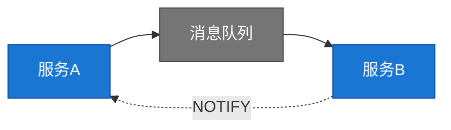
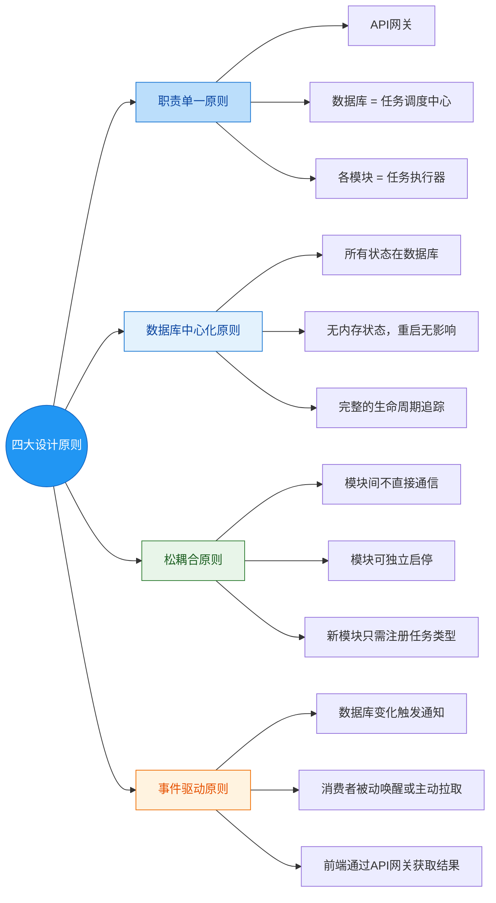
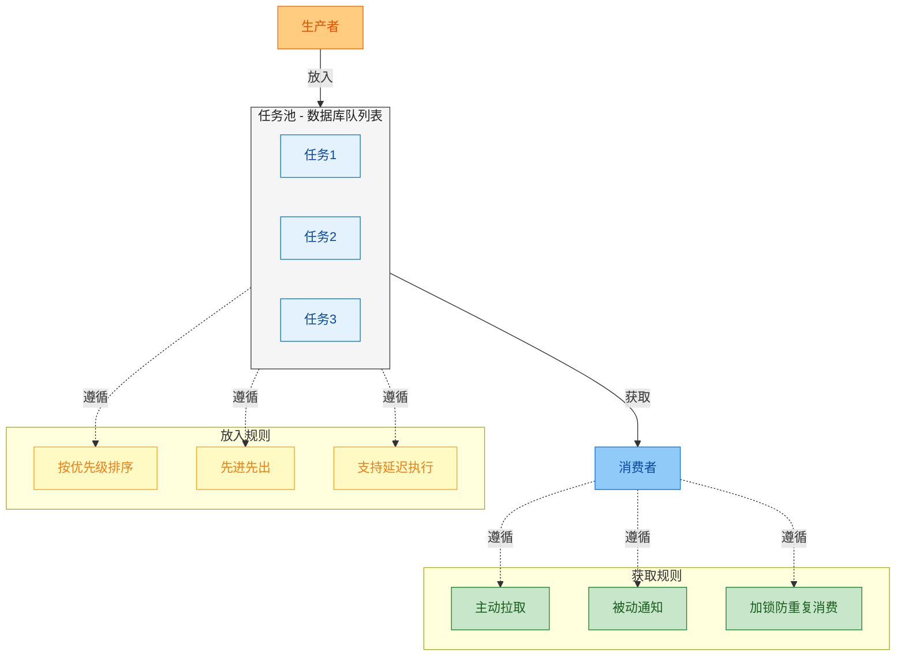
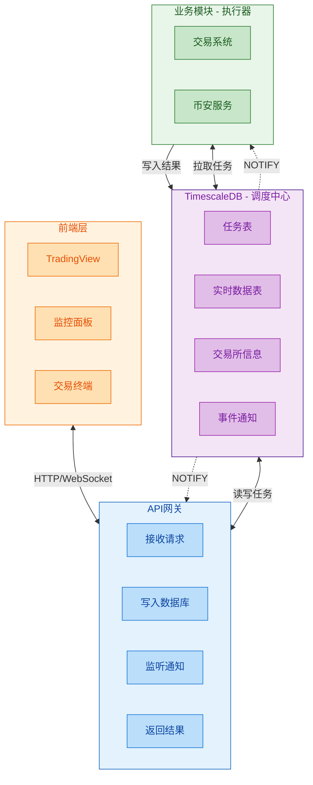
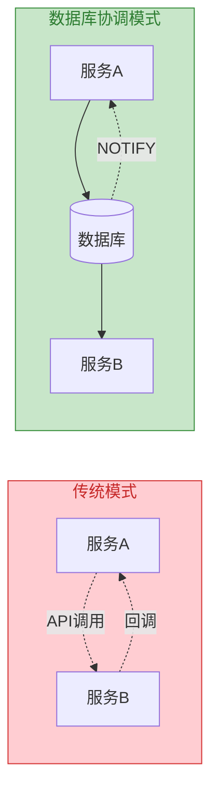
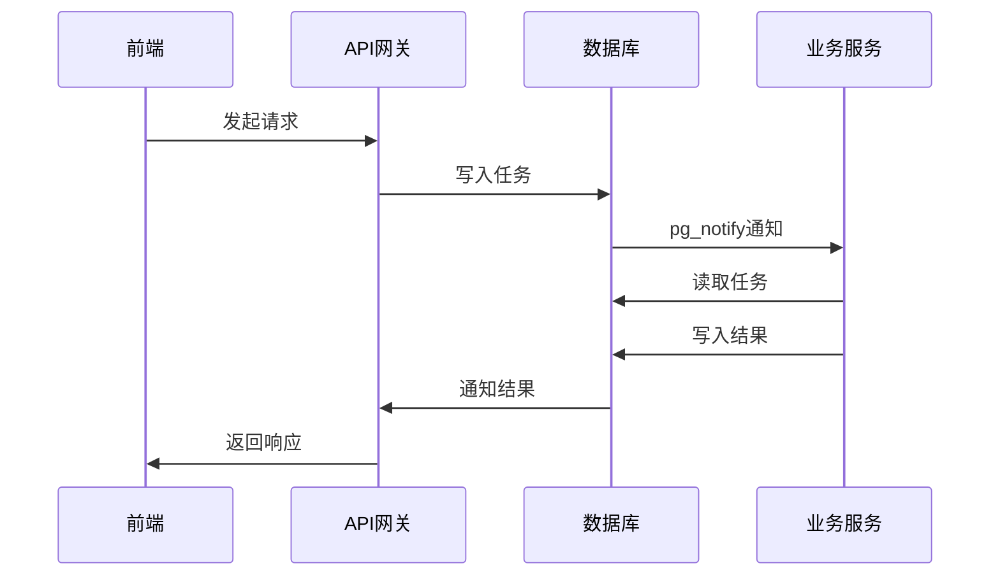
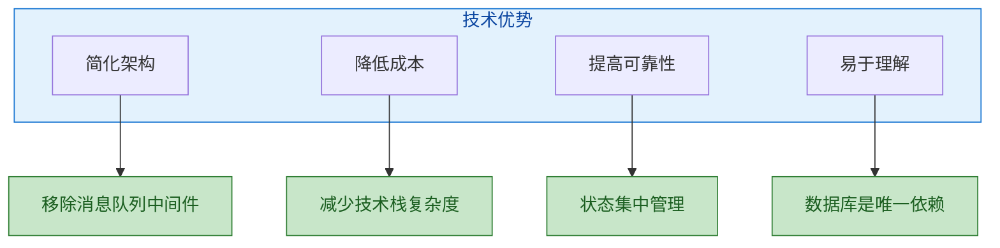
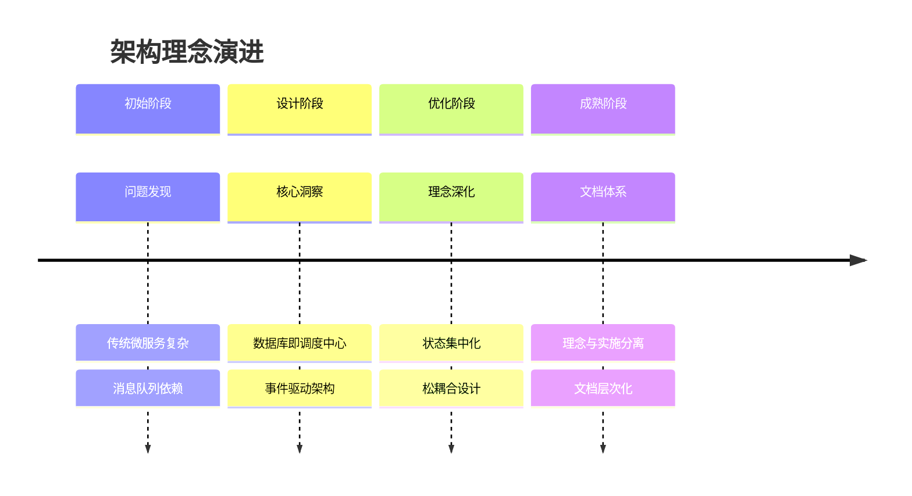

# 基于数据库协调的轻量级任务调度架构

> **文档状态**: v3.1
> **最后更新**: 2026-02-10
> **文档定位**: 核心理念与设计哲学
> **相关文档**: `QUANT_TRADING_SYSTEM_ARCHITECTURE.md`（详细实施指南）

## 1. 设计背景

### 1.1 传统架构的问题

在微服务架构中，服务间通信通常依赖消息队列或直接API调用：



**问题:**
- 引入额外中间件（RabbitMQ/Kafka）
- 状态分散在各服务
- 故障排查困难
- 技术栈复杂

### 1.2 核心洞察

> 所有数据都是围绕K线数据
> 所有功能都依赖数据库作为基础

**结论:** 为什么不直接让数据库成为调度中心？

★ Insight ─────────────────────────────────────
**架构演进方向**：从"服务协调"到"数据库协调"
- 传统模式：服务间直接通信或通过消息队列
- 数据库协调：所有交互通过数据库中转，服务只读写数据库
- 核心原则：**数据库是唯一的事实来源**
─────────────────────────────────────────────────

## 2. 核心设计思想

### 2.1 架构原则



### 2.2 核心模型



## 3. 整体架构

### 3.1 架构图



### 3.2 组件职责

| 组件 | 职责 | 设计原则 |
|------|------|----------|
| **前端** | 发起请求，接收响应 | 简单、轻量、无状态 |
| **API网关** | 请求转发，状态管理，通知监听 | 职责单一，状态持久化 |
| **数据库** | 任务调度，数据持久化，事件通知 | 调度中心，唯一事实来源 |
| **业务模块** | 任务执行，数据处理 | 独立、可插拔、无共享状态 |

## 4. 核心理念

### 4.1 数据库即调度中心

**核心理念**: 所有任务调度通过数据库实现，服务间不直接通信。



### 4.2 事件驱动架构

**设计思想**: 数据库状态变化自动触发事件，消费者被动响应。



#### 三阶段消息流程

> **重要设计原则**：本系统**所有请求类型**都遵循"先返回 ack，确认收到请求"的原则。

```
请求 → ack确认 → (处理) → success/error回应
```

| 阶段 | 消息类型 | 说明 |
|------|---------|------|
| 1 | 请求 | 客户端发送请求（携带 requestId） |
| 2 | **ack** | **服务端立即确认收到请求**（返回 requestId） |
| 3 | success/error | 服务端返回处理结果 |

**适用范围**：本系统所有请求类型都采用三阶段模式，无论数据来源于本地查询还是远程 API 处理，都必须先返回 ack 确认收到请求。

#### requestId 与 taskId 的区别

| 字段 | 来源 | 用途 | 是否返回客户端 |
|------|------|------|--------------|
| `requestId` | 客户端生成 | 关联请求和最终响应 | ✅ 是 |
| `taskId` | 服务端生成 | 内部任务管理与数据库映射 | ❌ 否 |

**说明**：
- `requestId`：客户端生成，用于追踪整个请求-响应流程
- `taskId`：服务端生成，仅用于内部任务管理和数据库映射，**不返回给客户端**
- 更新消息是服务器主动推送的数据，遵循 TradingView API 规范，不包含 requestId 字段

### 4.3 状态集中化

**核心原则**: 所有系统状态持久化在数据库，无内存状态。

| 状态类型 | 存储位置 | 说明 |
|----------|----------|------|
| 任务状态 | tasks表 | 生命周期管理（payload字段存储任务数据） |
| 订阅状态 | realtime_data表 | 实时数据订阅 |
| 业务数据 | 各自业务表 | 业务相关信息 |
| 临时状态 | 内存字典 | 仅前端显示用，可丢失 |

#### 命名区分规范

为避免概念混淆，系统采用明确的命名规范：

| 名称 | 用途 | 位置 |
|------|------|------|
| `content` | 实时推送的实际数据内容 | WebSocket update 消息 |
| `payload` | 数据库任务表（tasks）的载荷字段 | tasks 表存储 |
| `requestId` | 客户端生成的请求追踪标识 | 请求/响应消息 |
| `taskId` | 服务端生成的任务管理标识 | 数据库内部 |

**设计原则**：实时数据推送使用 `content` 命名，避免与数据库的 `payload` 字段混淆，提升代码可读性。

### 4.4 数据命名规范

#### 命名转换原则

系统在不同层级之间传递数据时，需要进行命名风格转换：

| 层级 | 命名风格 | 转换说明 |
|------|----------|----------|
| 前端 | camelCase | JavaScript/TypeScript 标准 |
| API服务入口 | camelCase → snake_case | 请求转换 |
| 内部服务 | snake_case | Python 惯例 |
| 数据库 | snake_case | PostgreSQL 惯例 |
| API服务出口 | snake_case → camelCase | 响应转换 |

#### 转换实现：Pydantic to_camel/to_snake

系统使用 Pydantic v2 的 `alias_generators` 实现自动转换：

```python
from pydantic import BaseModel, ConfigDict
from pydantic.alias_generators import to_camel, to_snake

# 内部模型使用 snake_case
class KlineData(BaseModel):
    model_config = ConfigDict(
        alias_generator=to_snake,
        populate_by_name=True,
    )

    open_time: int
    open_price: float
    close_price: float

# 外部模型使用 camelCase
class BinanceKline(BaseModel):
    model_config = ConfigDict(
        alias_generator=to_camel,
        populate_by_name=True,
        by_alias=True,
    )

    openTime: int
    openPrice: float
    closePrice: float
```

#### 服务边界转换原则

转换发生在"服务边界"，核心业务逻辑"不知道"转换的存在：

- **API服务边界**：WebSocket 入口/出口负责 camelCase ↔ snake_case 转换
- **币安服务边界**：币安客户端入口/出口负责 camelCase ↔ snake_case 转换
- **内部流转**：服务间传递统一使用 snake_case，无需转换

★ Insight ─────────────────────────────────────
**命名转换的设计哲学**：
- 转换是"装饰层"，不污染核心业务逻辑
- Pydantic 的 alias_generator 让转换透明化
- 开发者只需关注业务逻辑，无需手动转换
─────────────────────────────────────────────────

### 4.5 松耦合设计

**设计目标**: 服务独立，可独立部署和扩展。

```mermaid
flowchart TB
    subgraph Services[服务集合]
        S1[服务1]
        S2[服务2]
        S3[服务3]
        style S1 fill:#e3f2fd,color:#0d47a1,stroke:#1976d2
        style S2 fill:#e3f2fd,color:#0d47a1,stroke:#1976d2
        style S3 fill:#e3f2fd,color:#0d47a1,stroke:#1976d2
    end

    subgraph DB[(数据库)]
        Tasks[任务表]
        Data[业务表]
        Notify[通知]
        style Tasks fill:#f3e5f5,color:#7b1fa2,stroke:#4a148c
        style Data fill:#f3e5f5,color:#7b1fa2,stroke:#4a148c
        style Notify fill:#f3e5f5,color:#7b1fa2,stroke:#4a148c
    end

    Services -.->|"读取"| Tasks
    Services -.->|"读写"| Data
    DB -.->|"通知"| Services
```

## 5. 设计哲学

### 5.1 简单性优先

**原则**: 尽可能简化系统复杂度

- 减少组件：传统消息队列 → 数据库
- 简化通信：直接调用 → 数据库通知
- 统一管理：多状态 → 数据库单一状态

### 5.2 数据库为中心

**理念**: 数据库不仅是存储，更是调度中心

- 任务调度：通过数据库队列表实现
- 状态管理：所有状态持久化
- 事件通知：使用PostgreSQL NOTIFY/LISTEN
- 生命周期：完整追踪和审计

### 5.3 事件驱动

**模式**: 事件驱动而非轮询

- 被动响应：服务监听数据库通知
- 实时性：状态变化立即通知
- 解耦：生产者无需知道消费者

### 5.4 可观测性

**目标**: 系统状态透明可追踪

- 状态在数据库：随时查询
- 事件日志：完整的操作审计
- 生命周期：任务从创建到完成全程追踪

## 6. 适用场景

### 6.1 适合的系统

- ✅ 中小型微服务系统（5-20个服务）
- ✅ 任务处理为主的应用
- ✅ 实时性要求不极端的场景（秒级）
- ✅ 数据一致性要求高的系统
- ✅ 团队规模较小（<20人）

### 6.2 不适合的系统

- ❌ 超大规模分布式系统（>100个服务）
- ❌ 极低延迟要求（毫秒级）
- ❌ 跨地域部署的系统
- ❌ 高吞吐量场景（>10万QPS）

### 6.3 决策标准

| 决策维度 | 权重 | 考虑因素 |
|----------|------|----------|
| 系统复杂度 | 高 | 服务数量、依赖关系 |
| 团队规模 | 中 | 运维能力、技术栈 |
| 性能要求 | 中 | 延迟、吞吐量 |
| 一致性需求 | 高 | 数据准确性要求 |
| 开发效率 | 高 | 快速迭代、简化运维 |

## 7. 架构优势

### 7.1 技术优势



### 7.2 业务优势

- **快速交付**: 简化架构减少开发时间
- **易于维护**: 统一的数据中心便于管理
- **故障排查**: 状态透明，问题易于定位
- **扩展灵活**: 新服务只需接入数据库

### 7.3 对比分析

| 维度 | 传统微服务 | 数据库协调 |
|------|------------|------------|
| 组件数量 | 服务 + MQ + 数据库 | 服务 + 数据库 |
| 状态管理 | 分散在各个服务 | 集中在数据库 |
| 通信方式 | API调用 + 消息 | 数据库读写 |
| 故障排查 | 跨服务追踪 | 数据库查询 |
| 部署复杂度 | 高（多组件） | 低（少组件） |
| 学习成本 | 高（多技术栈） | 低（统一技术） |

## 8. 演进历史

### 8.1 版本演进

| 版本 | 日期 | 重大变更 |
|------|------|----------|
| 1.0 | 2026-02-03 | 初稿，使用Mermaid图示 |
| 1.1-1.9 | 2026-02-05 | 多次优化和重构 |
| 2.0 | 2026-02-06 | 补充交易所信息全量替换功能 |
| 3.0 | 2026-02-06 | **理念文档重构** |
| | | - 移除具体实施细节 |
| | | - 聚焦核心理念和设计哲学 |
| | | - 明确与实施文档的关系 |
| 3.1 | 2026-02-10 | **跟进 TradingView API v2.1 规范** |
| | | - 补充三阶段消息流程说明 |
| | | - 添加 requestId 与 taskId 区别说明 |
| | | - 添加命名区分规范（content vs payload） |

### 8.2 理念演进



### 8.3 未来规划

- **v3.2**: 增加性能基准测试数据
- **v3.3**: 添加故障排查指南
- **v4.0**: 考虑多数据库支持

## 9. 相关文档

### 9.1 文档体系

本文档是**核心理念文档**，请结合以下文档使用：

| 文档 | 类型 | 说明 |
|------|------|------|
| **QUANT_TRADING_SYSTEM_ARCHITECTURE.md** | 详细实施 | 数据库设计、表结构、触发器、流程图 |
| **TradingView-完整API规范设计文档.md** | API规范 | WebSocket消息协议、数据格式、实时推送 |
| **docs/architecture/README.md** | 文档索引 | 完整文档体系说明 |

### 9.2 阅读建议

1. **新团队成员**: 先读本文档理解理念，再读实施文档掌握细节
2. **架构师**: 重点关注第4-7章的设计哲学和适用场景
3. **开发人员**: 重点关注第3章的整体架构和第9章的相关文档
4. **技术决策**: 综合考虑第6章的适用场景和第7章的优势对比

### 9.3 文档维护

- **理念文档**: 保持抽象性，每季度回顾一次
- **实施文档**: 保持细节准确，随代码变更更新
- **版本同步**: 两个文档版本号保持同步更新
- **变更记录**: 在相应文档中记录重大变更

---

## 附录：核心理念总结

### 数据库协调 vs 传统微服务

| 传统微服务 | 数据库协调 |
|------------|------------|
| 服务间直接通信 | 通过数据库中转 |
| 状态分散在各服务 | 状态集中在数据库 |
| 依赖消息队列 | 使用PostgreSQL通知 |
| 故障排查困难 | 状态透明易排查 |
| 技术栈复杂 | 技术栈简单 |

### 四大设计原则

1. **职责单一原则**: API网关只负责请求转发和状态管理
2. **数据库中心化原则**: 数据库是调度中心和唯一事实来源
3. **松耦合原则**: 服务间不直接通信，独立可部署
4. **事件驱动原则**: 数据库变化自动触发通知，消费者被动响应

### 核心理念

**数据库即调度中心，事件驱动架构，状态集中管理，服务松耦合。**
