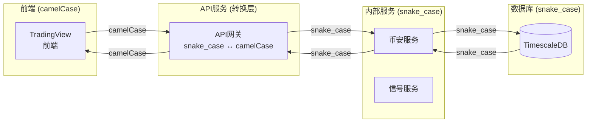

# 量化交易系统架构设计

> **本文档是详细实施指南**，包含完整的数据库表结构、触发器、流程图等。
> 核心理念请参考 [DATABASE_COORDINATED_ARCHITECTURE.md](./DATABASE_COORDINATED_ARCHITECTURE.md)

## 文档导航

### 快速索引

| 主题 | 详细文档 |
|------|----------|
| 任务与订阅管理 | [01-task-subscription.md](./01-task-subscription.md) |
| 数据流设计 | [02-dataflow.md](./02-dataflow.md) |
| 币安服务 | [03-binance-service.md](./03-binance-service.md) |
| 信号服务 | [05-signal-service.md](./05-signal-service.md) |
| 告警服务 | [06-alert-service.md](./06-alert-service.md) |
| TradingView API | [07-websocket-protocol.md](./07-websocket-protocol.md) |
| K线表优化 | [../database/Kline-Table-Event-Optimization.md](../database/Kline-Table-Event-Optimization.md) |
| API 数据模型 | [08-api-models.md](./08-api-models.md) |

## 核心概念

### 两种数据交互类型

| 类型 | 特点 | 处理方式 |
|------|------|----------|
| **一次性请求** | 前端发起一次请求，获取一次响应 | 通过 tasks 表 + 任务队列 |
| **持续订阅** | 前端订阅后持续接收更新 | 通过 realtime_data 表 + 触发器 |

### 数据模型

| 表 | 用途 |
|---|------|
| `tasks` | 一次性请求任务 |
| `klines_history` | K线历史数据 |
| `realtime_data` | 实时数据状态 |
| `exchange_info` | 交易对信息 |
| `strategy_signals` | 策略信号 |
| `alert_configs` | 告警配置 |
| `account_info` | 用户账户信息（期货/现货） |

### 事件流

```
写入 → 触发 → 通知 → 订阅
```

**K线事件链**: 采集 → 写入 → kline.new → 信号计算
**信号事件链**: 信号写入 → signal.new → 交易决策
**交易事件链**: 交易执行 → trade.completed → 账户更新

### 数据命名转换

系统在不同层级之间传递数据时进行命名风格转换：



**转换规则**：
- 前端 ↔ API服务：camelCase ↔ snake_case（使用 Pydantic to_camel/to_snake）
- API服务 ↔ 内部服务：snake_case（无需转换）
- 内部服务 ↔ 数据库：snake_case（无需转换）

**详细设计**：见 [DATABASE_COORDINATED_ARCHITECTURE.md](./DATABASE_COORDINATED_ARCHITECTURE.md#44-数据命名规范)

## 目录结构

```
docs/backend/
├── design/
│   ├── DATABASE_COORDINATED_ARCHITECTURE.md  # 核心理念
│   ├── QUANT_TRADING_SYSTEM_ARCHITECTURE.md # 本文档（索引）
│   ├── 01-task-subscription.md               # 任务与订阅
│   ├── 02-dataflow.md                        # 数据流
│   ├── 03-binance-service.md                 # 币安服务
│   ├── 05-signal-service.md                  # 信号服务
│   ├── 06-alert-service.md                   # 告警服务
│   └── 07-websocket-protocol.md             # WebSocket 协议
├── database/
│   └── Kline-Table-Event-Optimization.md     # K线优化
└── events/
    └── (待创建)
```

## 相关资源

- **数据库初始化**: `docker/init-scripts/01-database-init.sql`
- **API服务**: `services/api-service/`
- **币安服务**: `services/binance-service/`
- **信号服务**: `services/signal-service/`

---

**版本**：v3.2
**更新**：2026-02-27 - 添加账户订阅服务设计（"GET 完整 + 订阅增量"策略）
**上一版本**：v3.1 (2026-02-24)
