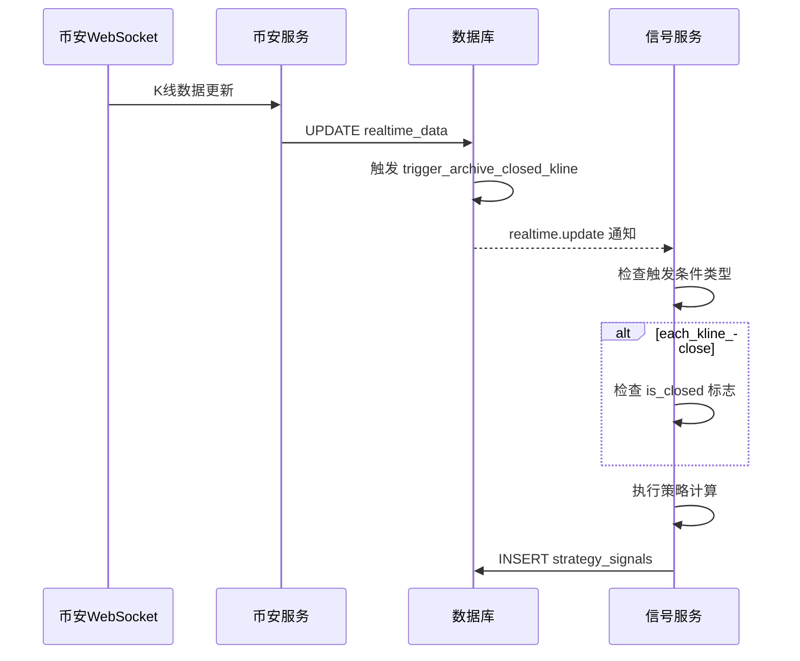

# 告警服务设计

## 概述

告警服务负责配置和管理交易告警，监控价格/指标变化，触发告警通知。

---

## 9. 告警配置管理

### 9.1 设计背景

告警配置管理（原策略配置）用于集中管理交易策略的告警规则，支持动态调整和持久化存储。系统通过 `alert_configs` 表存储告警配置，支持 MACD 共振策略等多种策略类型。

**核心功能**：
- 告警配置的 CRUD 操作
- 触发条件配置
- 多告警并行运行
- 配置变更通知
- 实时信号推送

### 9.2 核心数据模型

#### 9.2.1 alert_configs 告警配置表

```sql
CREATE TABLE IF NOT EXISTS alert_configs (
    -- 告警标识
    id VARCHAR(36) PRIMARY KEY,  -- 前端生成的 UUIDv4（如 "0189a1b2-c3d4-5e6f-7890-abcd12345678"）

    -- 告警信息
    name VARCHAR(100) NOT NULL,              -- 告警名称（用户友好，可重复）
    description TEXT,                          -- 告警描述

    -- 策略类型（便于按策略类型索引和筛选）
    strategy_type VARCHAR(50) NOT NULL,       -- 策略类型，如 "macd_resonance", "rsi_oversold"

    -- 交易对和周期
    symbol VARCHAR(50) NOT NULL,              -- 交易对：如 "BINANCE:BTCUSDT"
    interval VARCHAR(10) NOT NULL,            -- K线周期：TradingView格式 (1, 5, 15, 60, 240, D, W, M)

    -- 触发条件类型
    trigger_type VARCHAR(20) NOT NULL DEFAULT 'each_kline_close',
    -- - once_only: 仅执行一次
    -- - each_kline: 每个K线触发
    -- - each_kline_close: 每个K线闭合时触发
    -- - each_minute: 每分钟触发

    -- 策略参数（JSON格式存储，支持任意策略类型）
    params JSONB NOT NULL DEFAULT '{}',        -- 策略参数，如 {"macd1_fastperiod": 12, "macd1_slowperiod": 26, "macd1_signalperiod": 9}

    -- 告警状态
    is_enabled BOOLEAN NOT NULL DEFAULT TRUE,

    -- 用户标识（便于按用户索引和筛选）
    created_by VARCHAR(100),                  -- 创建者标识

    -- 时间戳
    created_at TIMESTAMPTZ DEFAULT NOW(),
    updated_at TIMESTAMPTZ DEFAULT NOW()

    -- 注意：所有字段都可重复，唯一标识为 id
);

-- 复合索引：按用户 + 策略类型查询
CREATE INDEX IF NOT EXISTS idx_alert_configs_user_strategy
    ON alert_configs (created_by, strategy_type);

-- 复合索引：按用户 + 交易对查询
CREATE INDEX IF NOT EXISTS idx_alert_configs_user_symbol
    ON alert_configs (created_by, symbol);

-- 复合索引：按策略类型 + 交易对查询
CREATE INDEX IF NOT EXISTS idx_alert_configs_strategy_symbol
    ON alert_configs (strategy_type, symbol);

-- GIN 索引：按参数查询（支持参数维度筛选）
CREATE INDEX IF NOT EXISTS idx_alert_configs_params_gin
    ON alert_configs USING GIN (params jsonb_path_ops);

-- 索引：按启用状态查询（批量处理时使用）
CREATE INDEX IF NOT EXISTS idx_alert_configs_enabled
    ON alert_configs (is_enabled) WHERE is_enabled = TRUE;
```

**设计说明**：
- **唯一标识**：所有字段都可重复，唯一标识为前端生成的 UUIDv4 `id`
- **ID 生成**：前端使用 `crypto.randomUUID()` 生成（如 `0189a1b2-c3d4-5e6f-7890-abcd12345678`）
- **订阅键格式**：`SIGNAL:{id}`（如 `SIGNAL:0189a1b2-c3d4-5e6f-7890-abcd12345678`）

**字段说明**：
| 字段 | 说明 |
|------|------|
| `id` | 告警唯一标识，前端生成 UUIDv4 |
| `name` | 告警名称（可重复） |
| `description` | 告警描述 |
| `strategy_type` | 策略类型 |
| `symbol` | 交易对 |
| `interval` | K线周期 |
| `trigger_type` | 触发条件类型 |
| `params` | 策略参数，JSON格式 |
| `is_enabled` | 是否启用 |
| `created_by` | 创建者标识 |

**索引使用场景**：
| 索引 | 典型查询 |
|------|----------|
| `idx_alert_configs_user_strategy` | 查询某用户的所有某类型告警 |
| `idx_alert_configs_user_symbol` | 查询某用户的所有某交易对告警 |
| `idx_alert_configs_strategy_symbol` | 查询某策略类型在某交易对的告警 |
| `idx_alert_configs_params_gin` | 按参数值筛选（如 macd1_fastperiod=12 的所有告警） |
| `idx_alert_configs_enabled` | 批量查询所有启用的告警（信号服务使用） |

### 9.3 MACD 共振策略参数

#### 9.3.1 参数结构

```json
{
    "macd1_fastperiod": 12,
    "macd1_slowperiod": 26,
    "macd1_signalperiod": 9,
    "macd2_fastperiod": 4,
    "macd2_slowperiod": 20,
    "macd2_signalperiod": 4
}
```

**参数说明**：
| 参数 | 说明 | 推荐值 |
|------|------|--------|
| `macd1_fastperiod` | MACD1 快速EMA周期 | 12 |
| `macd1_slowperiod` | MACD1 慢速EMA周期 | 26 |
| `macd1_signalperiod` | MACD1 信号线周期 | 9 |
| `macd2_fastperiod` | MACD2 快速EMA周期（短周期） | 4 |
| `macd2_slowperiod` | MACD2 慢速EMA周期（短周期） | 20 |
| `macd2_signalperiod` | MACD2 信号线周期 | 4 |

#### 9.3.2 共振阈值

- `threshold = 0`: 完全共振，两组 MACD 信号同时满足条件
- `threshold > 0`: 允许第一组信号强度大于第二组一定倍数

### 9.4 策略元数据 API

| 操作 | data.type | 说明 |
|------|-----------|------|
| 获取所有策略 | `get_strategy_metadata` | 获取已注册策略列表及其参数定义 |
| 获取指定策略 | `get_strategy_metadata_by_type` | 根据策略类型获取详细参数定义 |

#### 9.4.1 获取所有策略元数据

**请求格式**：
```json
{
    "protocolVersion": "2.0",
    "action": "get",
    "requestId": "req_strategy_001",
    "timestamp": 1704067200000,
    "data": {
        "type": "get_strategy_metadata"
    }
}
```

**成功响应**：
```json
{
    "protocolVersion": "2.0",
    "action": "success",
    "requestId": "req_strategy_001",
    "timestamp": 1704067201000,
    "data": {
        "type": "get_strategy_metadata",
        "strategies": [
            {
                "type": "macd_resonance_v5",
                "name": "MACD共振策略V5",
                "description": "双MACD指标金叉/死叉共振，结合EMA均线系统过滤，捕捉趋势交易机会",
                "params": [
                    {"name": "macd1_fastperiod", "type": "int", "default": 12, "min": 1, "max": 100, "description": "MACD1快速EMA周期"},
                    {"name": "macd1_slowperiod", "type": "int", "default": 26, "min": 1, "max": 200, "description": "MACD1慢速EMA周期"},
                    {"name": "macd1_signalperiod", "type": "int", "default": 9, "min": 1, "max": 50, "description": "MACD1信号线周期"},
                    {"name": "macd2_fastperiod", "type": "int", "default": 4, "min": 1, "max": 50, "description": "MACD2快速EMA周期"},
                    {"name": "macd2_slowperiod", "type": "int", "default": 20, "min": 1, "max": 100, "description": "MACD2慢速EMA周期"},
                    {"name": "macd2_signalperiod", "type": "int", "default": 4, "min": 1, "max": 50, "description": "MACD2信号线周期"}
                ]
            },
            {
                "type": "macd_resonance_v6",
                "name": "MACD共振策略V6",
                "description": "MACD共振策略V6性能优化版",
                "params": [
                    {"name": "macd1_fastperiod", "type": "int", "default": 12, "min": 1, "max": 100, "description": "MACD1快速EMA周期"},
                    {"name": "macd1_slowperiod", "type": "int", "default": 26, "min": 1, "max": 200, "description": "MACD1慢速EMA周期"},
                    {"name": "macd1_signalperiod", "type": "int", "default": 9, "min": 1, "max": 50, "description": "MACD1信号线周期"},
                    {"name": "macd2_fastperiod", "type": "int", "default": 4, "min": 1, "max": 50, "description": "MACD2快速EMA周期"},
                    {"name": "macd2_slowperiod", "type": "int", "default": 20, "min": 1, "max": 100, "description": "MACD2慢速EMA周期"},
                    {"name": "macd2_signalperiod", "type": "int", "default": 4, "min": 1, "max": 50, "description": "MACD2信号线周期"}
                ]
            },
            {
                "type": "macd_resonance_short",
                "name": "MACD做空策略",
                "description": "基于双MACD共振的基本做空策略",
                "params": [
                    {"name": "macd1_fastperiod", "type": "int", "default": 12, "min": 1, "max": 100, "description": "MACD1快速EMA周期"},
                    {"name": "macd1_slowperiod", "type": "int", "default": 26, "min": 1, "max": 200, "description": "MACD1慢速EMA周期"},
                    {"name": "macd1_signalperiod", "type": "int", "default": 9, "min": 1, "max": 50, "description": "MACD1信号线周期"},
                    {"name": "macd2_fastperiod", "type": "int", "default": 4, "min": 1, "max": 50, "description": "MACD2快速EMA周期"},
                    {"name": "macd2_slowperiod", "type": "int", "default": 20, "min": 1, "max": 100, "description": "MACD2慢速EMA周期"},
                    {"name": "macd2_signalperiod", "type": "int", "default": 4, "min": 1, "max": 50, "description": "MACD2信号线周期"}
                ]
            },
            {
                "type": "alpha_01",
                "name": "Alpha01策略",
                "description": "基于ATR止损和枢轴点的趋势跟踪策略",
                "params": [
                    {"name": "ema_period", "type": "int", "default": 50, "min": 1, "max": 500, "description": "EMA周期"},
                    {"name": "volume_ma_period", "type": "int", "default": 20, "min": 1, "max": 200, "description": "成交量MA周期"},
                    {"name": "threshold", "type": "float", "default": 0.02, "min": 0.0, "max": 1.0, "description": "阈值"}
                ]
            }
        ]
    }
}
```

**使用场景**：
1. 前端加载告警配置表单时，先调用此接口获取策略列表
2. 用户选择策略后，前端根据 `params` 数组动态渲染参数输入控件
3. 参数类型决定使用哪种输入组件（int/float 用数字输入框，bool 用开关）

### 9.5 告警配置操作 API

| 操作 | data.type | 说明 |
|------|-----------|------|
| 创建告警 | `create_alert_config` | 创建新的告警规则 |
| 获取告警 | `get_alert_config` | 获取单个告警详情 |
| 列表告警 | `list_alert_configs` | 列出告警（支持分页和过滤） |
| 更新告警 | `update_alert_config` | 更新告警配置 |
| 删除告警 | `delete_alert_config` | 删除告警 |
| 启用告警 | `enable_alert_config` | 启用告警 |
| 禁用告警 | `disable_alert_config` | 禁用告警 |

#### 9.5.1 创建告警信号

**前端生成 ID**：
- 使用 JavaScript `crypto.randomUUID()` 生成 UUIDv4
- 示例：`0189a1b2-c3d4-5e6f-7890-abcd12345678`

**请求格式**：
```json
{
    "protocolVersion": "2.0",
    "action": "get",
    "requestId": "req_create_001",
    "timestamp": 1704067200000,
    "data": {
        "type": "create_alert_config",
        "id": "0189a1b2-c3d4-5e6f-7890-abcd12345678",
        "name": "macd_resonance_btcusdt",
        "description": "BTCUSDT MACD共振告警",
        "strategy_type": "macd_resonance_v5",
        "symbol": "BINANCE:BTCUSDT",
        "interval": "60",
        "trigger_type": "each_kline_close",
        "params": {
            "macd1_fastperiod": 12,
            "macd1_slowperiod": 26,
            "macd1_signalperiod": 9,
            "macd2_fastperiod": 5,
            "macd2_slowperiod": 35,
            "macd2_signalperiod": 5
        },
        "is_enabled": true,
        "created_by": "user_001"
    }
}
```

**字段说明**：
| 字段 | 类型 | 必填 | 说明 |
|------|------|------|------|
| `id` | string | ✅ | 前端生成的 UUIDv4（用于订阅键 SIGNAL:{id}） |
| `name` | string | ✅ | 告警名称 |
| `description` | string | ❌ | 告警描述 |
| `strategy_type` | string | ✅ | 策略类型 |
| `symbol` | string | ✅ | 交易对 |
| `interval` | string | ✅ | K线周期 |
| `trigger_type` | string | ✅ | 触发类型 |
| `params` | object | ✅ | 策略参数 |
| `is_enabled` | boolean | ✅ | 是否启用 |
| `created_by` | string | ✅ | 创建者标识 |

**成功响应**：
```json
{
    "protocolVersion": "2.0",
    "action": "success",
    "requestId": "req_create_001",
    "timestamp": 1704067201000,
    "data": {
        "type": "create_alert_config",
        "id": "0189a1b2-c3d4-5e6f-7890-abcd12345678",
        "name": "macd_resonance_btcusdt",
        "description": "BTCUSDT MACD共振告警",
        "strategy_type": "macd_resonance_v5",
        "symbol": "BINANCE:BTCUSDT",
        "interval": "60",
        "trigger_type": "each_kline_close",
        "params": {
            "macd1_fastperiod": 12,
            "macd1_slowperiod": 26,
            "macd1_signalperiod": 9,
            "macd2_fastperiod": 5,
            "macd2_slowperiod": 35,
            "macd2_signalperiod": 5
        },
        "is_enabled": true,
        "created_at": "2026-02-13T10:00:00Z",
        "created_by": "user_001"
    }
}
```

**前端订阅信号**（创建告警后需要手动订阅）：
```json
{
    "protocolVersion": "2.0",
    "action": "subscribe",
    "requestId": "req_sub_001",
    "timestamp": 1704067200000,
    "data": {
        "subscriptions": [
            "SIGNAL:0189a1b2-c3d4-5e6f-7890-abcd12345678"
        ]
    }
}
```

**查询参数 (`list_alert_configs`)**:

| 参数 | 类型 | 说明 |
|------|------|------|
| `page` | int | 页码，默认 1 |
| `page_size` | int | 每页数量，默认 20 |
| `strategy_type` | string | 按策略类型过滤 |
| `symbol` | string | 按交易对过滤 |
| `interval` | string | 按 K 线周期过滤 |
| `is_enabled` | bool | 按启用状态过滤 |
| `created_by` | string | 按创建者过滤 |

#### 9.4.2 信号查询 API

| 操作 | data.type | 说明 |
|------|-----------|------|
| 信号列表 | `list_signals` | 获取信号列表（支持分页和过滤） |
| 单个信号 | `get_signal` | 获取指定信号 |
| 最近信号 | `recent_signals` | 获取最近信号 |
| 策略信号 | `signals_by_alert` | 获取指定告警的信号 |

**查询参数 (`list_signals`)**:

| 参数 | 类型 | 说明 |
|------|------|------|
| `page` | int | 页码，默认 1 |
| `page_size` | int | 每页数量，默认 20 |
| `symbol` | string | 按交易对过滤 |
| `strategy_type` | string | 按策略类型过滤 |
| `interval` | string | 按 K 线周期过滤 |
| `signal_value` | bool | 按信号值过滤 |
| `created_by` | string | 按创建者过滤 |
| `from_time` | int | 起始时间戳（毫秒） |
| `to_time` | int | 结束时间戳（毫秒） |
| `order_by` | string | 排序字段，默认 computed_at |
| `order_dir` | string | 排序方向，默认 desc |

### 9.6 与信号服务的集成

```mermaid
flowchart LR
    subgraph Alert[告警配置管理]
        Create[创建告警]
        Update[更新告警]
        Delete[删除告警]
    end

    subgraph Signal[信号服务]
        Load[加载告警]
        Calculate[策略计算]
    end

    subgraph DB[(数据库)]
        AS[alert_configs表]
    end

    Create -->|INSERT| AS
    Update -->|UPDATE| AS
    Delete -->|DELETE| AS

    AS -->|SELECT (is_enabled=true)| Load
    Load --> Calculate
```

**告警信号变更通知**：

| 频道 | 触发时机 | 接收者 | 说明 |
|------|---------|--------|------|
| `alert_config.new` | INSERT alert_configs | signal-service | 新建告警配置 |
| `alert_config.update` | UPDATE alert_configs | signal-service | 更新告警配置 |
| `alert_config.delete` | DELETE alert_configs | signal-service | 删除告警配置 |

```sql
-- 告警新增通知（统一包装格式）
CREATE OR REPLACE FUNCTION notify_alert_config_new()
RETURNS TRIGGER AS $$
BEGIN
    PERFORM pg_notify('alert_config.new', jsonb_build_object(
        'event_id', uuidv7()::TEXT,
        'event_type', 'alert_config.new',
        'timestamp', NOW()::TEXT,
        'data', jsonb_build_object(
            'id', NEW.id,
            'name', NEW.name,
            'strategy_type', NEW.strategy_type,
            'symbol', NEW.symbol,
            'interval', NEW.interval,
            'trigger_type', NEW.trigger_type,
            'params', NEW.params,
            'is_enabled', NEW.is_enabled,
            'created_by', NEW.created_by,
            'created_at', NEW.created_at::TEXT
        )
    )::TEXT);
    RETURN NEW;
END;
$$ LANGUAGE plpgsql;

DROP TRIGGER IF EXISTS trigger_alert_config_new ON alert_configs;
CREATE TRIGGER trigger_alert_config_new
    AFTER INSERT ON alert_configs
    FOR EACH ROW
    WHEN (NEW.is_enabled = TRUE)
    EXECUTE FUNCTION notify_alert_config_new();

-- 告警更新通知（统一包装格式）
CREATE OR REPLACE FUNCTION notify_alert_config_update()
RETURNS TRIGGER AS $$
BEGIN
    PERFORM pg_notify('alert_config.update', jsonb_build_object(
        'event_id', uuidv7()::TEXT,
        'event_type', 'alert_config.update',
        'timestamp', NOW()::TEXT,
        'data', jsonb_build_object(
            'id', NEW.id,
            'name', NEW.name,
            'description', NEW.description,
            'strategy_type', NEW.strategy_type,
            'symbol', NEW.symbol,
            'interval', NEW.interval,
            'trigger_type', NEW.trigger_type,
            'params', NEW.params,
            'is_enabled', NEW.is_enabled,
            'updated_at', NEW.updated_at::TEXT,
            'created_by', NEW.created_by
        )
    )::TEXT);
    RETURN NEW;
END;
$$ LANGUAGE plpgsql;

DROP TRIGGER IF EXISTS trigger_alert_config_update ON alert_configs;
CREATE TRIGGER trigger_alert_config_update
    AFTER UPDATE ON alert_configs
    FOR EACH ROW
    EXECUTE FUNCTION notify_alert_config_update();

-- 告警删除通知（统一包装格式）
CREATE OR REPLACE FUNCTION notify_alert_config_delete()
RETURNS TRIGGER AS $$
BEGIN
    PERFORM pg_notify('alert_config.delete', jsonb_build_object(
        'event_id', uuidv7()::TEXT,
        'event_type', 'alert_config.delete',
        'timestamp', NOW()::TEXT,
        'data', jsonb_build_object(
            'id', OLD.id,
            'name', OLD.name,
            'strategy_type', OLD.strategy_type,
            'symbol', OLD.symbol,
            'interval', OLD.interval,
            'deleted_at', NOW()::TEXT
        )
    )::TEXT);
    RETURN OLD;
END;
$$ LANGUAGE plpgsql;

DROP TRIGGER IF EXISTS trigger_alert_config_delete ON alert_configs;
CREATE TRIGGER trigger_alert_config_delete
    AFTER DELETE ON alert_configs
    FOR EACH ROW
    EXECUTE FUNCTION notify_alert_config_delete();
```

---

## 10. 触发条件机制

### 10.1 设计背景

触发条件机制定义了策略何时被执行，支持多种触发类型以满足不同的交易需求。

### 10.2 触发类型

| 类型 | 说明 | 适用场景 |
|------|------|----------|
| `once_only` | 仅执行一次 | 一次性策略 |
| `each_kline` | 每个K线触发 | 实时信号计算 |
| `each_kline_close` | 每个K线闭合时触发 | 收盘价策略 |
| `each_minute` | 每分钟触发 | 高频策略 |

### 10.3 触发流程



### 10.4 触发条件与信号服务

信号服务监听 `realtime.update` 通知，根据配置中的 `trigger_type` 决定是否执行策略计算：

```python
async def handle_realtime_update(self, notification: dict):
    """处理实时数据更新通知"""
    data = notification["data"]
    subscription_key = data["subscription_key"]

    # 获取该订阅键对应的策略配置
    configs = await self.config_repo.get_by_subscription(subscription_key)

    for config in configs:
        # 检查触发条件
        if not self._should_trigger(config, data):
            continue

        # 执行策略计算
        await self.calculate_and_signal(config, data)
```

### 10.5 K线闭合检测

对于 `each_kline_close` 触发类型，系统通过 `is_closed` 字段判断 K 线是否闭合：

```sql
-- trigger_archive_closed_kline 触发器条件
WHEN (NEW.data_type = 'KLINE' AND (NEW.data->'k'->>'x')::boolean = true)
```

---

## 相关文档

- [QUANT_TRADING_SYSTEM_ARCHITECTURE.md](./QUANT_TRADING_SYSTEM_ARCHITECTURE.md) - 完整实施文档
- [05-signal-service.md](./05-signal-service.md) - 信号服务设计

---

**版本**：v3.1
**更新**：2026-02-21
